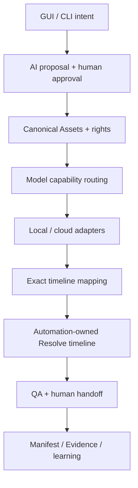
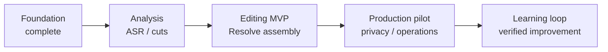

# BAI Video Production

[日本語](README.md) | **English**

[](https://github.com/baisound/bai_video_production/actions/workflows/ci.yml)
[](https://github.com/baisound/bai_video_production/actions/workflows/security.yml)
[](LICENSE.md)
[](https://www.python.org/)

BAI Video Production is a Python foundation for gradually automating secure media ingest, normalization, AI provider selection, local/cloud generation, exact timeline mapping, and DaVinci Resolve workflows.

## Choose your guide

| Reader | Page | Purpose |
|---|---|---|
| First-time or non-developer reader | [Beginner guide (Japanese)](docs/user/GETTING-STARTED.md) | Capabilities, cost/safety, five-minute demo, troubleshooting |
| Evaluator | [Project status](PROJECT.md) | Implemented versus planned scope and milestones |
| Developer or contributor | [Developer Architecture Guide](docs/developer/ARCHITECTURE.md) | Data flow, boundaries, adapters, tests, change procedure |
| OSS reviewer | [Public-readiness schedule](docs/oss/PUBLIC-READINESS-SCHEDULE.md) | Deadlines, evidence, adoption and application gates |

> **Project status: Alpha**
>
> The project currently implements foundations, provider boundaries, and timeline mapping. It is not yet a one-click end-user product that turns any input into a finished video. Unimplemented capabilities are never presented as complete.

## Why this project exists

Useful video automation requires more than generation. It must handle media rights, exact timing, external API cost, retries, provenance, interruption recovery, and human edits inside a professional NLE as one auditable workflow. This project separates probabilistic AI decisions from deterministic execution, protects source media, and keeps results reproducible, inspectable, and manually correctable.

## Expected public impact

Video production capacity affects education, local culture, research communication, accessibility, nonprofit work, creators, and small businesses. Today, users must assemble multiple AI providers, specialist NLE skills, infrastructure, rights checks, and privacy controls themselves. That burden excludes people and organizations with fewer financial and technical resources.

BAI Video Production aims to provide a reusable public foundation that:

- avoids vendor lock-in and lets users choose local, free-tier, or paid AI according to privacy, quality, and budget;
- automates proposals, generation, and placement while preserving human approval, asset replacement, and final editing control;
- treats rights, consent, cost, provenance, privacy, reproducibility, and recovery as core production requirements;
- publishes common contracts so developers do not repeatedly solve the same provider, media, and NLE integration problems from scratch;
- can eventually learn from evaluated evidence of good human edits without blindly imitating poor operations.

This impact is an objective, not a claim of demonstrated scale. We intend to publish only measured results: human time and cost saved against a defined baseline, recovery rate, rights-metadata completion, local-processing rate, reproducibility, contributors, adopters, and downstream integrations.

## Current capabilities

- Canonical Asset Registry, rights/checksum metadata, and Logical Path Resolver
- ffprobe media inspection, CFR proxies, and 48 kHz analysis audio
- exact rational timebase and source-to-timeline mapping
- DaVinci Resolve capability probes and automation-owned timeline boundaries
- local ComfyUI image/video runtime boundaries
- Audacity/OpenVINO Noise Suppression and verified two-stem separation boundary
- OpenAI, Anthropic, and Google text-capability adapters
- ElevenLabs TTS, sound-effect, and music adapters
- SunoAPI.org asynchronous music adapter
- routing based on exact model capabilities rather than fixed provider purposes
- a secret-free settings preflight API covering planning, video, image, audio, and music
- a bilingual GUI-neutral settings contract with atomic save, integrity checks, conflict protection, and legacy migration
- a local bilingual screen for editing five workload modes and preferred configured models
- execution boundaries that keep credentials out of profiles, manifests, and evidence

See [PROJECT.md](PROJECT.md) and the [Canonical Roadmap](docs/roadmap/PROJECT-ROADMAP-CANONICAL.md) for detailed status.

After installation, start the AI Connection settings screen with:

```powershell
powershell -ExecutionPolicy Bypass -File .\tools\windows\run-ai-connection-settings.ps1
```

See the [beginner screen guide](docs/user/AI-CONNECTION-SETTINGS.en.md) and [developer contract](docs/developer/AI-CONNECTION-SETTINGS-WEB.md).

## Not implemented yet

- integrated production GUI beyond the implemented AI Connection settings screen
- completed existing-video ASR, silence/filler cuts, and subtitle placement E2E
- completed new-video planning, generation, and Resolve assembly E2E
- every catalogued Runway, Luma, Kling, MiniMax, and other adapter
- automated publishing

A provider in the catalog does not imply that its adapter is implemented. Integration status distinguishes `IMPLEMENTED`, `LOCAL_RUNTIME`, and `PLANNED_ADAPTER`.

## Architecture



AI produces proposals and generated candidates. Deterministic services own assets, time, state, recovery, and publication boundaries. External cost and NLE mutation require explicit authorization.

## Roadmap at a glance



The foundation, timeline mapping, and provider boundaries are implemented. The next major outcome is an Editing MVP that produces a cut and subtitled Resolve timeline from an existing video.

## Requirements

- Python 3.11+
- Windows 10/11 is the primary verified product target
- FFmpeg/ffprobe for media-processing features
- DaVinci Resolve Studio for Resolve integration
- ComfyUI or Audacity/OpenVINO only for their respective local AI features
- an account/API key only for each cloud provider a user explicitly enables

External runtimes, models, API keys, and paid services are not bundled or automatically installed.

## Installation

```bash
git clone https://github.com/baisound/bai_video_production.git
cd bai_video_production
python -m venv .venv
python -m pip install --upgrade pip
python -m pip install -e ".[dev]"
```

## Five-minute, credential-free demo

The quickstart uses no API key, network, paid AI, real media, or NLE mutation. It demonstrates offline capability routing and exact NTSC timeline mapping.

```powershell
ai-video-quickstart --output .\quickstart-output.json
Get-Content .\quickstart-output.json
```

See the [Five-minute demo guide](docs/quickstart/FIVE-MINUTE-DEMO.md) for expected output and explicit non-claims.

## Verification

```powershell
python -c "import ai_video_production; print(ai_video_production.__version__)"
python -m pytest -q
python -m compileall -q src tests
```

Ordinary CI does not invoke paid APIs, ComfyUI, Audacity, or Resolve. Live evidence probes run only under documented safety conditions.

## Provider configuration

- [AI Connection profile example](profiles/ai-connection-creator.example.json)
- [External media profile example](profiles/external-media-providers.example.json)

Profiles store `credential://...` references, never raw API keys. External media generation also requires an explicit rights-authorization reference.

## Security, privacy, and rights

Do not disclose vulnerabilities, credentials, personal data, private media, cookies, authorization headers, or signed URLs in public issues or pull requests. Follow [SECURITY.md](SECURITY.md) for private vulnerability reporting.

Users remain responsible for provider/model terms, fees, commercial-use conditions, copyright, likeness/voice consent, privacy, and applicable law. This project is not an official product of, or endorsed by, the external providers and runtimes named in its compatibility documentation.

## Contributing

Read [CONTRIBUTING.md](CONTRIBUTING.md) and [CODE_OF_CONDUCT.md](CODE_OF_CONDUCT.md). First-time contributors should start with a `good first issue` that requires no credentials, paid API, private media, or destructive NLE action.

## Governance and releases

- [Governance](GOVERNANCE.md)
- [Changelog](CHANGELOG.md)
- [Support scope](SUPPORT.md)
- [Third-party notices](THIRD_PARTY_NOTICES.md)
- [Adoption and impact plan](docs/oss/ADOPTION-AND-IMPACT-PLAN.md)

## License

Original code and documentation in this repository are available under the [MIT License](LICENSE.md), unless a file states otherwise. Third-party runtimes, models, dependencies, media, and trademarks remain subject to their own terms.
