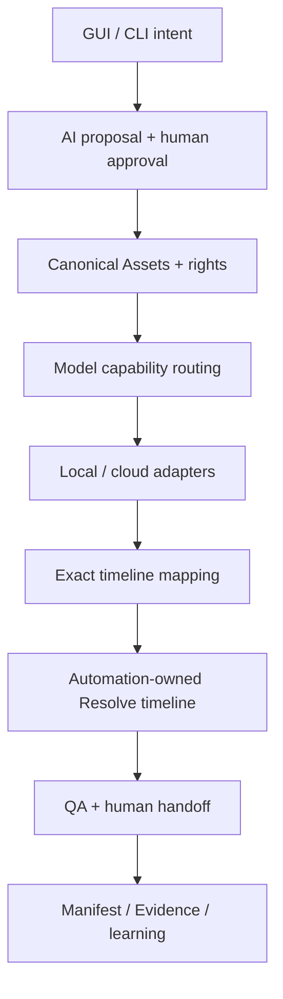
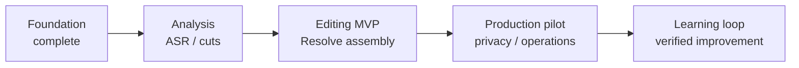

# BAI Video Production

**日本語** | [English](README.en.md)

[](https://github.com/baisound/bai_video_production/actions/workflows/ci.yml)
[](https://github.com/baisound/bai_video_production/actions/workflows/security.yml)
[](LICENSE.md)
[](https://www.python.org/)

動画素材の安全な取り込み、正規化、AI Provider選択、ローカル／クラウド生成、正確なTimeline Mapping、DaVinci Resolve連携を段階的に自動化するPython基盤です。

## はじめに読むページ

| 読む人 | ページ | 内容 |
|---|---|---|
| 初めて見る方・非開発者 | [やさしい導入ガイド](docs/user/GETTING-STARTED.md) | 何ができるか、費用・安全性、5分Demo、困った時 |
| 利用を検討する方 | [機能と開発状況](PROJECT.md) | 実装済み／未実装、現在地、次の到達点 |
| 開発者・Contributor | [開発者Architecture Guide](docs/developer/ARCHITECTURE.md) | Data flow、責任境界、Adapter、Test、変更手順 |
| OSS活動を確認する方 | [公開準備Schedule](docs/oss/PUBLIC-READINESS-SCHEDULE.md) | 期限、Evidence、採択準備、実利用Gate |

> **Project status: Alpha**
>
> 現在は基盤・Provider境界・Timeline Mappingを実装中です。「動画を投入するだけで完成動画が得られる」一般利用者向け製品版ではありません。未実装機能は実装済みとして表示しません。

## Why this project exists

動画自動化は、AI生成だけでなく、素材の権利、時刻精度、外部API費用、再試行、生成履歴、NLE上の人間の編集を一体で扱う必要があります。本プロジェクトは、AI判断と決定論的処理を分離し、元素材を破壊せず、結果を監査・再生成・手動修正できる共通基盤を目指します。

## Expected public impact

動画制作能力は、教育、地域文化、研究成果、福祉、非営利活動、小規模事業の情報発信を左右します。しかし現状のAI動画制作は、複数Provider、専門的なNLE操作、高い制作費、権利確認、機密素材の外部送信リスクを利用者自身がつなぎ合わせる必要があります。この複雑さは、資金や専門人材の少ない個人・組織ほど大きな障壁になります。

BAI Video Productionは、その障壁を下げるための共有可能な公共基盤を目指します。

- 特定Providerへ固定せず、予算・品質・プライバシーに応じてlocal、free、paid AIを選べるようにする。
- 人間の編集を置き換えるのではなく、提案・生成・配置を自動化し、素材差し替えと最終判断を人間に残す。
- 権利、同意、費用、来歴、再現性を後付けではなく制作工程の中心に置く。
- 失敗や中断を安全に再開できる共通仕様を公開し、同じ難題を各開発者がゼロから解き直す重複を減らす。
- 将来は、良い人間編集をEvidenceと評価指標から学び、悪い操作を無条件に模倣しない、検証可能な改善ループを構築する。

成功を「生成本数」だけでは測りません。制作時間と費用の削減、手動修正可能性、失敗後の回復率、権利情報の充足率、local処理率、再現可能性、利用者・Contributor・下流統合の増加を公開指標として追跡する方針です。現在はAlpha段階であり、この社会的効果は目標です。実利用のEvidenceを集め、実証できた値だけを公開します。

## Current capabilities

- Canonical Asset Registry、rights/checksum、Logical Path Resolver
- ffprobeを利用したMedia inspection、CFR Proxy、48 kHz analysis audio
- 正確な有理数Timebaseとsource-to-Timeline mapping
- DaVinci Resolve capability probeとAutomation-owned Timeline境界
- ComfyUI画像・動画生成のローカルRuntime境界
- Audacity/OpenVINO Noise Suppression・2-stem separation境界
- OpenAI、Anthropic、Googleのtext-capability adapter
- ElevenLabs TTS・SE・音楽生成adapter
- SunoAPI.org非同期音楽生成adapter
- Provider固定用途ではなく、正確なModel Capabilityに基づくRouting
- 企画・動画・画像・音声・音楽を一覧化する秘密情報なしのSettings Preflight API
- 原子的保存、破損検出、競合防止、旧形式移行を備えた日英GUI中立Settings契約
- 5用途の利用方法と優先Modelを変更できるローカル専用の日英Settings画面
- Provider・Model候補をGUIから追加・編集・無効化し、Adapter実装状態を区別するCatalog
- CredentialをProfile、Manifest、Evidenceへ埋め込まない実行境界

詳細な進捗は[PROJECT.md](PROJECT.md)と[Canonical Roadmap](docs/roadmap/PROJECT-ROADMAP-CANONICAL.md)を参照してください。

AI Connection設定画面は、インストール後に次のコマンドで起動できます。

```powershell
powershell -ExecutionPolicy Bypass -File .\tools\windows\run-ai-connection-settings.ps1
```

初心者向け手順は[AI Connection設定画面の使い方](docs/user/AI-CONNECTION-SETTINGS.md)、実装・安全境界は[Developer Contract](docs/developer/AI-CONNECTION-SETTINGS-WEB.md)を参照してください。

## Not implemented yet

- 動画制作全体を操作する一般利用者向け統合GUI（AI Connection設定画面のみ実装済み）
- 既存動画のASR、無音／フィラーCut、字幕配置の完成E2E
- 新規動画の企画から素材生成・Resolve組立までの完成E2E
- Runway、Luma、Kling、MiniMax等の全Adapter
- 自動公開

Provider Catalogへの掲載は、Adapter実装済みを意味しません。実装状態は`IMPLEMENTED / LOCAL_RUNTIME / PLANNED_ADAPTER`で区別します。

## Architecture principles

1. Canonical Manifestを正本とし、NLE Projectだけを正本にしない。
2. 元素材と人間所有Timelineを破壊しない。
3. AI提案と決定論的実行を分離する。
4. Model Capability、費用、locality、credential、availabilityを実行前に検証する。
5. 外部Jobはidempotency、checkpoint、Evidenceで安全に再開する。
6. 権利、プライバシー、API費用、公開安全性をProduct要件として扱う。

## Architecture overview



AIは企画・候補・生成を担当し、決定論的ServiceがAsset、時間軸、状態、再試行を管理します。人間の承認前に外部費用やNLE書込を開始しない構成を目指します。

## Roadmap at a glance



現在はFoundationとTimeline Mapping、Provider境界まで実装済みです。次の主要到達点は、既存動画からCut・字幕付きResolve Timelineを得るEditing MVPです。

## Requirements

- Python 3.11以上
- Windows 10/11を主要な実行対象として検証
- FFmpeg／ffprobe：Media処理機能で必要
- DaVinci Resolve Studio：Resolve連携機能で必要
- ComfyUI、Audacity/OpenVINO：該当するローカルAI機能でのみ必要
- 各クラウドProviderのAccount/API Key：利用するProviderだけ必要

外部Runtime、Model、API Keyは同梱せず、自動インストールしません。

## Installation

```bash
git clone https://github.com/baisound/bai_video_production.git
cd ai-video-production
python -m venv .venv
```

Windows PowerShell：

```powershell
.\.venv\Scripts\Activate.ps1
python -m pip install --upgrade pip
python -m pip install -e ".[dev]"
```

## Verification

```powershell
python -c "import ai_video_production; print(ai_video_production.__version__)"
python -m pytest -q
python -m compileall -q src tests
```

通常CIは有料API、ComfyUI、Audacity、Resolveを実行しません。実機Evidence Probeは、明示的な手順と安全条件を確認した場合だけ実行してください。

## Five-minute demo

API Key、ネットワーク、有料AI、実メディアを使わず、Provider capability routingと正確なNTSC Timeline Mappingを確認できます。

```powershell
ai-video-quickstart --output .\quickstart-output.json
Get-Content .\quickstart-output.json
```

詳しい期待値と、このDemoがまだ証明しない範囲は[Five-minute demo](docs/quickstart/FIVE-MINUTE-DEMO.md)を参照してください。

## Provider configuration

設定例：

- [AI Connection profile](profiles/ai-connection-creator.example.json)
- [External media profile](profiles/external-media-providers.example.json)

API KeyそのものはProfileへ保存せず、`credential://...`参照と環境変数等のCredential Storeを使用します。外部メディア生成はCredentialに加えて`authorization://...`の権利承認参照を要求します。

## Repository layout

```text
src/ai_video_production/   Product source
tests/                     Offline-first regression tests
schemas/                   Canonical JSON Schemas
profiles/                  Secret-free configuration examples
tools/                     Windows/WSL helper commands
docs/                      Design, roadmap and task evidence
.github/                   CI, security and contribution templates
```

## Security and privacy

脆弱性の詳細を公開Issueへ投稿しないでください。[SECURITY.md](SECURITY.md)の非公開報告手順を利用してください。API Key、Authorization Header、Cookie、署名URL、個人情報、未公開素材をIssue、Pull Request、ログ、Evidenceへ含めないでください。

## External services and rights

本プロジェクトはOpenAI、Anthropic、Google、ElevenLabs、Suno、SunoAPI.org、Runway、Luma AI、Stability AI、Replicate、fal.ai、MiniMax、Kling、Black Forest Labs、ComfyUI、Audacity、OpenVINO、FFmpeg、Blackmagic Design／DaVinci Resolveの公式製品ではなく、各社から承認・後援されたものではありません。

利用者は、各Provider／Model／素材の利用規約、料金、商用利用条件、著作権、肖像・音声同意、プライバシー、地域法令を確認する責任があります。外部サービス名とModel名は互換性説明のために使用します。

## Contributing

[CONTRIBUTING.md](CONTRIBUTING.md)を確認してください。大きな変更は実装前にIssueで目的と境界を共有し、1 Pull Requestを1目的に限定してください。[CODE_OF_CONDUCT.md](CODE_OF_CONDUCT.md)がすべてのProject spaceに適用されます。

初めてのContributionでは、`good first issue`のうちCredential、有料API、非公開素材、NLE書込を必要としないDocumentation・Fixture・Offline testを推奨します。

## Governance and releases

- Maintainer責任と意思決定：[GOVERNANCE.md](GOVERNANCE.md)
- Version履歴：[CHANGELOG.md](CHANGELOG.md)
- サポート範囲：[SUPPORT.md](SUPPORT.md)
- 第三者コンポーネント：[THIRD_PARTY_NOTICES.md](THIRD_PARTY_NOTICES.md)

## License

本Repositoryで独自に提供するコードと文書は、個別表示がない限り[MIT License](LICENSE.md)で公開します。第三者Runtime、Model、依存パッケージ、素材、商標にはそれぞれの条件が適用されます。

## English documentation

The complete English README, including public impact, architecture, quickstart, safety and contribution guidance, is available in [README.en.md](README.en.md).
