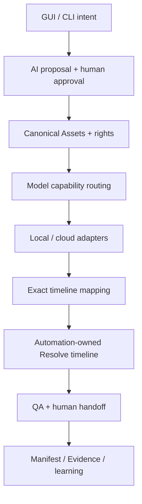
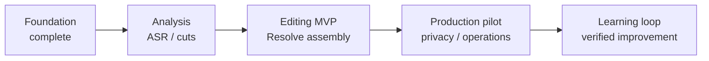

# BAI Video Production

**日本語** | [English](README.en.md)

[](https://github.com/baisound/bai_video_production/actions/workflows/ci.yml)
[](https://github.com/baisound/bai_video_production/actions/workflows/security.yml)
[](LICENSE.md)
[](https://www.python.org/)

動画素材の安全な取り込み、正規化、AI Provider選択、ローカル／クラウド生成、正確なTimeline Mapping、DaVinci Resolve連携を段階的に自動化するPython基盤です。

## はじめに読むページ

| 読む人 | ページ | 内容 |
|---|---|---|
| 初めて見る方・非開発者 | [やさしい導入ガイド](docs/user/GETTING-STARTED.md) | 何ができるか、費用・安全性、5分Demo、困った時 |
| OBSで学習用音声を録音する方 | [OBS Voice Capture Plugin 導入・利用ガイド](docs/user/OBS-VOICE-CAPTURE-PLUGIN.md) | 日本語・Englishで準備から保存・復旧まで説明する初心者向けガイド |
| 録音から音声Model作成の流れを確認する方 | [BAI Voice Model Builder 初心者向けガイド](docs/user/VOICE-MODEL-BUILDER.md) | Windows installer、起動、現在の表示専用範囲、将来のDataset・学習・style・Master WAV工程、source build |
| ローカル音声Modelを準備する方 | [Qwen3-TTS 0.6B Base セットアップ](docs/user/QWEN3-TTS-06B-BASE-SETUP.md) / [学習依存（flash-attn・TensorBoard）](docs/user/QWEN3-TTS-TRAINING-DEPENDENCIES.md) / [WSL2実測手順](docs/user/QWEN3-TTS-WSL2-VERIFIED-ENVIRONMENT.md) / [Windowsネイティブ検証手順](docs/user/QWEN3-TTS-WINDOWS-NATIVE-ENVIRONMENT.md) | 隔離環境、固定revision、GPU確認、Windows制約、学習を始めてよい条件 |
| 利用を検討する方 | [機能と開発状況](PROJECT.md) | 実装済み／未実装、現在地、次の到達点 |
| 開発者・Contributor | [開発者Architecture Guide](docs/developer/ARCHITECTURE.md) | Data flow、責任境界、Adapter、Test、変更手順 |
| OSS活動を確認する方 | [公開準備Schedule](docs/oss/PUBLIC-READINESS-SCHEDULE.md) | 期限、Evidence、採択準備、実利用Gate |

> **Project status: Alpha**
>
> 現在は基盤・Provider境界・Timeline Mappingを実装中です。「動画を投入するだけで完成動画が得られる」一般利用者向け製品版ではありません。未実装機能は実装済みとして表示しません。

## Why this project exists

動画自動化は、AI生成だけでなく、素材の権利、時刻精度、外部API費用、再試行、生成履歴、NLE上の人間の編集を一体で扱う必要があります。本プロジェクトは、AI判断と決定論的処理を分離し、元素材を破壊せず、結果を監査・再生成・手動修正できる共通基盤を目指します。

## Expected public impact

動画制作能力は、教育、地域文化、研究成果、福祉、非営利活動、小規模事業の情報発信を左右します。しかし現状のAI動画制作は、複数Provider、専門的なNLE操作、高い制作費、権利確認、機密素材の外部送信リスクを利用者自身がつなぎ合わせる必要があります。この複雑さは、資金や専門人材の少ない個人・組織ほど大きな障壁になります。

BAI Video Productionは、その障壁を下げるための共有可能な公共基盤を目指します。

- 特定Providerへ固定せず、予算・品質・プライバシーに応じてlocal、free、paid AIを選べるようにする。
- 人間の編集を置き換えるのではなく、提案・生成・配置を自動化し、素材差し替えと最終判断を人間に残す。
- 権利、同意、費用、来歴、再現性を後付けではなく制作工程の中心に置く。
- 失敗や中断を安全に再開できる共通仕様を公開し、同じ難題を各開発者がゼロから解き直す重複を減らす。
- 将来は、良い人間編集をEvidenceと評価指標から学び、悪い操作を無条件に模倣しない、検証可能な改善ループを構築する。

成功を「生成本数」だけでは測りません。制作時間と費用の削減、手動修正可能性、失敗後の回復率、権利情報の充足率、local処理率、再現可能性、利用者・Contributor・下流統合の増加を公開指標として追跡する方針です。現在はAlpha段階であり、この社会的効果は目標です。実利用のEvidenceを集め、実証できた値だけを公開します。

## Current capabilities

- Canonical Asset Registry、rights/checksum、Logical Path Resolver
- ffprobeを利用したMedia inspection、CFR Proxy、48 kHz analysis audio
- 正確な有理数Timebaseとsource-to-Timeline mapping
- DaVinci Resolve capability probeとAutomation-owned Timeline境界
- ComfyUI画像・動画生成のローカルRuntime境界
- Audacity/OpenVINO Noise Suppression・2-stem separation境界
- OpenAI、Anthropic、Googleのtext-capability adapter
- ElevenLabs TTS・SE・音楽生成adapter
- SunoAPI.org非同期音楽生成adapter
- Provider固定用途ではなく、正確なModel Capabilityに基づくRouting
- 企画・動画・画像・音声・音楽を一覧化する秘密情報なしのSettings Preflight API
- 原子的保存、破損検出、競合防止、旧形式移行を備えた日英GUI中立Settings契約
- 5用途の利用方法と優先Modelを変更できるローカル専用の日英Settings画面
- Provider・Model候補をGUIから追加・編集・無効化し、Adapter実装状態を区別するCatalog
- CredentialをProfile、Manifest、Evidenceへ埋め込まない実行境界

詳細な進捗は[PROJECT.md](PROJECT.md)と[Canonical Roadmap](docs/roadmap/PROJECT-ROADMAP-CANONICAL.md)を参照してください。

AI Connection設定画面は、インストール後に次のコマンドで起動できます。

```powershell
powershell -ExecutionPolicy Bypass -File .\tools\windows\run-ai-connection-settings.ps1
```

初心者向け手順は[AI Connection設定画面の使い方](docs/user/AI-CONNECTION-SETTINGS.md)、実装・安全境界は[Developer Contract](docs/developer/AI-CONNECTION-SETTINGS-WEB.md)を参照してください。

## Not implemented yet

- 動画制作全体を操作する一般利用者向け統合GUI（AI Connection設定画面のみ実装済み）
- 既存動画のASR、無音／フィラーCut、字幕配置の完成E2E
- 新規動画の企画から素材生成・Resolve組立までの完成E2E
- Runway、Luma、Kling、MiniMax等の全Adapter
- 自動公開

Provider Catalogへの掲載は、Adapter実装済みを意味しません。実装状態は`IMPLEMENTED / LOCAL_RUNTIME / PLANNED_ADAPTER`で区別します。

## Architecture principles

1. Canonical Manifestを正本とし、NLE Projectだけを正本にしない。
2. 元素材と人間所有Timelineを破壊しない。
3. AI提案と決定論的実行を分離する。
4. Model Capability、費用、locality、credential、availabilityを実行前に検証する。
5. 外部Jobはidempotency、checkpoint、Evidenceで安全に再開する。
6. 権利、プライバシー、API費用、公開安全性をProduct要件として扱う。

## Architecture overview



AIは企画・候補・生成を担当し、決定論的ServiceがAsset、時間軸、状態、再試行を管理します。人間の承認前に外部費用やNLE書込を開始しない構成を目指します。

## Roadmap at a glance



現在はFoundationとTimeline Mapping、Provider境界まで実装済みです。次の主要到達点は、既存動画からCut・字幕付きResolve Timelineを得るEditing MVPです。

## Requirements

- Python 3.11以上
- Windows 10/11を主要な実行対象として検証
- FFmpeg／ffprobe：Media処理機能で必要
- DaVinci Resolve Studio：Resolve連携機能で必要
- ComfyUI、Audacity/OpenVINO：該当するローカルAI機能でのみ必要
- 各クラウドProviderのAccount/API Key：利用するProviderだけ必要

外部Runtime、Model、API Keyは同梱せず、自動インストールしません。

## Installation

```bash
git clone https://github.com/baisound/bai_video_production.git
cd ai-video-production
python -m venv .venv
```

Windows PowerShell：

```powershell
.\.venv\Scripts\Activate.ps1
python -m pip install --upgrade pip
python -m pip install -e ".[dev]"
```

### 0.21.0への更新とProject移行

公開済みTagから利用する場合は、Repositoryを取得して`v0.21.0`を選び、同じ方法でインストールします。

```powershell
git fetch --tags
git checkout v0.21.0
python -m pip install -e ".[dev]"
```

既存のv0.20.1 Projectは読み取り可能です。移行が必要な場合も、登録済みのlossless変換だけをbackup付きcopy-on-writeで適用し、再open検証が成功するまで完了扱いにしません。Manifestがない旧Projectは、明示的なProject identityを指定してpreviewしてから取り込みます。未知・新しい・破損・曖昧な形式は自動変換せず、fail closedで停止します。Human-owned Projectを曖昧に上書きしないでください。

### Windows EXE build

WindowsクライアントをEXEにする場合は、ビルド用の依存を明示的にインストールしてから、ルートのバッチを実行します。

```powershell
python -m pip install -e ".[windows-build]"
.\build-windows-exe.bat
```

出力は `builds\BAI Video Production\BAI Video Production.exe` です。one-dir形式なので、EXEだけではなく `BAI Video Production` フォルダー全体を一緒に使用してください。バッチは依存の自動インストール、署名、Tag、Release、Deployを行いません。

前提条件、Pythonの選択方法、作り直し方、エラー対処は [Windows EXEビルド手順](docs/windows/BUILDING-WINDOWS-EXE.md) を参照してください。

### OBS Voice Capture Pluginとインストーラーのbuild

GitHub Releaseには、BAI Video Production本体に加えて次の3点を同梱します。

- `bai-voice-capture-0.1.0-dev.10-installer.1-windows-x64-setup.exe`：初心者向けWindowsインストーラー
- `bai-voice-capture-0.1.0-dev.10-windows-x64.zip`：検証・復旧用runtime package
- `bai-voice-capture-0.1.0-dev.10-source.zip`：対応するPlugin source

Release workflowは[`SHA256SUMS`](packaging/release-assets/task047/SHA256SUMS)を先に検証し、
3点のどれかが欠落または改変されていればRelease作成前に停止します。現在のinstallerは
OBS Studio 32.2.1 x64向けの未署名開発候補です。実際の導入と使い方は
[初心者向けガイド](docs/user/OBS-VOICE-CAPTURE-PLUGIN.md)を上から順に読んでください。

現在の公開Technical Previewは
[BAI Voice Capture v0.1.0-dev.10 installer.1](https://github.com/baisound/bai_video_production/releases/tag/obs-voice-capture-v0.1.0-dev.10-installer.1)
です。通常の利用者はRelease Assetsにある
`bai-voice-capture-0.1.0-dev.10-installer.1-windows-x64-setup.exe`を取得してください。
これは未署名のPre-releaseであり、BAI Video Production全体の安定版`v0.21.0`とは別です。
Dev.10 ControllerはOBS 32.2.1を起動したまま保存先選択、5秒GAIN確認、録音開始、一時停止、
再開、停止を行えます。GAINバーと`学習データ録音中` / `一時停止中`表示を常時確認してください。

sourceからPlugin、runtime package、installerまで作り直す場合は、空の作業directoryを使い、
OBS Studio `32.2.1` source（submoduleを含む）、Visual Studio Build Tools 2026、
Windows SDK `10.0.26100.0`、CMake `3.30.5`、Inno Setup `7.1.0`を用意します。
`cmake`をPATH任せにせず、実在するabsolute pathを指定してください。

```powershell
$ObsSource = 'C:\src\obs-studio-32.2.1'
$PluginSource = Join-Path $ObsSource 'plugins\bai-voice-capture'
$Cmake = 'C:\Tools\CMake\3.30.5\bin\cmake.exe'
$Ctest = 'C:\Tools\CMake\3.30.5\bin\ctest.exe'
$Csc = 'C:\Program Files\Microsoft Visual Studio\18\BuildTools\MSBuild\Current\Bin\Roslyn\csc.exe'
$Iscc = 'C:\Program Files (x86)\Inno Setup 7\ISCC.exe'

git clone --recursive --branch 32.2.1 https://github.com/obsproject/obs-studio.git $ObsSource
New-Item -ItemType Directory -Path $PluginSource | Out-Null
Expand-Archive .\packaging\release-assets\task047\bai-voice-capture-0.1.0-dev.10-source.zip -DestinationPath $PluginSource

& "$PluginSource\scripts\configure.ps1" -CMakeExecutable $Cmake
& "$PluginSource\scripts\build-controller.ps1" -Compiler $Csc
& "$PluginSource\scripts\build.ps1" -CMakeExecutable $Cmake -Configuration Release
& "$PluginSource\scripts\test.ps1" -CMakeExecutable $Cmake -CtestExecutable $Ctest -Configuration Release
& "$PluginSource\scripts\package.ps1" -Configuration Release

$Artifacts = Join-Path (Split-Path $ObsSource -Parent) 'artifacts'
$RuntimeZip = Join-Path $Artifacts 'bai-voice-capture-0.1.0-dev.10-windows-x64.zip'
$InstallerWork = Join-Path $env:TEMP 'bai-task047-installer-build-work'
$InstallerOut = Join-Path $env:TEMP 'bai-task047-installer-build-output'
powershell -ExecutionPolicy Bypass -File .\tools\windows\build-task047-obs-installer.ps1 `
  -RuntimeZip $RuntimeZip -InnoCompiler $Iscc `
  -WorkRoot $InstallerWork -OutputDirectory $InstallerOut
```

各scriptはconfigure、build、test、packageの順序とhashをfail closedで検査します。
既存の`$InstallerWork`または`$InstallerOut`は上書きせず停止するため、再buildでは新しい空pathを指定します。
現在の検証環境ではCMake 3.30.5がVisual Studio 18 generatorを認識しません。既存VS18 graphでの
Release再compileはPASSしていますが、fresh configureが失敗した場合に別CMakeやPATHへ暗黙fallbackせず停止し、
toolchain compatibilityを解決してから再実行してください。installer単体のcompileは、hash固定済みruntime ZIPと
Inno Setup 7.1.0を上記scriptへ渡して再現できます。
この手順はTag、GitHub Release、署名、OBSへのinstall/load、録音を自動実行しません。

## Verification

```powershell
python -c "import ai_video_production; print(ai_video_production.__version__)"
python -m pytest -q
python -m compileall -q src tests
```

通常CIは有料API、ComfyUI、Audacity、Resolveを実行しません。実機Evidence Probeは、明示的な手順と安全条件を確認した場合だけ実行してください。

### APIキーを安全に登録する / Secure API-key onboarding

WindowsではAI Connection設定画面の **APIキーの安全な保管 / Secure credentials** から、Model候補に必要なキーをWindows Credential Managerへ保存・削除できます。キーはProjectの設定JSONへ保存されず、画面には登録済みかどうかだけが表示されます。この操作だけで外部API、課金、生成、編集は始まりません。

On Windows, the local AI Connection screen can store or delete each required key in Windows Credential Manager. Project JSON and browser responses never contain the key; the screen exposes registration status only. This action does not contact a Provider or start billing, generation, or editing.

詳細と確認手順 / Design and verification: [`docs/ai-team/tasks/TASK-034/`](docs/ai-team/tasks/TASK-034/)

## Five-minute demo

API Key、ネットワーク、有料AI、実メディアを使わず、Provider capability routingと正確なNTSC Timeline Mappingを確認できます。

```powershell
ai-video-quickstart --output .\quickstart-output.json
Get-Content .\quickstart-output.json
```

詳しい期待値と、このDemoがまだ証明しない範囲は[Five-minute demo](docs/quickstart/FIVE-MINUTE-DEMO.md)を参照してください。

## 字幕編集基盤 / Subtitle editing foundation

FasterWhisperを使い、実際の音声・動画からTranscriptとSRTをローカル生成できます。モデル取得は明示許可制で、推論素材は外部APIへ送信しません。`0.16.0`では、企画時のナレーション予定、ASR結果、持込SRTを同じ字幕Workspaceで扱い、行の追加・挿入・修正・削除とSRT書出しができます。DaVinci Resolveへの字幕配置は次のAssembly Sliceで接続します。

The provider-neutral Transcript and Subtitle Plan receive real-media local FasterWhisper output and render deterministic, non-overlapping SRT. Version 0.16.0 adds one local review workspace for planned narration, ASR and imported SRT with row-level editing. DaVinci Resolve subtitle placement remains the next bounded slice.

```powershell
python -m pip install -e ".[asr]"
powershell -ExecutionPolicy Bypass -File .\tools\windows\run-task006-faster-whisper-transcription.ps1 -MediaPath ".\sample.mp4" -OutputDirectory ".\task006-transcription-output" -Model small -Language ja -Device cpu -AllowModelDownload
```

出力先には`transcript.json`、`subtitles.srt`、本文を含まない`transcription-report.json`が作成されます。初回取得後は`-AllowModelDownload`を外して実行できます。

字幕Workspaceは次で起動します。既定の`AI誤字・脱字チェック`はOFFで、0.16.0ではONにしても許可状態を保存するだけです。AI通信、課金、本文の自動変更は行いません。

```powershell
powershell -ExecutionPolicy Bypass -File .\tools\windows\run-subtitle-workspace.ps1
```

数GB動画の安定処理は、分割・Checkpoint・空き容量検査を追加する次Sliceまで保証しません。詳細は[字幕Workspace利用手順](docs/user/SUBTITLE-WORKSPACE.md)と[0.16.0詳細設計](docs/design/TASK-006_SUBTITLE-WORKSPACE_詳細設計_Ver1.0.md)を参照してください。

[TASK-006詳細設計 / Detailed design](docs/ai-team/tasks/TASK-006/detailed-design.md)

## 新規動画のScene設計 / New-production blueprint

実制作資料11点から一般化した`ProductionBlueprint`により、全体尺、Scene範囲、PERSON／SPACE／ASSET参照、素材の調達方法、Camera、Narration／SE／BGMを生成前に検証できます。実素材を優先し、密な日本語UI・表・数値を含むSceneでは、Locked参照・固定Camera・後段文字組版を必須にして文字崩れを予防します。

The validated Production Blueprint captures exact Scene timing, stable references, real-first sourcing, camera risk and per-Scene audio intent before generation. Dense text/UI scenes fail closed unless they use a locked reference, static camera and post-composited text.

[TASK-027 Production Blueprint詳細設計](docs/ai-team/tasks/TASK-027/production-blueprint-detailed-design.md) / [実制作ナレッジ取込記録](docs/ai-team/knowledge/real-production-workflow-intake-2026-08-10.md)

## Provider configuration

設定例：

- [AI Connection profile](profiles/ai-connection-creator.example.json)
- [External media profile](profiles/external-media-providers.example.json)

API KeyそのものはProfileへ保存せず、`credential://...`参照と環境変数等のCredential Storeを使用します。外部メディア生成はCredentialに加えて`authorization://...`の権利承認参照を要求します。

## Repository layout

```text
src/ai_video_production/   Product source
tests/                     Offline-first regression tests
schemas/                   Canonical JSON Schemas
profiles/                  Secret-free configuration examples
tools/                     Windows/WSL helper commands
docs/                      Design, roadmap and task evidence
.github/                   CI, security and contribution templates
```

## Security and privacy

脆弱性の詳細を公開Issueへ投稿しないでください。[SECURITY.md](SECURITY.md)の非公開報告手順を利用してください。API Key、Authorization Header、Cookie、署名URL、個人情報、未公開素材をIssue、Pull Request、ログ、Evidenceへ含めないでください。

## External services and rights

本プロジェクトはOpenAI、Anthropic、Google、ElevenLabs、Suno、SunoAPI.org、Runway、Luma AI、Stability AI、Replicate、fal.ai、MiniMax、Kling、Black Forest Labs、ComfyUI、Audacity、OpenVINO、FFmpeg、Blackmagic Design／DaVinci Resolveの公式製品ではなく、各社から承認・後援されたものではありません。

利用者は、各Provider／Model／素材の利用規約、料金、商用利用条件、著作権、肖像・音声同意、プライバシー、地域法令を確認する責任があります。外部サービス名とModel名は互換性説明のために使用します。

## Contributing

[CONTRIBUTING.md](CONTRIBUTING.md)を確認してください。大きな変更は実装前にIssueで目的と境界を共有し、1 Pull Requestを1目的に限定してください。[CODE_OF_CONDUCT.md](CODE_OF_CONDUCT.md)がすべてのProject spaceに適用されます。

初めてのContributionでは、`good first issue`のうちCredential、有料API、非公開素材、NLE書込を必要としないDocumentation・Fixture・Offline testを推奨します。

## AUTONOMYを使った開発

AUTONOMYは、BAI Development OSのルールに従い「次にどの開発作業を選び、どこまで自走してよいか」を決める仕組みです。BAI VIDEO PRODUCTION本体が勝手に動画制作、Provider利用、課金、Resolve/Cubase操作を始める機能ではありません。BVPは単独でも動作し、Development OSは開発時のGovernanceとして使います。

### 実際の起動から終了まで

今後の基本的な使い方は次のとおりです。

1. CodexでBAI Development OSの対象Repositoryを開きます。
2. 必要なら最新の引継ぎパックを渡します。
3. 「BAI Development OS Autonomous Development Modeで開始」と指示します。
4. Codex自身にCurrent State、Authority、Git、Autonomous Queueを確認させます。
5. 認可済みで依存関係上安全なRunnable Taskを自走させます。
6. Human Gateに到達したTaskだけをParkします。
7. 他に安全なRunnable Taskがあれば続行させます。
8. Contextが重くなったらHandoffを作り、Session Rotationします。
9. 認可済みRunnable Taskが無くなった時点で終了します。

AUTONOMYはRepositoryを最初から全部読む方式ではありません。原則として `Handoff → Current State → Authority → Current Task → Development Profile → 対象Source → 関連Test` の順に、現在のTaskに必要な最小Contextだけを読みます。引継ぎ資料はAuthorityそのものではなくInput Evidenceとして扱い、現在のcheckoutと照合してSource of Truthを決めます。

次の操作へ到達しても、自動では突破しません。

- Human Final Authority
- 実機または外部アプリへの変更
- 有料Provider実行
- 破壊操作
- Credential入力
- ReleaseまたはDeploy
- Authority競合
- 人間によるUX Acceptance

この場合は該当Taskだけを止めます。`TASK_BLOCKED != SYSTEM_BLOCKED` として、他に認可済みRunnable Taskがあればそちらへ進みます。

### 一番よく使う標準の開始指示

```text
BAI Development OS Autonomous Development Modeで作業を開始してください。

最初に現在のBAI Development OS Governance、Current State、Task Authority、Human Gate、Autonomous Queue、実際のGit checkout / branch / worktreeを確認し、現在のSource of Truthを確定してください。

引継ぎ資料は正しいものと仮定せず、現行Repositoryと照合してください。既存実装・不足要件・矛盾・古い情報がないか確認した上で進めてください。

認可済みかつ依存関係上安全なRunnable Taskについて、必要な詳細設計 → Critic → 修正 → 実装 → focused tests → 必要なfull regression → Evidence → checkpointまで自走してください。

Human Gate、実機操作、有料Provider、Credential、Release / Deploy、破壊操作などに到達したTaskは、そのTaskだけParkしてください。他に認可済みRunnable Taskがあれば継続してください。

Repository全文を毎回読み込まず、現在のTaskに必要な最小Contextだけを取得してください。未知のローカル変更は保護し、git add .、force push、reset --hard、protected mainへの直接pushは行わないでください。

Contextが大きくなった場合は安全なAtomic Unitを完了した後、Current State / Next Action / Human Gates / Autonomous Queue / Context Costを更新し、Conversation-freeで再開可能なHandoffを作成してSession Rotationしてください。

認可済みRunnable Taskが無くなるかHuman Authority以外で安全に続行不能になるまで進めてください。
```

### 基本の流れ

1. 作業ブランチで設計または実装し、テストを通してPull Requestを作ります。
2. GitHub Actionsがすべて緑になったらmainへマージします。
3. mainの正確なmerge SHAを確認し、リモート作業ブランチとローカル作業cloneを片付けます。
4. この完了を「mainマージ1回」と数えます。OPEN、失敗、未確認のPRは数えません。
5. mainマージが2回完了した時点で、BAI Development OSのQueueへ戻ります。
6. AUTONOMYが選んだTask、Authority、Allowed Filesを確認し、対象mainから新しくcloneして次の開発を始めます。

Human Gateが必要な操作に着いた場合は、その操作だけをParkします。別の安全で独立した作業がある場合は、AUTONOMYが選択した範囲内で続行できます。AUTONOMYは既存の権限を広げず、mainへの直接push、force push、有料Providerの無断実行、曖昧なユーザープロジェクトへの書き込みを許可しません。

### 使用例1：設計と実装を2回のマージで進める

- 1回目: Builder Design、Critic Review、Final Planを文書化して設計PRをmainへマージします。
- 2回目: fresh cloneで認可済み設計を実装し、回帰テスト後に実装PRをmainへマージします。
- 後処理後: 2回に達したためDevelopment OS Queueへ戻り、次のTaskを再判定します。

Codexへの依頼例:

```text
BAI Development OSのAUTONOMYを使って、現在のmainと直近2回のmergeを確認してください。
Queueが選んだTaskについて、まずDESIGN_ONLYで設計PRまで進めてください。
mainマージと後処理後はfresh cloneし、認可済みならIMPLEMENTATIONを進めてください。
2回目のmainマージ後は、必ず再びAUTONOMYへ戻ってください。
```

### 使用例2：Human Gateだけを止める

たとえば実DaVinci Resolveプロジェクトへの書き込みが対象不明なら、そのNative Gateは `PARKED` にします。一方、オフラインテストや文書同期など、対象が明確で独立した作業は止めずに進められます。

Codexへの依頼例:

```text
AUTONOMYで次の作業を選び、Human Gateが必要な外部操作だけParkしてください。
Provider課金、Resolve/Cubaseへのwrite、Production Activationは実行しないでください。
独立して安全なローカル実装とテストがあれば継続してください。
```

### 使用例3：Windows EXEビルド作業を進める

ビルド契約の実装はローカルで検証できます。依存取得にネットワークが必要な場合や、GUIでEXEを実行する段階は環境条件として分けて記録します。ビルド成功はRelease完了を意味しません。

Codexへの依頼例:

```text
AUTONOMYがWindows build-contractを選んだことを確認してからfresh cloneしてください。
build-windows-exe.batの静的テストと全回帰を実施し、依存が揃っていれば実EXEもビルドしてください。
生成物はbuilds/からstageせず、PRはソース、テスト、文書だけに限定してください。
```

### 使用例4：できるところまで全部進める

```text
AUTONOMYで開発を継続してください。

現在地点をBootstrapで確認し、Autonomous Queueから次の認可済みRunnable Taskを選択してください。

1つ終わったら、依存関係上安全で認可済みの次Taskへ進んで構いません。詳細設計、Critic、実装、Test、Evidence、checkpointまで可能な範囲を自走してください。

Human Gateが必要なTaskはParkし、他に進めるTaskがあればそちらを進めてください。

Release、Deploy、有料Provider、実機外部アプリ変更、Credential、破壊操作は勝手に実行しないでください。

認可済みで安全に進められる作業が無くなるまで続けてください。
```

これは「次の次、次の次の次まで進めて」に相当する指示です。

### 使用例5：今日は設計だけ先まで進める

AUTONOMYは必ず実装まで進むモードではありません。

```text
AUTONOMYのDesign-Ahead Modeとして進めてください。

現在の実装Taskは変更せず、認可されている範囲で後続Taskの詳細設計を先行してください。

各TaskについてCurrent implementationを確認し、既存機能を再実装しないようにした上で、詳細設計 → Critic Review → 修正版詳細設計まで進めてください。

Implementation Authorizationが無いTaskはコード変更しないでください。

設計上の不足、ロードマップ変更が必要な場合、Task Candidate / Roadmap Impactとして明示してください。
```

### 使用例6：このTASKだけを自走して完成させる

```text
TASK-XXXをAUTONOMYで完走してください。

TASK-XXXのCurrent Gate、Authority、Allowed Files、依存関係、既存実装、関連Testを最初に確認してください。

認可された範囲で詳細設計 → Critic → 実装 → focused tests → full regression → Evidence → Judge/checkpointまで進めてください。

TASK-XXX以外へ勝手に実装範囲を広げないでください。ただしTASK-XXXを完了するために別Taskが必要だと判明した場合は実装せず、Dependency / Roadmap Candidateとして報告してください。

Human Gateに達した場合は安全な状態でParkしてください。
```

### 使用例7：人間待ちになっても全体を止めない

```text
AUTONOMYで継続してください。

Human Gateが発生しても全体を停止しないでください。

TASK_BLOCKED != SYSTEM_BLOCKED を適用し、該当Taskだけ READY_FOR_HUMAN_GATE としてParkしてください。

その後、依存関係上安全で認可済みの別Taskが存在する場合は、自動的にそちらへ移動してください。

最後に、完了Task、Human Gate待ちTask、次のRunnable Task、Ownerに必要な操作を明確にしてください。
```

### 使用例8：長くなったチャットを引継いで続ける

```text
現在のAUTONOMY Sessionを安全にRotationしてください。

今のAtomic Unitを中途半端な状態で切らず、必要なTestとdiff確認まで完了してください。

その後、Current State、HEAD / branch / worktree、完了Task、In Progress、Human Gates、Autonomous Queue、Next Action、Context Cost、読み込む必要がある最小Contextを含むConversation-free Handoffを作成してください。

次のCodex Sessionが前の会話を一切知らなくても再開可能な状態にしてください。
```

会話履歴ではなく、Repository内のCurrent StateとHandoffを再開の正本にするのがSession Rotationの要点です。

### 使用例9：新しい要件を取り込みロードマップも変える

```text
AUTONOMYで新規要件を取り込んでください。

添付の要件・引継ぎ資料はAuthorityではなくInput Evidenceとして扱ってください。

まずCurrent mainと照合し、既に実装済み、部分実装、修正で対応、Contract Migration必要、新機能必要、不要/重複、不明に分類してください。

引継ぎに書かれていない不足要件もCritic視点で探してください。

新機能が必要ならRoadmap Impactを分析し、現在のロードマップのどこへ入れるべきか提案してください。

全詳細設計が完成してCriticを通るまでは、新規機能の実装へ進まないでください。

実装認可済み範囲だけ、その後AUTONOMYで実装・Test・Evidenceまで進めてください。
```

### 使用例10：夜間に安全な単位で長時間進める

```text
今夜はAUTONOMYで長時間実行してください。

現在のGovernanceとAuthorityの範囲内で、認可済みRunnable Taskを順次進めてください。

Taskごとに詳細設計、Critic、実装、Test、Evidenceを完結させ、中途半端な変更を大量に残さないでください。

Human Gateが必要ならそのTaskだけParkし、別のRunnable Taskへ移ってください。

Contextが非効率になったらSession Rotationしてください。

Release / Tag / Deploy / Paid Provider / Credential / destructive operation / native external mutationは実行しないでください。

朝までに進められるだけ進めるのではなく、安全なCheckpointを単位として進められるだけ進めてください。

最終報告には、完了、Park、未着手、次のHuman操作をまとめてください。
```

### 短い指示でも開始できる

BAI Development OSのAUTONOMY Root Promptが正式に読み込まれていれば、安全規則を毎回すべて繰り返す必要はありません。次の短い指示を標準として使えます。

```text
BAI Development OS AUTONOMYで開始。Current Stateから認可済みRunnable Taskを自走し、Human GateはPark、他があれば継続。
```

### AUTONOMYを止める条件

テスト失敗、同期元の不一致、未許可ファイルへの変更、権限不明、課金やProduction writeの可能性、復旧対象が曖昧な削除がある場合は、その時点で止めてEvidenceを残します。また、Ownerが「切りの良いところで切断」と指示した場合は、現在の安全なcheckpointと後処理を完了してからAUTONOMYへ新しい作業を選ばせません。

## Governance and releases

- Maintainer責任と意思決定：[GOVERNANCE.md](GOVERNANCE.md)
- Version履歴：[CHANGELOG.md](CHANGELOG.md)
- サポート範囲：[SUPPORT.md](SUPPORT.md)
- 第三者コンポーネント：[THIRD_PARTY_NOTICES.md](THIRD_PARTY_NOTICES.md)

## License

本Repositoryで独自に提供するコードと文書は、個別表示がない限り[MIT License](LICENSE.md)で公開します。第三者Runtime、Model、依存パッケージ、素材、商標にはそれぞれの条件が適用されます。

## English documentation

The complete English README, including public impact, architecture, quickstart, safety and contribution guidance, is available in [README.en.md](README.en.md).
