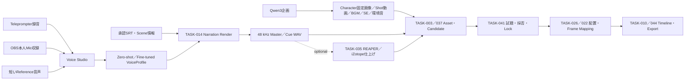

# BAI VIDEO PRODUCTION
## Voice Studio・ローカルAI・SRTナレーション・OBS自動収録 統合詳細設計書 Ver.1.2

| 項目 | 内容 |
|---|---|
| 文書種別 | Consumer Product 詳細設計・ロードマップ投入候補 |
| 対象製品 | BAI VIDEO PRODUCTION |
| 作成日 | 2026-08-15 |
| 状態 | `DESIGN_INTAKE / IMPLEMENTATION_NOT_AUTHORIZED_BY_THIS_DOCUMENT / APPEND_ONLY_REQUIREMENTS` |
| 対象リポジトリ確認基準 | `baisound/bai_video_production` の 2026-08-15 時点 `main` |
| 追加参照設計 | `BaiVoice_Studio_システム総合設計書_Ver3.6_ManagedRuntime_QualityCalibration統合版.docx` |
| 追加参照SHA-256 | `46C1A3BC5959A8C9D73E71AE78D10D7A89CABC8CC44C7BF52D2934C0E8E620C0` |
| 設計対象 | 無料・ローカルAI接続、企画、Character固定、画像・動画・BGM・SE・環境音、Voice Studio、本人音声学習、ゼロショット音声クローン、SRTナレーション、OBS、REAPER／iZotope、段階的多言語化 |
| 最終利用形態 | 単一の `BAI Video Production.exe` 内の統合機能 |
| 正本性 | 本文書単独では既存Canonical、TASK状態、実装権限、Provider実行権限を変更しない |
| 意思決定状態 | Q1～Q44回答済み／Critic二段階監査済み／Judge `PASS` |

---

## 目次

| 部 | 章 |
|---|---|
| 文書統制 | 0. 目的と継続改訂規則／1. エグゼクティブサマリー／2. TASK番号の混同防止 |
| 現行構成 | 3. 既存機能の確認／4. TASK-004の現在地とローカル準備 |
| Voice Studio | 5. 製品配置／6. テレプロンプター録音／7. GAIN・ノイズチェック／8. Datasetと品質達成率／9. AI録音コーチ／10. 感情・発声Style |
| ナレーション制作 | 11. SRTからWAV生成／12. 専有処理モード／13. Asset管理と配置／14. 字幕文章分割／15. Scene-aware Reflow |
| 外部連携 | 16. iZotope RX・REAPER／17. OBS Pluginと自動収録 |
| 実装設計 | 18. データモデル／19. UI／20. Job・復旧・同時実行／21. Privacy・Consent・Security／22. 失敗時の扱い |
| 開発計画 | 23. TASK割当案／24. 開発Phase／25. 受入基準／26. 非機能要件／27. 未確定事項 |
| 設計補強 | 28. BaiVoice Studio Ver.3.6シナジー統合判断／29. 監査済みDecision Register・実機Baseline・多言語Roadmap |
| 追跡情報 | 30. 参考資料／31. 原要求保存台帳／32. 改訂履歴 |

---

## 0. 本書の目的と継続改訂規則

本書は、これまでの対話で提示された要求、確認事項、設計判断、技術候補、ライセンス上の注意、TASK境界および実装上の安全条件を、重複を整理しながら一件も捨てず、実装に使用できる順序へ再構成した統合詳細設計書である。

今後、この対話で利用者が一言だけ次のように指示した場合、本文書の継続改訂を意味する。

> 清書して

この短縮指示の正式な意味は次のとおりとする。

1. 前回の清書以降に追加された要求・判断・調査結果を本文書へ加筆する。
2. 全体を読み直し、章順、用語、重複、TASK依存関係、設計整合性を再校正する。
3. 既存要求を削除しない。
4. 誤りを訂正する場合も、要求の存在を消さず、改訂履歴または「変更・置換された判断」として追跡可能に残す。
5. 新しい決定が過去の案を置換した場合、過去案を無言で消さず、`SUPERSEDED` と理由を記録する。
6. 利用者原文は本書末尾の「原要求保存台帳」に追記し、削除・要約置換しない。
7. 実装状況を確認せず、設計済み機能を実装済みと表現しない。

この規則により、本文は読みやすい最新版を保ち、末尾の台帳は要求の欠落を防ぐ追記専用記録として機能する。

---

## 1. エグゼクティブサマリー

本設計の中心は、利用者本人の声を安全に収録・学習し、SRTと映像内容から自然なナレーションWAVをローカル生成し、素材管理とタイムラインへ正確に配置できる「Voice Studio」をBAI VIDEO PRODUCTIONに統合することである。

Ver.1.2ではこれを無料Local Creative AI全体へ拡張し、企画、Character固定画像、Shot動画、Instrumental BGM、SE、環境音、SRT、本人Voiceを同じAsset／License／Timeline契約でEnd-to-End接続する。`無料` は商用利用可能を自動的に意味しないため、Artifact単位のLicense Gateを必須とする。

営業向けに一言で表すと、次の製品である。

> 自分の声を、短い見本音声でも、30分から2時間の本格収録でもAI音声化し、字幕と映像に合わせて感情付きナレーションを作り、そのまま動画素材として編集へ渡せるローカル中心の制作環境。

主な価値は次のとおりである。

- 自分の声をゼロショットまたは追加学習で再現できる。
- 普通、悲しみ、怒り、恐怖、張り上げ、実況者風、ささやき、中間ささやきを切り替えられる。
- 2時間分の原稿をテレプロンプター表示し、途中停止・再開しながら複数日に分けて録音できる。
- 録音前にGAIN、ノイズ、反響、音割れ、最大声量時の余裕を自動判定できる。
- 録音時間だけでなく、音素、品質、感情・スタイル分布から「あと何分必要か」を表示できる。
- AIが不足スタイルを見つけ、次に読むべき原稿、再録音箇所、追加原稿を提案できる。
- OBSの選択したマイク入力から、配信・実況・会議中の本人発話を自動収録候補として蓄積できる。
- SRTから感情を推定し、WAVカットを生成して適切なトラック・位置への配置案を作れる。
- 不自然に速い字幕・ナレーションを、前後の話速、シーン切り替え、映像内容、実際のTTS所要時間から検出し、タイミング、分割、文章を修正提案できる。
- ナレーション生成・音声学習時は、BAI VIDEO PRODUCTION内の他の重いAI処理を安全に停止し、GPU・CPUを音声処理へ専有できる。
- 生成したWAVは素材管理へ登録し、未処理版、ノイズ処理版、REAPER/iZotope仕上げ版を別Revisionとして保持できる。
- 無料Local環境から企画、Character固定、画像、Shot動画、BGM、SE、環境音まで開始できる。
- 非商用Model由来Assetを、本人の収益化動画へ誤って配置・Exportしない。
- 最初に60～90秒の作品を一周させ、日本語版から英語、中国、韓国、台湾へ段階展開できる。

本設計は既存のTASK-004を再開しない。TASK-004は「ローカルAI実行基盤」であり、Voice StudioとOBS連携は新規TASKとして採番監査を通す。完成したVoiceProfileを既存のBAI VIDEO PRODUCTION側TASK-014へ渡し、TASK-014がSRT・承認原稿からナレーションを生成する。



---

## 2. TASK番号の混同防止

本作業では二つの製品に同じTASK番号が存在する。

- **BAI VIDEO PRODUCTION側TASK**：動画制作製品の機能開発TASK。
- **BAI Development OS側TASK**：開発統制基盤のTASK。

例えば、BAI VIDEO PRODUCTION側TASK-014は「Voice TTS / Owner Narration」だが、BAI Development OS側TASK-014は「Adaptive Governance Calibration & Policy Learning」であり、無関係である。

本書で単にTASK-014、TASK-044などと記す場合は、特記がない限り **BAI VIDEO PRODUCTION側TASK** を意味する。

---

## 3. 既存機能の確認

### 3.1 P-NLE-3とは何か

P-NLE-3は、TASK-044を構成する四つの実装単位のうち、三番目の **Durable Export Queue composition** である。

営業向けには「編集中の動画を書き出す仕事を、安全に予約し、アプリを再起動しても状態を失わず、古い編集内容を誤って書き出さないための書き出し待ち行列」と説明できる。

P-NLE-3が保持する主な情報は次のとおりである。

- Project IDと正確なManifest checksum。
- Product version。
- Timeline Plan ID、Revision、Hash。
- Edit Plan／Assembly Planのchecksum。
- Export presetのID、Version、Checksum。
- 映像・音声の出力条件。
- 公開状態には実ホストパスを持たない論理出力先。
- Resolve ProjectおよびAutomation Timelineの識別子。
- 入力AssetのHash、権限区分、費用情報。
- 冪等なDurable Operation ID。

P-NLE-3はExportの準備とキュー管理を行うが、その時点ではResolveやRenderを自動許可しない。外部実行直前に入力を再検証し、入力が変わっていれば `STALE_REPREPARE_REQUIRED` とする。外部処理開始後に状態が不明になった場合は `UNKNOWN` とし、自動再実行しない。

したがって、P-NLE-3はAI接続機能、音声学習機能、SRT生成機能ではない。

### 3.2 TASK-044に含まれる内容

TASK-044は **Interactive Timeline / Unified NLE / Export Queue** であり、既存の最低限編集Shellを実用的な製品内NLEへ拡張したTASKである。

| 単位 | 機能 |
|---|---|
| P-NLE-1 | 動的トラック、クリップ選択、Seek、再生ヘッド、Zoom、Fit、Scroll、10,000クリップ規模の表示範囲限定 |
| P-NLE-2 | フレーム単位Trim、Snap、IN/OUT、追記型Timeline Revision、CAS、Undo/Redo |
| P-NLE-3 | Project・Timeline・Presetを固定した再起動耐性Export Queue、STALE／UNKNOWN／取消／照合 |
| P-NLE-4 | 統合Shell/UI、キーボード操作、Narrator、DPI・画面幅対応、Native Windows受入 |

TASK-044は既存の責務を再実装しない。

- Cut Candidate判断：TASK-007。
- Frame Mapping：TASK-022。
- Audio Placement：TASK-026。
- Resolve mutation：TASK-010。
- Render QA：TASK-011。
- Editor handoff：TASK-012。
- Desktop Shell：TASK-036。
- Project保存・復旧・Durable Job：TASK-043。

### 3.3 無料・ローカルAI接続の既存TASK

無料AIとの接続は一つのTASKだけでは完成しない。既存の役割は次のように分かれている。

| TASK | 機能 |
|---|---|
| TASK-003 | 生成物・録音物・派生WAVを安全に素材登録するAsset Registry |
| TASK-004 | ComfyUI、Audacity/OpenVINO、画像・動画・音声のローカル実行基盤 |
| TASK-006 | Transcript、字幕Revision、SRT入出力 |
| TASK-013 | 画像、動画、SE、BGMの創作判断、Provider選択、Rights／Cost／Evidence |
| TASK-014 | Owner Voiceによるナレーション生成 |
| TASK-020 | 全体Resource Admission、GPU／CPU／Disk監視とScheduler |
| TASK-022 | 正確なフレーム・時間変換 |
| TASK-023 | FasterWhisperローカルASR |
| TASK-026 | SE、BGM、Narrationの配置Plan |
| TASK-027 | 企画、脚本、Storyboard、Shot、Asset、音声を統合する制作Orchestrator |
| TASK-028 | `AI / FREE / AUTO / OFFLINE_ONLY / DISABLED` を含むProvider・Model Routing |
| TASK-032 | AI Connection Settings UI |
| TASK-033 | Provider／Model Catalog編集 |
| TASK-034 | OS Credential Store連携 |
| TASK-035 | REAPER、iZotope、Resolve Round-trip |
| TASK-036 | 一つのデスクトップアプリとしてのShell統合 |
| TASK-037 | Scene Asset Slot、Candidate、Dependency、LOCK／STALE |
| TASK-041 | 音声Candidateの試聴、Placement Review、Lock、DAW往復表示 |
| TASK-043 | Project、Autosave、Recovery、Durable Product Job |
| TASK-044 | 実用TimelineとExport Queue |

無料・ローカルAIから最終動画までの代表経路は次のとおりである。

```text
TASK-032/033  接続・モデル設定
        ↓
TASK-028      FREE / OFFLINE_ONLY ルーティング
        ↓
TASK-004      ローカルRuntime実行基盤
        ↓
TASK-013/014  生成判断・音声生成
        ↓
TASK-003/037  Asset登録・Scene Slot・Candidate
        ↓
TASK-041      音声試聴・採否・LOCK
        ↓
TASK-026/022  音声配置・正確なFrame Mapping
        ↓
TASK-010      Resolve Assembly
        ↓
TASK-011      Render QA
        ↓
TASK-044      Timeline確認・Export Queue
```

---

## 4. TASK-004の現在地とローカル準備

### 4.1 TASK-004の正式な役割

TASK-004は完了済みの **Media Normalization + Local Visual/Audio AI Runtime Foundation** であり、次の四Laneと共通Policyを持つ。

1. 正確なTimebase、CFR Proxy、48 kHz分析用WAV。
2. ComfyUIによるローカル画像生成。
3. ComfyUI／MiniMax H3によるローカル動画生成。
4. Audacity／OpenVINOによるNoise Suppressionと2-stem Music Separation。
5. 最低限のVRAM、Disk、Runtime、License AdmissionとEvidence。

TASK-004はRuntime基盤であり、企画、創作判断、字幕完成、ナレーション学習、配置、最終編集を単独で完成させるものではない。

### 4.2 TASK-004をスムーズに利用するためのローカル準備

開発・実機検証を円滑にするため、利用者環境には次を準備する。最終製品では可能な限りアプリ内PreflightとInstaller誘導へ置き換える。

#### 必須基盤

- Windows 11または製品が正式対応するWindows。
- 対応GPU Driver。NVIDIA利用時はモデルが要求するCUDA互換性を確認する。
- 十分な空きDisk。モデル、Cache、WAV、Proxy、生成動画は別々に容量を消費する。
- FFmpeg／ffprobe。製品が絶対パスを解決し、VersionとHashを記録する。
- 高速なSSD上のProduct Asset RootとModel Cache。
- 安定した48 kHz対応Audio InterfaceまたはUSB Microphone。
- 密閉型Headphone。Speaker回り込みを防止する。

#### 画像・動画生成

- ComfyUI本体。
- API形式Workflow JSON。
- 使用するCheckpoint／VAE／Text Encoder／Custom Node。
- FLUX.1 SchnellまたはSDXL等、用途とLicenseが確認できる画像モデル。
- MiniMax H3を使う場合は、対応Workflow、Model、必要VRAM、Custom Node、License承認。
- H3 Single-FrameやSpectrumを使う場合は、別途外部NodeのLicenseとRuntime Probe。

#### 音声処理

- Audacity。
- `mod-script-pipe` を有効化すること。ただしローカル限定とする。
- Intel OpenVINO AI Plugins for Audacity。
- Noise Suppression／Music Separationの実機Capability Probe。
- 4-stemは現在確認済みRuntimeでScript制御できないため、利用可能と偽装しない。

#### 字幕・ASR

- FasterWhisperのローカルModel Cache。
- Model downloadは明示許可時だけ行う。
- 日本語音声用の適切なModel sizeを、速度・VRAM・精度で選択する。

#### Voice Studio

- Voice EngineごとのPython／CUDA／Model環境をProduct Coreから分離する。
- 録音先は48 kHz PCMのProduct管理領域。
- OBS連携を使う場合はOBS StudioとBAI Voice Capture Plugin。
- 仕上げを行う場合はREAPER、必要に応じて正規LicenseのiZotope RX／Nectar等。

### 4.3 TASK-004単独と製品全体の充足状況

`TASK-004だけで足りるか` と `BAI VIDEO PRODUCTION全体で到達済みか` を混同しない。特にSRTは、TASK-004単独では不足するが、製品全体ではTASK-006／023により既存経路がある。

| 工程 | TASK-004単独 | 製品全体 | 2026-08-15実機状態 | 到達に必要なTASK |
|---|---|---|---|---|
| 企画・構成案 | × | △ | Local LLM未接続 | TASK-027／028／032／033。Qwen3 8B＋Ollamaを第一評価候補 |
| 画像生成 | △ | △ | ComfyUI／FLUX基盤あり。Character固定未実装 | TASK-004／013／027／037／041。初期VersionからCharacter consistency必須 |
| 動画生成 | △ | △ | H3実機生成は不安定。Wan2.2未評価 | TASK-004／013／027／020。H3を固定しWan2.2専用環境で評価 |
| BGM生成 | × | × | MusicGenはCapability発見のみ | TASK-013／026。ACE-Step 1.5を第一評価候補 |
| SRT作成 | × | ○ | FasterWhisper small経路あり | TASK-006／023／022。large-v3-turboを追加選択肢にする |
| SE生成 | △ | △ | H3 Foleyは実験段階 | TASK-013／026。Stable Audio 3系をLicense Gate付き評価候補 |
| 環境音生成 | × | × | 安定した正式経路なし | TASK-013／026。環境音Bed、Loop、Crossfade、Loudnessを実装 |
| 自分の声の学習 | × | 設計済み・未実装 | Voice Studio未実装 | 新規Voice Studio TASK／TASK-014／020／043 |
| SRTからナレーション | × | 設計済み・未実装 | Local Owner Voice経路未実装 | TASK-014／006／022／026／041 |

### 4.4 採用・評価候補

候補はFamily名ではなく、正確なModel／Checkpoint／Adapter／Quantization／Custom Nodeの組合せで審査する。`無料` は単一のBooleanにせず、無償入手、Local実行、商用利用可能、登録要否、売上上限、Notice義務を別属性で表示する。

| 分野 | Primary／評価候補 | 決定状態 | 用途・注意 |
|---|---|---|---|
| 企画 | Qwen3 8B量子化版＋Ollama | 第一評価候補 | 企画、台本、Scene分解、映像Prompt。通常は完全Local |
| 画像 | FLUX.1 Schnell＋ComfyUI | Primary候補 | 初期VersionからCharacter Profile、Reference、Seed、Pose、配色、目視承認を含む |
| 動画 | Wan2.2 TI2V-5B専用ComfyUI | `EVALUATION_CANDIDATE` | H3環境を更新しない。12GB VRAMでPeak、Offload、時間、失敗率を実測するまで正式採用しない |
| BGM | ACE-Step 1.5 | 第一評価候補 | 初期正式範囲はInstrumental。歌声・歌詞は検証限定 |
| SE／環境音 | Stable Audio 3系 Small SFX等 | License Gate付き評価候補 | One-shot SEとLoop可能な環境音Bed。CodeとModel Licenseを分離審査 |
| ASR／SRT | FasterWhisper small＋large-v3-turbo | 正式二段候補 | smallを削除せず案件単位で選択。日本語を初期正式対象 |
| Voice | Qwen3-TTS、Chatterbox、CosyVoice | Capability比較候補 | Zero-shot、Fine-tune、日本語、Style、商用License、12GB VRAMを実測 |

Character consistencyの合格はBase Modelだけで決めない。Checkpoint、LoRA、IP-Adapter、ControlNet、VAE、Custom Node、Reference素材を一つのLicense Chainとして審査し、自作、所有、または利用許諾済みReferenceだけを正式対象とする。

### 4.5 商用利用から隔離する候補

MusicGen／AudioGen、AudioLDM 2、MMAudio等、採用Artifactが非商用条件を持つ場合はCatalogから隠さないが、`PERSONAL_RESEARCH` または `NONCOMMERCIAL_EXPERIMENT` Projectだけで利用可能とする。

- 商用Projectでの生成開始をBlockする。
- 生成Assetと全Derived Assetへ利用制限を継承する。
- 商用Timelineへの配置と商用ExportをBlockする。
- 警告を無視するだけの解除を認めない。
- 別途商用License Evidenceを登録し、Artifact Hashと一致した場合だけ解除できる。

### 4.6 Eドライブ上の分離配置と導入順

```text
E:\BAI-Video-Production-AI\
├── runtimes\llm-qwen3\
├── runtimes\comfy-flux-character\
├── runtimes\comfy-wan22-evaluation\
├── runtimes\music-ace-step\
├── runtimes\audio-stable-audio\
├── runtimes\voice\
├── models\
├── datasets\
├── checkpoints\
├── cache\
└── staging\
```

1. 現行ComfyUI／H3環境をVersion・Hash固定し、更新しない。
2. Qwen3 8B＋Ollamaを企画用独立環境として導入する。
3. FLUX Character consistency用Workflowを独立して検証する。
4. Wan2.2 TI2V-5B専用ComfyUIを別Runtime／Model／Input／Outputで導入する。
5. ACE-Step 1.5を独立環境で評価する。
6. Stable Audio 3系をLicense Evidence付き隔離環境で評価する。
7. 非公開の短いTest Assetで速度、Peak VRAM、品質、失敗率、Licenseを記録する。
8. 合格したAdapterだけをTASK-013へ接続し、TASK-026で配置する。

Modelは必要時に容量、License、Hash、Runtime分離先を表示し、利用者の承認後に個別導入する。初回一括Downloadを既定にしない。

---

## 5. Voice Studioの製品配置

### 5.1 メニュー構成

Ver.1.0時点では既存の `音声` Workspace内へ置く案だったが、Q11の利用者決定により変更する。`Voice Studio` は独立したTop-levelメニューとし、既存の `音声` Workspace、Narration／TTS、Audio Placement Review、Audio Finishingへ双方向導線を持たせる。この変更は旧案を削除するものではなく、意思決定による置換として記録する。

```text
Voice Studio                     新規Top-level
├─ クイック音声クローン
├─ 本格録音・学習
├─ OBS自動収録
├─ データセット管理
├─ AI録音コーチ
├─ VoiceProfile比較・承認
├─ SRTナレーション生成          TASK-014
└─ Audio Finishing連携           TASK-035

音声                              既存Top-level
├─ Audio Placement Review        TASK-041
├─ Narration / TTS               TASK-014
└─ Voice Studioを開く            新規導線
```

すべて `BAI Video Production.exe` から到達できる。CLI、Python Worker、localhost UI、OBS Plugin、REAPER Bridgeは内部Capabilityまたは外部Adapterであり、通常利用者に別アプリ起動を要求しない。

### 5.2 VoiceProfile

VoiceProfileは安定IDとRevisionを持つ。

| Profile Mode | 内容 |
|---|---|
| `ZERO_SHOT` | 数秒から数分の本人Referenceで即時Clone |
| `FINETUNED_30MIN` | 合格音声30分を目標にした初期学習 |
| `FINETUNED_60MIN` | 発音・話速・感情の不足を追加した中間学習 |
| `FINETUNED_90MIN` | Style coverageを拡張した高品質学習 |
| `FINETUNED_120MIN` | 最大2時間の本格Datasetによる学習 |
| `ELEVENLABS` | 既存のOwner-trained Voiceを参照する外部Provider Profile |

生成方式はModel名とは別に、BaiVoice Studio Ver.3.6の考え方を取り入れた技術Tierで表す。

| Voice Quality Tier | 定義 |
|---|---|
| `QUICK_CLONE` | 単一または少量Referenceを使うZero-shot方式 |
| `MULTI_REFERENCE` | 複数の合格Referenceから本人性・Style安定性を高める方式 |
| `FINE_TUNED` | 承認済みDatasetから学習した専用Voice Model |

Tierは製品料金Planではなく技術属性である。`voice_quality_tier`、Reference数、合計Reference時間、Engine、Model、Dataset Revisionを保持し、Engineが対応しないTierは選択不可とする。

過去Projectは「最新Profile」ではなく、使用した正確な `voice_profile_id + revision + model_id + settings digest` を固定する。新しい学習で過去作品の声が無言で変わってはならない。

VoiceProfileは次を保持する。

- Owner identityのローカル参照。
- Consent subject、scope、用途、撤回状態。
- Engine family、Model ID、Checkpoint hash。
- Zero-shot referenceまたはDataset revisionの参照。
- 日本語、方言、発音辞書、固有名詞辞書。
- Style capability matrix。
- Default speed、energy、pitch、pause、prosody。
- Validation音声とHuman approval。
- 学習日、入力Hash、設定、評価結果。
- 外部Providerの場合はsecretを含まない間接Credential参照。
- Reference録音は原則48 kHz／24-bit／Mono／WAVを原本とし、BGM、SE、Reverb、強いEQ、Compression、Limiter、Noise Gateを避ける。

原録音、API key、生のprivate voice IDを公開ManifestやTelemetryへ出さない。

### 5.3 Voice Engine Adapter

Engine差をUIへ直接露出せず、次のCapabilityで扱う。

- Japanese support。
- Zero-shot cloning。
- Fine-tuning。
- Reference audio conditioning。
- Instruction-based emotion。
- Emotion reference audio。
- Speed、pitch、energy、pause制御。
- Whisper／breathy voice。
- CharacterまたはWord timing。
- Streaming preview。
- Offline-only execution。
- License state。
- Required VRAM／RAM。

初期検討候補は次のとおりである。

| Engine | 強み | 注意 |
|---|---|---|
| Qwen3-TTS Base | 日本語、短いReferenceによるClone、Fine-tuning候補、Apache-2.0 Repository | BaseのInstruction制御可否をCustomVoice／VoiceDesignと混同しない |
| Qwen3-TTS CustomVoice／VoiceDesign | 自然言語Style指示 | 固定Speaker用途と本人Clone用途の差をCapabilityで表す |
| CosyVoice | 日本語、Zero-shot、多言語、感情・速度・音量Instruction候補 | 使用CheckpointのLicenseを個別確認する |
| Chatterbox | Zero-shot、簡潔なExaggeration／CFG調整 | 日本語品質、Watermark、詳細Style制御を実機評価する |
| IndexTTS2 | Emotion vector／Reference／Text制御候補 | 商用利用は公式確認が必要なため初期商用Baselineにしない |
| XTTS-v2 | 広く知られたVoice Clone候補 | Model Licenseが非商用条件を含むため商用Baselineにしない |
| F5-TTS | Fine-tuning／Clone研究候補 | 公式Base Checkpointの非商用条件に注意する |

推奨は一つのModelへ固定せず、Zero-shot向けとFine-tuned／Expressive向けの複数Adapterを同じVoiceProfile Contractへ接続することである。

---

## 6. 2時間テレプロンプター録音

### 6.1 基本UX

2時間分の原稿を、下から上へゆっくりスクロールするテレプロンプターとして表示する。

必要機能は次のとおりである。

- 文字サイズ、行間、表示幅、背景色、反転表示。
- 手動Scroll速度とAI推奨速度。
- カウントダウン。
- 録音開始、一時停止、再開、終了。
- 一文戻る、直前Segment再録音。
- 途中でアプリを終了しても再開できるCheckpoint。
- 残り時間、合格済み時間、要再録時間。
- 現在要求されるStyleと強度。
- Microphone、Gain、Noise、Headroomの常時表示。
- 読み間違い検出とTranscript差分。
- 録音後の即時試聴、採用、保留、再録。

ScrollはAI推奨速度を初期値とし、録音中も利用者が手動微調整できるHybrid方式を正式採用する。AIによる音声追従は補助機能であり、読み位置を無断で飛ばさない。

利用者には連続録音に見せるが、保存は3～15秒程度の発話単位へ分割する。2時間を一つの巨大WAVとして学習へ渡さない。

### 6.2 Session設計

2時間を一度に録らず、20～30分程度のSessionへ分ける。

- Session開始時にGain／Noise Preflightを行う。
- Microphone、Sample rate、Device設定をSessionに記録する。
- 環境が変わった場合はDatasetで別環境として識別する。
- 休憩後は短い声質Consistency Checkを行う。
- Segmentは原文、Transcript、Style、強度、品質指標と結び付ける。
- Raw録音は不変とし、Trim／Denoise／NormalizeはDerived Assetにする。

一時停止時に発話中だったSegmentは `INCOMPLETE` として残し、再開は未完了文の先頭から3秒Countdown後に行う。途中の一文字から継ぎ足さず、最後に確定したSegmentを上書きしない。Crash時の未保存損失上限は1 Segment、3～15秒以内とする。

---

## 7. 録音前GAIN・ノイズ・音響チェック

### 7.1 Preflight手順

録音開始前に次を順番に実施する。

1. 5～10秒の無音。
2. 通常声の短文。
3. 小声およびささやき。
4. 通常より強い声。
5. 実況・張り上げで使用する最大想定声量。

測定項目は次のとおりである。

- Peak、RMS、LUFS相当の入力Level。
- Clip sample数。
- 最大声量時のHeadroom。
- S/N比。
- 定常Noise、50/60 Hz Hum。
- Room reverb、Echo、Speaker回り込み。
- DC offset。
- Dropout、Buffer underrun。
- 左右Channel不一致。
- Microphone距離変動。

### 7.2 自動調整と表示

ソフトウェアから制御可能なDeviceのみ自動Gainを提案・適用する。Hardware Gainを制御できない場合は、画面に「つまみを少し下げる」等の具体的誘導を表示する。

Gainの自動提案・適用は録音前Preflightに限定し、本番録音開始後は固定する。録音中のLevel変動は警告するが、Raw Datasetの一貫性を壊す自動Gain変更を行わない。

通常音声と最大張り上げ音声の両方で余裕を確認し、最大声量が0 dBFSへ接近しない設定にする。固定値だけで判定せず、Microphone self-noise、Room noise、Voice styleを含むProfile別基準を使用する。

利用者が指定する「感情強度95%」は、Amplitude 95%またはDigital Level -0.5 dBFSを意味しない。感情の演技強度と録音Levelは別Parameterであり、強い演技でも十分なHeadroomを確保する。

### 7.3 判定結果

- `READY`：録音開始可能。
- `READY_WITH_WARNING`：録音可能だが品質低下要因がある。
- `RECALIBRATE`：Gainや距離の再調整が必要。
- `BLOCKED`：Clip、著しいNoise、Device不良等により学習用収録を開始しない。

### 7.4 用途別品質Preset

| Preset | 用途 | Gate方針 |
|---|---|---|
| `DRAFT_RECORDING` | 機能確認・仮収録 | 重大Clip／DropoutをBlockし、Noise／ReverbはWarning |
| `YOUTUBE` | 本人の収益化動画 | 本人性、明瞭度、Noise、Timing、Loudnessを実用基準でGate |
| `PROFESSIONAL` | 正式VoiceProfile・高品質Master | 最も厳しい録音Consistency、Alignment、Human Reviewを要求 |

Presetの数値は実機CalibrationでVersion管理し、固定の95%を全用途へ流用しない。

---

## 8. Datasetと品質達成率

### 8.1 録音時間と合格時間

画面には必ず次を分けて表示する。

- 総録音時間。
- 自動分割済み時間。
- 品質合格時間。
- Human承認済み時間。
- Style別合格時間。
- 重複・Noise・誤読等で除外した時間。

30分、60分、90分、120分は「録音ボタンを押していた時間」ではなく、原則として承認済みの有効音声時間で評価する。

利用者は30／60／90／120分から目標を選択できる。AI Coachは選択時間を勝手に変更せず、不足音素、Style、品質不良率、重複率から「同じ目標を満たすための追加録音量」と「次段階へ進む価値」を補正提案する。

### 8.2 指標

一つの曖昧な百分率だけで完成を保証しない。次を個別表示する。

| 指標 | 意味 |
|---|---|
| 録音量達成率 | 目標に対する承認済み有効時間 |
| 日本語発音Coverage | 音素、モーラ、アクセント、数字、英字、固有名詞の網羅 |
| Style Coverage | 普通、感情、ささやき、張り上げ、実況等の分布 |
| 録音品質 | S/N、Clip、Reverb、Consistency |
| Transcript一致 | 原稿と実発話の一致 |
| Voice Consistency | Session間で声質・距離・Deviceが安定しているか |
| Model Validation | 学習後の未見文での自然さ・本人性・明瞭度 |
| Human Approval | 利用者が本番利用を承認したか |

### 8.3 「とてつもなく良い品質」Indicator

表示名称は誤解を避け、次のようにする。

- `Recording Readiness`：学習素材としての準備度。
- `Style Readiness`：Style別素材の充足度。
- `Estimated Additional Recording`：不足を埋める推定追加時間。
- `Model Quality Validation`：実際に学習して試聴・評価した品質。
- `PRODUCTION_APPROVED`：Humanが本番利用を承認した状態。

95%などの数値は「非常に良い音声を保証する確率」ではない。あくまで定義済みCoverageと品質条件に対する充足率である。最終品質は未見原稿の生成、複数Style、長文Consistency、Human listeningで判定する。

### 8.4 追加録音時間の推定

推定は単純な `目標120分 - 録音済み時間` ではない。不足音素、不足Style、再録率、Session品質、重複率から算出する。

例：

> 合格済み 74分。普通声は十分です。普通～ささやき8分、恐怖4分、実況者風12分、数字・固有名詞5分、品質不良再録6分を推奨します。推定追加録音は35分です。

---

## 9. AI録音コーチ

### 9.1 目的

現在の読み上げ原稿と収録結果を照合し、Style別達成率に応じて「次に何を読むべきか」を提案する。

### 9.2 Style別表示例

| Style | 目標 | 合格済み | 達成率 | AI提案 |
|---|---:|---:|---:|---|
| 普通 | 40分 | 35分 | 88% | あと5分。数字・固有名詞を優先 |
| 普通～ささやき | 20分 | 9分 | 45% | 中間強度の原稿を追加 |
| ささやき | 15分 | 6分 | 40% | 息の多い短文を追加 |
| 悲しい | 15分 | 12分 | 80% | 長い間を含む文章を追加 |
| 怒り | 15分 | 8分 | 53% | 強度30～70%を中心に追加 |
| 怖がる | 10分 | 3分 | 30% | 小声、震え、緊張表現を追加 |
| 張り上げ | 15分 | 10分 | 67% | 最大音量ではなく中高強度を追加 |
| 実況者風 | 20分 | 7分 | 35% | 得点、逆転、ピンチ場面を追加 |

### 9.3 提案種類

1. 既存原稿から次に読むべき箇所を選ぶ。
2. 重複が多い箇所を後回しまたはSkip候補にする。
3. 不足音素・Styleを含む追加原稿を生成する。
4. Noise、Clip、誤読Segmentを再録Queueへ入れる。
5. 強度分布の偏りを補正する。
6. 普通とささやきの中間など、連続的なBridge Styleを追加する。

不足Style用の新規原稿はLocal LLMが提案できるが、利用者が内容とStyleを承認した場合だけ録音Listへ追加する。既存原稿の無断削除、無断置換、自動収録開始を行わない。

提案例：

- 「普通の声は十分です。次は普通～ささやきを8分録音してください」
- 「サ行・ハ行のささやき音声が不足しています」
- 「怒り95%の録音が多すぎます。自然な怒り40～60%を追加してください」
- 「実況者風に、選手名・数字・得点・残り時間を含む原稿を提案します」
- 「この部分はNoiseが多いため達成時間に含まれていません。再録音を推奨します」
- 「似た文章が多いため、この先の5ページはSkip可能です」

### 9.4 提案カード

```text
AI推奨：ささやき50%
不足している「サ行・ハ行・息を含む表現」を収録します
推定所要時間：3分40秒
[この原稿を読む] [後回し] [別案を生成]
```

AIは提案のみ行い、利用者の原稿を無断削除せず、録音済みSegmentの採否を勝手に確定しない。

---

## 10. 感情・発声Style制御

### 10.1 感情と発声方法の分離

感情と声の出し方を一つのEnumへ混在させない。

#### 感情

- 普通。
- 悲しい。
- 怒っている。
- 怖がっている。
- 興奮。
- 緊張。
- 喜び。

#### 発声Style

- `NORMAL`：普通。
- `SOFT`：普通より柔らかい。
- `SOFT_WHISPER`：普通とささやきの中間。
- `WHISPER`：ささやき。
- `PROJECTED`：通る声。
- `SHOUT`：張り上げ。
- `SPORTS_COMMENTARY`：一般的なサッカー等の実況者風。

特定の実在人物を無断で模倣するPresetは作らず、「スポーツ実況」「ニュース調」等の一般的役割Styleとして実装する。

### 10.2 Parameter

- 感情強度 0～100。
- 発声Style強度 0～100。
- 話速。
- Energy。
- Pitch centerとPitch variation。
- Prosody variation。
- Pause length。
- Breathiness。
- Articulation／明瞭度。
- Voice identity保持とStyle表現のTrade-off。

ParameterはGlobal、Scene、Cueの三階層でOverrideできる。Cue指定が最優先だが、最終値と由来をManifestへ記録する。

### 10.3 Semantic Direction Compiler

利用者の演出意図を特定EngineのTagへ直接保存しない。BaiVoice Studio Ver.3.6のSemantic Direction設計を採用し、次の三層へ分離する。

```text
Intent Layer: 利用者が指定した感情・演技・強調・間・息・語尾
    ↓
Plan Layer: Engine Capabilityを踏まえた変換計画
    ↓
Execution Layer: Engine固有Request、Reference Style、Segment、後処理
```

Direction Typeは `EMOTION`、`STYLE`、`EMPHASIS`、`PAUSE`、`BREATH`、`SPEED`、`ENERGY`、`PITCH`、`ENDING_TONE`、`SPEAKING_INTENT`、`PROSODY_CONTINUITY` とする。

変換結果は次のいずれかを必ず記録する。

- `DIRECT`：Engineが直接表現した。
- `CONVERTED`：Reference StyleやSegmentへ変換した。
- `DEGRADED`：一部表現を簡略化した。
- `UNSUPPORTED`：表現できなかった。

変換優先順位は、Direct、Reference Style、Segment split、Fallback parameter、Post-process、Unsupportedを基本とする。例えばEngineが強調を直接扱えない場合、対象語の前後でSegment分割し、結合時にCrossfade、Click、Pitch jump、Loudness jump、Voice driftを検査する。

Direction処理Modeは次のとおりである。

| Mode | 動作 |
|---|---|
| `OFF` | 未対応Directionを無視するが、Loss Reportは残す |
| `WARNING` | 警告を表示して生成を継続する。初期推奨 |
| `STRICT` | 未対応Directionが一つでもあれば生成を開始しない |

生成前にDirection Loss Reportを表示し、「ささやきはDirect、PitchはUnsupported、Ending ToneはText分割へ変換」のように、利用者の意図がどこまで反映されるかを明示する。

### 10.4 強いStyleの生成

怒り、恐怖、張り上げ、実況者風、強いささやきはModelによる破綻が起きやすいため、初期設定では一発確定せず、2～3候補を生成してHuman Reviewへ送る。

本当に叫ばせることと、音量を上げることは別である。生成後のPeakは安全にNormalizeし、感情はProsody、Pitch、速度、Energy、発音で表現する。

---

## 11. SRTからナレーションWAVを生成する

### 11.1 入力

- 承認済みSRT Revision。
- Source scriptまたはNarration script。
- Production Blueprint／Scene情報。
- VoiceProfile Revision。
- Global／Scene／Cue Style map。
- 発音辞書。
- Target frame rateとTimeline origin。

### 11.2 出力

- `narration_master.wav`：全体確認・DAW用Master。
- CueまたはUtterance単位のWAV。
- Source SRT。
- Narration timing manifest。
- Style／Emotion companion manifest。
- Asset provenance、Hash、Model、Profile、設定。
- Placement Plan候補。

Canonical formatは原則48 kHz PCM WAVとする。必要に応じてRaw Provider outputも派生元として保持する。

### 11.3 SRTとStyleの関係

標準SRT本文へ独自Style tagを埋め込まない。互換性を保つため、StyleはSRT Cue IDと結び付くCompanion Manifestに保存する。

```text
SRT cue ID -> Narration utterance IDs -> WAV Asset IDs -> Style spec -> Placement IDs
```

字幕表示用Cueとナレーション発話単位は同一でなくてよい。ただし必ず相互Mappingを保持する。

### 11.4 Subtitle Text／TTS Text／Alignment Textの分離

BaiVoice Studio Ver.3.6の設計を取り入れ、文字列を一つに混在させない。

| Text | 用途 |
|---|---|
| Subtitle Text | 画面に表示する原文。原則不変 |
| Normalized Text | 数字、単位、日付、時刻、略語を読み用に正規化した内部文 |
| TTS Text／Japanese TTS Script | 発音、アクセント、Phrase、Pause、Endingを含む生成入力 |
| Alignment Text | Engineへ実際に渡したResolved ReadingからStyle Tag等を除いた照合用文 |

例えばSubtitle Textの「Cubase 13で48kHz編集」は維持し、TTS Textでは「キューベース サーティーンでヨンジューハチキロヘルツ編集」のように読みを解決できる。

### 11.5 Japanese Linguistic Processing Layer

日本語処理は後付けの品質機能ではなく、最初のSRT→WAV生成から適用する。

```text
Subtitle Text
  -> Text Normalization
  -> Morphological Analysis
  -> Phrase／OOV detection
  -> Reading Resolution
  -> Pronunciation Dictionary
  -> Accent Phrase Analysis
  -> Pause／Boundary Analysis
  -> Ending Type Analysis
  -> Manual Override
  -> Japanese TTS Script
  -> Semantic Direction Compiler
  -> Voice Engine Adapter
```

第一候補はSudachi系を形態素・正規化担当、Open JTalk／pyopenjtalk系をFull-context・アクセント解析担当とする。ただし各固有形式をCanonical DBへ保存せず、Engine非依存のToken／Mora／Accent Phrase Modelへ変換する。

辞書解決順序は次のとおりとする。

1. Scene Manual Override。
2. Project Dictionary。
3. User Dictionary。
4. System Dictionary。
5. Morphological Analyzer。
6. OOV Fallback。

Readingには `reading_source` を保持し、なぜその読みになったかをGUIで説明できるようにする。複数語で一つの名称となる「DaVinci Resolve」「BAI VIDEO PRODUCTION」は長いPhrase一致を優先する。

Manual Reading／Accentは `AUTO`、`DICTIONARY`、`MANUAL`、`LOCKED` を持ち、SRT再ImportやAnalyzer再実行で `LOCKED` を上書きしない。Cache keyにはNormalized Text、Dictionary Version、Analyzer Version、Override Versionを含める。

未知語は `UNKNOWN_READING` Issueとし、「今回だけ」「Project Dictionary」「User Dictionary」への登録先を選べる。採用した技術用語の読み・アクセントは次回Projectで再利用できる。

### 11.6 Forced Alignment／Word-level Timestamp

WAV全長だけでは先頭・末尾無音や実発話のはみ出しを正しく判断できないため、生成後にKnown TranscriptとAudioを照合する。

優先順位は次のとおりである。

1. TTS Engineが返すNative timestamp。
2. 日本語対応Forced Alignment Adapter。
3. CTC Alignment Adapter。
4. ASR-based coarse alignment。

Forced Alignmentは「どこで話したか」、ASRは「何と聞こえたか」を担当し、役割を混同しない。

Alignment Resultは、File duration、Speech start／end、Leading／Trailing silence、Word／Token time、Confidenceを持つ。日本語では文字、形態素、単語、モーラ、音素が一致しないため、`Subtitle Token -> Japanese TTS Token -> Alignment Token -> Word/Phone Alignment` のMappingを保持する。

Timing Statusは次のように更新する。

- `PERFECT`：発話開始が適正で、Safety Marginより十分前に終了。
- `GOOD`：実発話終端がAllowed内。
- `TIGHT`：Allowed内だがSafety Marginを侵食。
- `OVER`：実発話終端がAllowed Durationを超過。
- `TOO_SHORT`：欠落または不自然な高速発話を疑う。

Alignment Engineの一時障害はTake品質のHard Failとせず `ANALYSIS_ERROR` として再解析可能にする。Quality Analysisは `FAST`、`STANDARD`、`FULL` を持ち、通常制作はSTANDARD、Final候補のSelected TakeはFULLを推奨する。

### 11.7 感情推定

AIはSRT本文、前後文、Scene目的、映像内容、音楽、既存演出から感情とStyleを提案する。

- 得点、逆転、危機：興奮／実況者風候補。
- 回想、別れ：悲しみ候補。
- 不安、暗所、接近音：恐怖候補。
- 通常説明：普通またはSoft。
- 秘密、接近した語り：Soft Whisper／Whisper候補。

推定は確定ではない。Scene単位一覧で利用者が確認・一括変更・Cue修正できる。

### 11.8 実際の長さを使う

推定話速だけで配置しない。まず短いPreviewまたはCue生成を行い、実際のWAV durationと可能ならWord／Character alignmentを取得する。その実測値でScene LedgerとPlacementを再計算する。

---

## 12. ナレーション専有処理モード

### 12.1 目的

ナレーション生成またはVoice Model学習中は、ローカルGPU・CPU・Disk I/Oをその処理へ集中させ、他の重いBAI VIDEO PRODUCTION作業を止める。

### 12.2 停止対象

- 画像生成。
- 動画生成。
- BGM生成。
- SE／環境音生成。
- ASR。
- Proxy／重い解析。
- 他のTTS。
- Render／Exportのうち競合する処理。

### 12.3 停止しないもの

- Project Autosave。
- Recovery journal。
- Job status表示。
- Cancel／Pause操作。
- LightweightなUI操作。
- OSや他社アプリケーション全体。

「すべて停止」はBAI VIDEO PRODUCTIONが管理する競合Jobに限定する。Windowsや利用者の他作業を強制停止しない。

### 12.4 安全な切替

専有開始前にPreflight Dialogを表示し、停止／保留対象Job、使用GPU／CPU／Disk、推定時間と誤差範囲、Cancel可能境界、Crash時の復旧位置を示す。利用者の確認なしに専有状態へ移行しない。

- 未開始JobはQueueで保留する。
- Safe checkpointを持つJobはPauseする。
- 外部実行中で中断不能なJobは完了または安全境界まで待つ。
- 状態不明の外部JobをKillして成功扱いにしない。
- TTSはCue単位Checkpointを持ち、Crash後は完成済みCueをHash確認して再利用する。
- 同一Operation IDで二重生成しない。

### 12.5 完了後

1. 全CueとMasterをMedia Probeする。
2. Hash、Duration、Silence、Clipを検査する。
3. Canonical Assetへ昇格する。
4. 素材管理で `利用可能` と表示する。
5. 保留していたJobを再開候補として表示する。
6. 利用者が選択したJobだけを再Preflight後に再開する。自動一括再開しない。

---

## 13. Asset管理と配置

### 13.1 Asset Revision

次を別Asset／Revisionとして保持する。

- Raw recording。
- Trimmed segment。
- Training-approved segment。
- Raw TTS output。
- Canonical 48 kHz narration。
- Denoised narration。
- RX／REAPER finished narration。
- Cue WAV。
- Master WAV。

処理済みWAVでRawを上書きしない。

### 13.2 Scene Slot

TASK-037のSlotとして次を使用する。

- `NARRATION/SEGMENT-n`
- `SCENE-n/NARRATION`
- `SCENE-n/SFX-n`
- `GLOBAL/BGM-BED`
- `SCENE-n/AMBIENCE`

Candidateは `CREATED -> READY_FOR_AUDIT -> ACCEPTED / REJECTED / ALTERNATE_USE -> LOCKED` を通る。Rejectは物理削除ではない。上流SRTやVoiceProfileが変わった場合は依存Candidateを `STALE` にし、無言で差し替えない。

### 13.3 Placement

TASK-026が正確なFrame-based Audio Placement Planを作り、TASK-041でHuman Reviewする。承認後、TASK-010がAutomation-owned Resolve Timelineへ反映する。

NarrationはLoop禁止。Gain、Fade、Snap、Track roleをPlanに保持し、下流Adapterが未対応の場合は値を捨てずFail closedとする。

### 13.4 複数Take・Preview Master・Final Master

BaiVoice Studio Ver.3.6の非破壊Take設計をTASK-014／037／041へ適合させる。

- 標準3Take、最大5Takeを生成可能とする。通常Cueでは1Takeを既定にできるが、強い感情、Timing Tight、固有名詞、品質警告時は複数Takeを推奨する。
- TakeごとにAsset ID、VoiceProfile Revision、Engine、Style、Speed、実Duration、Alignment、Quality、生成Attemptを保持する。
- AI Recommended TakeとHuman Selected Takeを分離する。
- A/B CompareではModel名・Take番号を隠すBlind modeを提供する。
- Context PlaybackではPrevious／Current／Nextを実Timeline間隔で連続再生する。
- Take変更はSceneを破壊せず、Slotに新Candidateを追加する。

Preview Masterは制作途中の確認物であり、承認済みTake、Review中の推奨Take、未生成区間のSilence等を明示Policyで組み立てられる。Final Masterは原則として全Cue承認、Hard Failなし、Critical Pronunciation Errorなし、Timing Overなし、Export blocking Issueなしを要求する。

### 13.5 Quality Issue共通管理

品質警告は表示文を処理Codeへ直書きせず、`issue_code + severity + action policy + localized message resource` に分離する。

初期Issue Codeには次を含める。

- `AUDIO_CLIPPING`
- `TIMING_OVER`
- `VOICE_DRIFT`
- `PRONUNCIATION_ERROR`
- `NOISE_DETECTED`
- `LOUDNESS_DIFFERENCE`
- `UNEXPECTED_SILENCE`
- `TIMELINE_SYNC_ERROR`
- `ACCENT_MISMATCH`
- `UNNATURAL_PHRASE_BOUNDARY`
- `UNNATURAL_PAUSE`
- `ENDING_INTONATION_MISMATCH`
- `NUMBER_READING_ERROR`
- `WORD_ALIGNMENT_FAILED`
- `SPEECH_START_OFFSET`
- `SPEECH_END_OVERFLOW`

IssueはProblem area再生、別Take差し替え、再生成、再解析、許可されたIgnoreをActionとして持つ。Ignoreした場合もIssueを削除せず、利用者、日時、理由を監査記録に残す。

---

## 14. 字幕の読みやすさと文章分割

### 14.1 原則

Source wordingを不変の原典として保持し、Display Subtitle RevisionとNarration Utterance Revisionを別々に作る。

日本語の初期表示Presetは1行18文字前後、最大2行とする。18文字は絶対上限ではなく、表示時間、Font、Safe Area、英数字混在、固有名詞、意味単位により調整する。

分割処理では次を守る。

- 文節・意味のまとまり。
- 助詞を次行へ孤立させない。
- 固有名詞を途中で切らない。
- 数値と単位を分離しない。
- 否定表現を切断して意味を反転させない。
- 引用、括弧、疑問、感嘆のまとまり。
- 日本語と英数字の混在。
- 1行／2行の最大長、表示時間、読速度。
- Source textの文字欠落・重複が0であること。

### 14.2 AIと決定論処理の分担

- AI：意味の切れ目、言い換え、短縮案、映像文脈の理解。
- 決定論処理：Timecode、Frame境界、重複、Gap、最大行数、文字保存検査。
- Human：意味を変える言い換えと最終採用。

AI提案は新Revisionとして保存し、原文を上書きしない。

Display Subtitle、Narration Utterance、TTS Text、Alignment Textは同じScene／Cue IDで関連づけるが、分割位置とRevisionを独立させる。ナレーション都合の分割を字幕表示へ無条件反映しない。

---

## 15. Scene-aware Subtitle／Narration Reflow

### 15.1 目的

前後の読み上げ速度と比べて一部だけ不自然に速いCueを検出し、動画のScene切り替えと映像内容に合わせてSRTまたはNarration scriptの修正案を作る。

### 15.2 入力

- SRT CueとRevision。
- 文字数、モーラ数、単語Timing。
- 同一Style／同一Scene内の前後話速。
- Shot／Scene boundary。
- 映像の内容、動き、重要なVisual event。
- Narrationの感情・Style。
- 実際に生成したTTS duration。
- Sceneの延長可能性。

### 15.3 異常検出

比較対象は全動画の平均ではなく、同じStyle、話者、Scene用途の局所的な中央値を基本とする。実況、ささやき、通常説明を同じ速度基準で比較しない。

使用候補指標：

- 文字／秒。
- モーラ／秒。
- 実WAV durationに対するCue duration不足。
- 前後Cueとの速度比。
- Robust median deviation。
- Scene boundaryまでの余白。
- 画面内で理解すべき情報量。

### 15.4 修正優先順位

意味変更の少ない順に処理する。

1. Cueの開始・終了を安全範囲で広げる。
2. 前後Cueを結合または意味単位で再分割する。
3. Pause位置と発話単位を変更する。
4. 同じ意味を保つ短い言い換えを提案する。
5. Scene尺の延長案または映像Cut位置の変更案を提示する。

AIが勝手にSceneを延ばしたり、字幕を確定変更したりしない。

### 15.5 保護対象

- 人名、製品名、地名。
- 日付、時刻、得点、金額、割合。
- 否定、条件、比較。
- 引用。
- 法的・安全上重要な文言。
- Brand指定語。

保護対象を変更する提案はHard warningとHuman approvalを要求する。

### 15.6 Revisionと差分確認

TASK-044 Timeline上で、旧Cue、新Cue、WAV duration、Scene boundary、移動量、文章差分、影響Trackを確認できるようにする。採用後はTASK-006／022／026の新Revisionを作り、既存配置を上書きしない。

### 15.7 Context-aware Generation

Scene単位生成で声高、テンション、語尾、話速が分断される問題を抑えるため、BaiVoice Studio Ver.3.6のContext-aware Audio Promptを採用する。

入力を次の三層へ分離する。

- Voice Identity Reference：本人性の基準。常に安定した承認Referenceを使う。
- Context Reference：前Sceneの韻律、感情、Energy、語尾の流れ。
- Current Scene Instruction：現在SceneのTextとSemantic Direction。

Audio Contextの初期Policyは `STRICT_APPROVED` とし、前Sceneの承認済みSelected Takeだけを利用する。前Sceneが未承認の場合はText Contextのみを許可する。Context AudioはForced AlignmentのSpeech endから最後のAccent PhraseをPhrase-awareに抽出し、長さはEngine Capabilityで決める。

Context Modeは `OFF`、`TEXT`、`PREVIOUS_AUDIO`、`FULL` を持つ。初期導入はTEXTから始め、実機品質検証後にPrevious Audioを有効化する。

前Scene Take、Text、Style、Emotion、Context Compiler Versionが変わった場合、依存する後続Cueを `CONTEXT_OUTDATED` にする。自動Cascade再生成は既定OFFとし、再生成範囲は `CURRENT_SCENE_ONLY` を初期推奨とする。

前Sceneの誤差を連鎖させないため、Context AudioをBase Voice Referenceへ置換しない。Engineが両者を分離できない場合はBase Reference＋Text ContextへFallbackする。Context ON／OFF TakeをA/B比較し、Identity SimilarityとContinuity Similarityを別々に評価する。

---

## 16. iZotope RX 8／9／10／11／12とREAPER連携

### 16.1 結論

正規Licenseで利用者がインストール・ActivateしているiZotope RXを、生成済みまたは録音済みナレーションの仕上げに使用することは、一般的な制作連携として技術的に可能である。ただし、BAI VIDEO PRODUCTIONへRX本体を同梱したり、License情報を取得・配布したりしない。

### 16.2 推奨経路

1. TASK-014が未処理48 kHz WAVを生成。
2. TASK-003へRaw／Canonical Assetとして登録。
3. TASK-035がREAPER ProjectまたはRX External Editor handoffを作成。
4. RX Voice De-noise、De-click、De-plosive、De-reverb等を人間がPreview。
5. REAPERまたはRXから新しいWAVをRender。
6. Hash、Sample rate、Channel、Duration、Peak、LoudnessをQA。
7. `finished` Derived Assetとして登録。
8. TASK-041でRaw／Finishedを比較し、Humanが採用。

### 16.3 Version差

RX 8、RX 9、RX 10、RX 12を一括して同一Capabilityとみなさない。各環境で次をProbeする。

Q29の利用者決定により、本番Primaryは購入予定の **RX 12 Standard** とする。現在導入済みのRX 11 Standard、RX 10 Elements、RX 9 Audio Editor、RX 8関連Pluginは、既存Project互換性と移行確認用Fallbackであり、RX 12と同等Capabilityを仮定しない。

- Standalone Editorの有無。
- VST3／対応Plugin format。
- REAPERで認識されるPlugin ID。
- 使用可能Module。
- Preset保存と再現性。
- Batch Processing可否。
- RX Connect可否。
- Offline render時の挙動。

公開された安定Headless CLI／APIを前提にせず、GUI自動操作を通常設計へ採用しない。最初はREAPER ReaScriptでPlugin挿入、Preset、Renderを扱い、Assistant操作は `PROBE_REQUIRED` とする。

### 16.4 License境界

- 利用者がRX／REAPERの正規Licenseを所有する。
- BAI VIDEO PRODUCTIONはPlugin binary、Preset library、License keyを同梱しない。
- 機械ID、Serial、Account情報をEvidenceへ保存しない。
- 生成済み音声の仕上げ利用と、AI学習用DatasetをRXで前処理する行為を同一扱いにしない。
- 現行Native Instruments／iZotope EULAにはAI Trainingに関する制限があるため、RX処理後の音声を学習Datasetへ投入する用途はVendorへ書面確認するまで法的確定としない。
- 学習前処理には、Raw保存を前提に、Licenseが明確なローカル処理経路も用意する。

これは法的助言ではなく、製品設計上のFail-closed方針である。

### 16.5 DAW／NLE制作往復の共通契約

BaiVoice Studio Ver.3.6のScene ID First設計は、BAI VIDEO PRODUCTIONのAsset Registry、Frame Mapping、Resolve Assembly、Interactive Timelineと強い相乗効果がある。統合後は `scene_id` と `cue_id` を制作工程全体の安定キーとし、表示名、ファイル名、Take番号を識別子として代用しない。

| 連携対象 | 正とする情報 | 受け渡す情報 | 戻り情報 |
|---|---|---|---|
| Voice Studio | 原稿、読み、Direction、Take、承認 | Cue WAV、Master WAV、Manifest | 採用Take、品質判断 |
| Asset Registry | Immutable Asset ID、Hash、派生関係 | Canonical Asset参照 | 新規派生Asset ID |
| TASK-022 | 有理数Frame位置 | Frame位置、表示用Timecode | Frame適合結果 |
| REAPER／DAW | 音響処理、編集結果 | Scene/Cue、Marker、音声 | Rendered WAV、Marker変更案 |
| Resolve／TASK-010／044 | 映像Timeline | Scene/Cue、字幕、配置候補 | Timeline差分、字幕修正案 |

DAW／NLE向けPackageは、原則として次を含む。

```text
voice-export-package/
├── master/narration_master.wav
├── scenes/SC0001.wav
├── subtitles/narration.srt
├── manifests/voice_export_manifest.json
├── markers/scene_markers.csv
└── reports/direction_loss_and_quality_report.json
```

- Canonical timingはTASK-022の有理数Frameとする。`duration_ms` や `start_ms` はEngine連携・画面表示用の派生値であり、再配置の権威値にしない。
- BWF `TimeReference`、Original Time Position、WAV Marker等は、DAW／VersionごとのCapability Probeに合格した場合だけ使う。非対応時はManifest＋Marker CSVへFallbackする。
- `SC0001.wav` のような固定別名はExport Package内部に限る。Asset RegistryのCanonical Assetを同名上書きせず、Take変更時は新Assetと新Manifest Revisionを作る。
- Master、Scene WAV、SRT、Manifestは同じExport Revisionに固定し、混在を禁止する。

### 16.6 差分PackageとReverse Sync

前回Export Manifestと現在の承認状態を比較し、変更SceneだけをPatch Packageへ含める。差分理由は `TEXT_CHANGED`、`READING_CHANGED`、`DIRECTION_CHANGED`、`TAKE_CHANGED`、`TIMING_CHANGED`、`AUDIO_FINISHED` 等として記録する。

DAW／NLEからの戻りは、Cubase／REAPER／Resolve固有Projectを無理に直接解析する方式をPrimaryにしない。検証済みの交換形式、Marker、SRT、Manifest、Rendered Audioを介し、次の3者を比較するThree-way Mergeとする。

1. `base`：前回BAI VIDEO PRODUCTIONからExportしたRevision。
2. `current`：BAI VIDEO PRODUCTION内の現在Revision。
3. `import`：DAW／NLEから戻った変更候補。

Importは必ずDry Runで `ADD`、`UPDATE`、`DELETE_REQUEST`、`CONFLICT`、`UNMAPPED` を表示し、人間の承認後に新Revisionとして反映する。外部変更で原稿、採用Take、Canonical Asset、Placementを直接上書きしない。SRT Round-tripでもScene IDを字幕本文へ埋め込まず、ManifestでSubtitle Indexと対応づける。

---

## 17. OBS Pluginと自動発話収録

### 17.1 目的

OBSの選択した音声入力ソースから、配信、ゲーム実況、ライブ発話、会議中の本人発話を自動収録候補としてVoice Studioへ送り、自然なStyle Datasetを増やす。

台本録音を置き換えるのではなく、実況時の自然な興奮、張り上げ、間、言い淀み、通常会話を補完する。

### 17.2 構成

検証BaselineはOBS Studio 32.2.1 x64、実行ファイル `E:\SteamLibrary\steamapps\common\OBS Studio\bin\64bit\obs64.exe` とする。旧Cドライブ登録情報を実行先として採用せず、Steam更新後はPlugin ABI／Load／Audio callback／IPCを再Probeする。

```text
OBS selected audio source
    -> BAI Voice Capture audio filter plugin
    -> lock-free/ring buffer
    -> authenticated local IPC
    -> Voice Studio Capture Session
    -> VAD / speaker verification / ASR / quality gate
    -> style classification
    -> quarantine or training candidate
    -> human approval
    -> VoiceProfile training revision
```

OBS PluginはC／C++と公式Plugin Templateを基盤にし、選択SourceへAudio Filterとして追加する。`filter_audio` callbackでは重いAI処理を行わず、PCMと最小MetadataをQueueへ複製する。OBSの配信音声自体を変更しない。

OBS WebSocketは、接続、Scene、Source、Mute、録音開始停止、状態表示、Vendor event等のControl planeに使う。Raw PCMの常時転送はPluginからLocal IPCで行う。

### 17.3 Plugin機能

- 対象音声Sourceの明示選択。
- 録音開始、一時停止、再開、終了。
- 常時見える録音Indicator。
- Scene名、Source ID、Timestamp、Sample rate、Channel、Peak、RMS。
- Voice Studio接続状態。
- 緊急停止Hotkey。
- 直前30秒破棄。
- Source mute／Device disconnectへの追従。
- Backpressure時のDrop検出と警告。
- Raw PCMを勝手にNetworkへ送信しない。

### 17.4 会議収録の標準Policy

標準は **自分専用Microphoneだけを学習対象にする**。

| 入力 | 標準動作 |
|---|---|
| 自分専用Mic | 自動収録候補にできる |
| 相手の会議音声 | 学習対象外 |
| 自分と相手が混在 | Quarantineし、本人分離を確認するまで不採用 |
| Game音・BGM混入 | 原則不合格または要確認 |
| 自分以外の声を検出 | 自動除外 |

ほかの参加者の声を学習させる場合は、本人ごとの明示同意、目的、保持期間、撤回方法を記録する。初期製品はOwner本人のみを正式対象とする。

### 17.5 自動処理

- VADで発話区間を3～15秒へ分割。
- Speaker verificationでOwner確率を算出。
- FasterWhisperでTranscriptを作成。
- Echo、BGM、Game音、Noise、Clip、Dropoutを判定。
- 重複音声を除外。
- 感情・発声Styleを候補分類。
- 現在不足しているStyle／音素への貢献度を計算。
- 合格候補だけをDataset Reviewへ送る。

表示例：

> 本日のOBS収録 42分。学習候補18分。本人以外の声7分、BGM混入9分、品質不良8分を除外。張り上げ達成率35%から61%。実況者風はあと約12分を推奨。

### 17.6 自動収録と自動学習の分離

会議・配信中にModelをOnline Fine-tuneしない。理由はGPU競合、誤った話者の混入、品質劣化、破壊的忘却、復旧困難である。

1. OBSで自動収録。
2. 軽量品質判定。
3. 終了後に候補確認。
4. Humanが合格音声を承認。
5. 専有処理モードで新VoiceProfile Revisionを学習。
6. 旧Modelと比較試聴。
7. 良いRevisionだけを `PRODUCTION_APPROVED` にする。

### 17.7 License構成

OBS Studioと公式Plugin TemplateはGPL-2.0-or-laterである。OBSへLinkするPlugin部分はGPL互換LicenseでSource公開する構成を第一候補とし、BAI VIDEO PRODUCTION本体とはLocal IPCで分離する。配布時には結合作品性とNoticeを法務確認する。

---

## 18. データモデル

### 18.1 VoiceRecordingSession

```yaml
session_id: string
owner_voice_profile_id: string
capture_mode: TELEPROMPTER | OBS | IMPORT
device_fingerprint_redacted: string
sample_rate: 48000
channels: 1
started_at: timestamp
ended_at: timestamp?
environment_profile_id: string
preflight_report_id: string
consent_record_id: string
checkpoint_revision: integer
status: READY | RECORDING | PAUSED | REVIEW | COMPLETED | ABORTED
```

### 18.2 VoiceSegment

```yaml
segment_id: string
session_id: string
raw_asset_id: string
source_text_ref: string?
transcript_ref: string
start_sample: integer
end_sample: integer
speaker_verification_score: number
emotion_label: string
vocal_style: string
style_intensity: number
quality_metrics_ref: string
review_state: CANDIDATE | ACCEPTED | REJECTED | RERECORD
rejection_reasons: [string]
```

### 18.3 VoiceDatasetRevision

```yaml
dataset_revision_id: string
voice_profile_id: string
parent_revision_id: string?
accepted_segment_ids: [string]
accepted_minutes: number
phonetic_coverage_digest: string
style_coverage_digest: string
quality_summary_digest: string
consent_scope_digest: string
immutable_manifest_hash: string
```

### 18.4 VoiceStyleSpec

```yaml
emotion: NORMAL | SAD | ANGRY | AFRAID | EXCITED | TENSE | HAPPY
emotion_intensity: 0..100
vocal_mode: NORMAL | SOFT | SOFT_WHISPER | WHISPER | PROJECTED | SHOUT | SPORTS_COMMENTARY
vocal_intensity: 0..100
speed: number
energy: number
pitch: number
prosody_variation: number
pause_scale: number
breathiness: number
identity_priority: number
```

### 18.5 NarrationRenderJob

```yaml
job_id: string
project_id: string
source_srt_revision: string
voice_profile_revision: string
style_manifest_hash: string
dictionary_hash: string
engine_id: string
model_id: string
exclusive_resource_policy: VOICE_EXCLUSIVE
cue_checkpoint_ids: [string]
status: QUEUED | PREFLIGHT | RUNNING | PAUSED | PARTIAL | COMPLETED | FAILED | UNKNOWN
result_asset_ids: [string]
```

### 18.6 ProjectUsagePolicy／LicenseLineage

```yaml
project_usage_class: COMMERCIAL_OWNER_VIDEO | PERSONAL_RESEARCH | NONCOMMERCIAL_EXPERIMENT
model_artifact_id: string
model_license_class: COMMERCIAL_ALLOWED | NONCOMMERCIAL_ONLY | RESTRICTED | UNKNOWN
commercial_use_allowed: boolean
license_evidence_id: string?
license_evidence_hash: string?
asset_usage_restriction: NONE | NONCOMMERCIAL | NO_EXPORT | REVIEW_REQUIRED
restriction_inherited_from: [string]
export_block_reason: string?
```

License制限はModelから生成Asset、派生Asset、Timeline Candidate、Export Packageへ単調に継承する。より制限の弱い派生物へ自動変換してはならない。`UNKNOWN` は商用利用不可としてFail closedにする。

### 18.7 CharacterProfile

```yaml
character_profile_id: string
revision: integer
display_name: string
approved_reference_asset_ids: [string]
reference_rights_evidence_ids: [string]
identity_anchors: [FACE, HAIR, BODY_TYPE, PRIMARY_COLORS]
scene_variable_traits: [COSTUME, POSE, EXPRESSION, BACKGROUND]
model_artifact_chain_ids: [string]
default_seed_policy: string
consistency_threshold_profile_id: string
human_approved_at: timestamp?
```

一つのProjectで複数Profileを利用でき、承認済みProfileを別ProjectへRevision付きで複製できる。顔、髪、体格、基調色をIdentity anchorとし、衣装、Pose、表情、背景はScene Directionで変更可能とする。意図的な外見変更は新Revisionにする。

### 18.8 ModelArtifact

```yaml
model_artifact_id: string
provider_family: string
exact_model_id: string
checkpoint_hash: string
adapter_hashes: [string]
quantization: string?
runtime_id: string
license_evidence_id: string
commercial_use_allowed: boolean
registration_required: boolean
revenue_limit: string?
notice_requirements: [string]
capability_probe_id: string
status: CATALOG_ONLY | EVALUATION_CANDIDATE | APPROVED | BLOCKED | DEPRECATED
```

### 18.9 ExternalResearchAudit

```yaml
research_run_id: string
project_id: string
initiated_by: string
search_terms: [string]
approved_destinations: [string]
sent_project_excerpt_hash: string?
redaction_report_id: string
started_at: timestamp
source_urls: [string]
result_proposal_id: string
```

---

## 19. UI詳細

### 19.1 Voice Studio Dashboard

- 独立Top-level menuから開く。
- Zero-shot／Fine-tune選択。
- 現在のVoiceProfileとRevision。
- 録音量、品質、Style、Model検証の四Indicator。
- 推定追加録音時間。
- 次に行う推奨Action。
- 最近のSession、OBS Capture、Training Job。

通常画面は利用者が判断する項目だけを表示し、`詳細設定` でEngine、Model、Direction変換、Alignment、音響Threshold、Calibration、Runtime情報を展開する。詳細設定を閉じても選択済み値と変更履歴を失わない。

### 19.2 Recording Screen

- 中央：Teleprompter。
- 上部：Style、強度、残り時間、Session状態。
- 左：原稿章、録音済み／未録音／再録。
- 右：Level meter、Noise、Headroom、AI Coach。
- 下：録音、一時停止、再開、直前再録、採用、保留。

### 19.3 Dataset Review

- WaveformとTranscript。
- Raw／Processed切替。
- 本人判定、Noise、Clip、Style、重複。
- Accept、Reject、Rerecord、Alternate use。
- Reject理由。
- 一括操作前の確認とUndo可能な論理操作。

### 19.4 VoiceProfile Compare

同じ未見原稿をZero-shot、30、60、90、120分Modelで生成し、Blind比較できる。

- 本人性。
- 自然さ。
- 明瞭度。
- 長文Consistency。
- Style追従。
- 発音辞書追従。
- Artifact。

選択したRevisionだけを本番既定にする。

### 19.5 SRT Narration Screen

- Cue一覧とScene境界。
- 推定StyleとHuman Override。
- 推定時間／実WAV時間。
- 読速度Warning。
- 原文、短縮案、Timing案の差分。
- Cue Preview、Scene Preview、全体Render。
- Asset登録とPlacement Reviewへの導線。

---

## 20. Job・復旧・同時実行

### 20.1 Durable Job

Voice Training、SRT Narration Render、OBS post-processing、RX／REAPER RenderはTASK-043のDurable Product Jobと同等の再起動耐性を持つ。

- Queue前にRequest fingerprintを確定。
- 外部Job IDを取得したら即時保存。
- 同一Fingerprintの二重実行を防止。
- Completed Cue／SegmentはHash検証して再利用。
- 外部状態不明は `UNKNOWN` とし、自動再試行しない。
- Cancelは安全な状態だけに適用する。

### 20.2 Resource Scheduling

初期実装では単純なExclusive lockでもよいが、最終的にはTASK-020のResource Admissionへ統合する。

- `GPU_EXCLUSIVE_VOICE_TRAINING`
- `GPU_EXCLUSIVE_NARRATION_RENDER`
- `GPU_SHARED_LIGHT_ASR`
- `CPU_AUDIO_QA`
- `DISK_HEAVY_MEDIA_RENDER`

VRAM不足、Disk不足、Model不在、Device変更は実行前にFail closedとする。

各Jobは実機Benchmarkから推定完了時間、推定速度、使用Hardware、品質Preset、推定誤差範囲を表示する。RTX 4070 SUPER 12GBを超える処理では、CPU Offloadと軽量Presetの品質・時間・機能差を示し、利用者が選んだ場合だけ実行する。

### 20.3 Managed AI Runtime

BaiVoice Studio Ver.3.6のManaged Runtime設計を、BAI VIDEO PRODUCTIONのローカルAI運用へ取り込む。目的は、利用者にPython、pip、CUDA Toolkit、venv、Conda、PATH編集を要求せず、TASK-004で確立したローカルRuntime基盤を製品配布可能な形へ発展させることである。

基本原則は次のとおり。

- System Python、利用者のvenv／Conda、System PATHを使用・変更しない。
- NVIDIA／AMD／Intel DriverはOS側の管理対象とし、BAI VIDEO PRODUCTIONが無断更新しない。
- Application、Core Runtime、日本語解析、TTS Engine、Alignment、Quality Analyzer、Modelを別ComponentとしてVersion固定する。
- RuntimeはVersion DirectoryへStagingし、Hash／Signature／Compatibility／Health Check合格後にActive PointerをAtomic切替する。
- Update失敗時は直前の既知良好RuntimeへRollbackし、ProjectとVoiceProfileを巻き戻さない。
- Model更新とRuntime更新を分離し、既存ProjectのPinを無言で変更しない。
- RepairはManifestとHashの差分だけを復旧し、全再導入を第一選択にしない。
- Online Installerに加え、署名・Hash付きOffline Bundleと再現可能なVersion Lockを提供する。
- CPU Fallbackは品質・所要時間をPreflight表示し、人間が選択した場合だけ使う。GPU失敗から無言でCPUへ切り替えない。

Runtime Manifestの最小項目は `component_id`、`version`、`platform`、`architecture`、`device_backend`、`dependencies`、`compatible_models`、`files[]`、`sha256`、`signature`、`installed_at`、`health_status` とする。Runtime Supervisorは起動前Capability Probe、Process監視、Log、Crash回数、有界再起動、Safe Modeを担当する。

### 20.4 Model・GPU・Storage・診断管理

- Model ManagerはLicense、入手元、Version、Hash、Disk容量、対応Engine、商用利用判定、導入状態を表示する。
- GPU ManagerはVRAM総量／空き、予約量、互換Backend、推定速度を表示し、TASK-020へAdmission要求を出す。
- Storage ManagerはProjects、Raw recordings、Takes、Masters、Datasets、Checkpoints、Cache、Logs、Backupsを分類表示する。
- BackupはProject Metadata、辞書、Direction、VoiceProfile、Training Checkpoint、採用Take、Manifestを対象にできる。巨大なBase ModelはID／Version／Hash参照だけでもよい。
- Diagnostics Bundleは秘密情報、音声本文、Voice embedding、License key、個人PathをRedactする。
- Safe Modeでは外部Plugin、追加Engine、GPU生成を無効化し、Project修復・Export・診断を可能にする。

### 20.5 EドライブStorage Gate

新規Job受付時にEドライブ総容量の15%または200GBの大きい方を空き容量下限として維持する。現在の2TB Eドライブでは概ね300GBが下限となる。不足時はJobを開始せず、容量、再生成可否、参照Project、最終使用日を含む削除候補を提示する。

- 整理はHuman承認後だけ実行する。
- Canonical Asset、Raw録音、Dataset、Checkpoint、承認済み生成物を自動削除しない。
- Runtime／Model導入前にDownload容量、展開容量、Rollback容量を合算する。
- DドライブはRaw／完成素材／Backup／Archive候補とし、USB接続のためActive Model CacheのPrimaryにしない。
- Cドライブは空き約17.6GBのため、AI Model、Staging、Rollbackの保存先にしない。

---

## 21. Privacy・Consent・Security

音声は個人識別性が高く、通常素材より厳格に扱う。

1. Owner本人の声だけを初期正式対象とする。
2. Zero-shot Reference、Training recording、VoiceProfile IDをPrivate Assetとする。
3. 外部Provider送信前に送信先、原稿、文字数、費用、保持条件を表示する。
4. Local-only設定ではNetwork egressを禁止する。
5. OBS収録中は常時Indicatorを表示する。
6. 会議参加者音声を既定で学習しない。
7. Consent撤回は新規生成・新規学習を止めるが、過去Project Assetを無断削除しない。
8. Raw audio、全文Transcript、private path、speaker embeddingを公開Evidenceへ出さない。
9. Model、Checkpoint、Custom Node、PluginのLicenseとHashを記録する。
10. VoiceProfile Exportは暗号化、明示操作、用途確認を要求する。
11. 特定人物へのなりすましPreset、無断Voice Clone、欺瞞用途を許可しない。

12. Dataset、VoiceProfile、Checkpoint、Speaker embedding、Export、Backupを実体暗号化する。AES-GCM等のData KeyをWindows DPAPIで保護し、別PC復旧用のPassword付きRecovery Packageを明示操作で作成可能にする。
13. 保持期間はProject単位で設定できるが、既定では自動削除しない。削除は参照関係とBackup影響を表示してから行う。
14. 通常の企画LLMは完全Localとする。Research Modeは利用者が明示開始し、検索語、参照先、外部へ送るProject抜粋を確認した場合だけ実行する。
15. Research Modeは原稿全文、音声、VoiceProfile、Reference画像、秘密情報を自動送信せず、送信先、内容、実行者、時刻、取得元を監査する。
16. Cloud／有料ProviderはLocal PrimaryのFallback候補だが既定OFFとし、Project単位で有効化し、Jobごとに送信内容、費用、保持条件を確認する。自動Cloud Fallbackは禁止する。ElevenLabsも同じPolicyに従う。
17. 本人の動画制作とYouTube収益化を初期正式対象とする。第三者Voice、VoiceProfile販売、製品外配布は初期範囲外とする。

---

## 22. 失敗時の扱い

| 失敗 | 動作 |
|---|---|
| Microphone disconnect | Segmentを不完全として停止し、Device再選択後に再開 |
| Clip検出 | 当該Segmentを不合格。自動修復して学習へ混ぜない |
| OBS IPC切断 | Plugin側Bufferを有界保持し、超過時はDrop数を記録。無言で継続しない |
| 他話者混入 | Quarantine。本人確認まで学習禁止 |
| BGM／Game音混入 | 除外または明示Review |
| ASR不一致 | RerecordまたはTranscript修正Review |
| Training crash | 最終安全Checkpointから再開。旧VoiceProfileを壊さない |
| TTS Cue失敗 | 成功Cueを保持し、失敗Cueだけ再試行候補 |
| Model／Profile変更 | 既存JobをSTALEにし、再Preflight |
| SRT変更 | 影響CueとPlacementだけSTALE。全Assetを無条件再生成しない |
| RX／REAPER crash | Raw AssetとProject snapshotを保持。完成扱いにしない |
| External state不明 | `UNKNOWN`、Human reconcile。自動二重実行禁止 |
| Disk不足 | Canonical昇格前に停止。Partial stagingを素材扱いしない |

自動再試行は、失敗原因と副作用を確定できるローカル処理だけ最大2回とする。外部Job、License状態、Provider請求、状態不明処理は自動再試行しない。

複数Cue／Shotの一部が失敗した場合、成功結果はStagingへ保持するが、全体QA完了まで正式な利用可能素材として公開しない。公開状態は `STAGING -> QA -> ATOMIC_PUBLISH` とし、部分公開を成功扱いにしない。

---

## 23. TASK割当案

既存TASK番号をこの文書だけで発行しない。最新ロードマップを監査し、未使用番号と依存関係を確認して正式採番する。

### 新規TASK-A：Voice Studio / Voice Dataset & Training

- Teleprompter。
- Recording／Pause／Resume／Checkpoint。
- Gain／Noise Preflight。
- Segment Dataset。
- Zero-shotとFine-tune。
- Quality／Style達成率。
- AI録音コーチ。
- VoiceProfile Revision／Comparison／Approval。

### 新規TASK-B：OBS Voice Capture Integration

- OBS Audio Filter Plugin。
- Local IPC。
- Capture Session。
- Speaker isolation／Consent。
- VAD／ASR／品質／Style分類。
- Voice Studio Dataset候補投入。

### TASK-014拡張：Local Owner Narration

- VoiceProfile Adapter。
- SRT／ScriptからCue Render。
- Style companion manifest。
- 48 kHz WAV。
- 実Duration／Alignment。
- 専有Render Job。
- Asset publication。

### TASK-006拡張：Readable Subtitle Reflow

- 日本語意味分割。
- 原文不変。
- 読速度異常検出。
- Scene-aware修正案。
- Revision／Diff／Human approval。

### TASK-035拡張：RX Finishing

- RX 12 StandardをPrimaryとし、RX 8／9／10／11を互換性FallbackとしてCapability Probe。
- REAPER VST3／External Editor経路。
- Raw／Finished比較。
- Training-data用途のLicense Gate。

### TASK-020／043連携

- Voice専有Resource class。
- Queue、Pause、Resume、Crash recovery。
- 他の重いBAI Job停止と再開。

### TASK-004／020／043／045拡張：Managed AI Runtime

- TASK-004のLocal Runtime契約を製品同梱・更新可能なManaged Componentへ拡張する。
- TASK-020でGPU／VRAM／CPU／DiskをAdmissionし、CPU Fallbackを明示選択にする。
- TASK-043でInstall、Download、Verify、Activate、Repair、RollbackをDurable Job化する。
- TASK-045でInstaller、Offline Bundle、署名、Update Channel、Safe ModeをRelease対象にする。

### 新規TASK-C：Voice Quality Calibration

- Training Datasetとは別のCalibration Dataset。
- Human Gold Labelと複数Reviewer集計。
- Raw Score／Calibrated Score、Analyzer Version、Scope管理。
- Threshold Simulator、Preset別Threshold、Decision Trace。
- Calibration Drift、Audit、Reanalysis。
- Auto Approve／Auto Rejectは初期OFF。

### TASK-003／010／022／026／035／044拡張：Scene ID Round-trip

- Scene／Cue共通ID、Immutable Asset、派生履歴。
- 有理数Frame基準のDAW／NLE配置。
- Scene WAV、Master、SRT、Manifest、Markerの同一Revision Package。
- Differential／Patch Export。
- SRT／Marker／AudioのThree-way MergeとDry Run。
- Canonical Assetの同名上書き禁止。

### TASK-013／027／028／032／033拡張：無料Local Creative AI

- TASK-027：Qwen3 8B＋Ollamaによる企画、台本、Scene、Prompt ProposalとResearch Mode。
- TASK-028：Local Primary、Cloud明示Opt-in、Model／License／Project usage routing。
- TASK-032／033：Model Catalog、正確なArtifact、容量、License、Hash、導入・更新UI。
- TASK-013：FLUX Character consistency、Wan2.2評価、ACE-Step、Stable Audio Adapter。
- TASK-003／037／041：Character Profile、生成Candidate、Human Review、License lineage、LOCK。
- TASK-026：BGM／SE／環境音の長さ、Loop、Crossfade、Loudness、配置。
- TASK-020／043：GPU／VRAM／Disk Admission、隔離Runtime、Durable Job、Staging。

### TASK-006／023拡張：FasterWhisper二段構成

- 現行small Modelを保持する。
- large-v3-turboを案件単位で選択可能にする。
- Model切替時もSource audio、Transcript Revision、Word timingを追跡する。
- 日本語を初期正式対象とし、段階的言語展開に備えてAnalyzerをLocale化する。

### 依存順

```text
TASK-003 / TASK-004 / TASK-006 / TASK-023 / TASK-028
             ↓
新規TASK-A Voice Studio
             ├──────── 新規TASK-B OBS Capture
             ├──────── 新規TASK-C Quality Calibration
             ↓
TASK-014 Local Owner Narration
             ↓
TASK-003 Asset publication
             ↓
TASK-037 Scene/Audio Candidate
             ↓
TASK-041 Human review & lock
             ↓
TASK-026 Audio Placement
             ↓
TASK-022 Frame Mapping
             ↓
TASK-010 Resolve Assembly
             ↓
TASK-035 Optional finishing / Scene ID Patch Package
             ↓
TASK-011 QA / TASK-044 NLE & Export Queue
```

無料Local Creative AIからのEnd-to-End依存は次のとおりである。

```text
TASK-027 Qwen3企画
    ↓
TASK-013 Character固定画像 / Shot動画 / BGM / SE / 環境音
    ↓
TASK-003 / 037 Asset・Candidate・License lineage
    ↓
TASK-041 Human review & lock
    ↓
TASK-026 / 022 配置・Frame
    ↓
TASK-010 Resolve Assembly
    ↓
TASK-011 QA
    ↓
TASK-044 NLE / Commercial Export Gate
```

---

## 24. 開発Phase

### Phase 0：採番・License・実機調査

- 新規TASK番号監査。
- Target GPU／Microphone／OBS／RX／REAPER確認。
- TTS Model Licenseと日本語品質比較。
- VoiceデータConsent contract。
- 既存TASK-014とのSchema差分。

### Phase 1：録音基盤

- Teleprompter、Pause／Resume。
- 48 kHz Raw capture。
- Preflight。
- Segment／Transcript／Review。
- Crash recovery。

### Phase 2：Zero-shot

- 短いReference登録。
- VoiceProfile ZERO_SHOT。
- Previewと未見文評価。
- SRTからCue WAV生成の最小Slice。

### Phase 3：Fine-tuning

- 30／60／90／120分Dataset Revision。
- Training Job専有実行。
- Quality Indicator。
- Model比較とProduction approval。

### Phase 4：Style・AI録音コーチ

- 感情／発声Style分離。
- Soft Whisper／Whisper／実況／張り上げ。
- Style coverageと追加原稿提案。

### Phase 5：SRT Scene-aware処理

- 感情推定。
- 読みやすい分割。
- 話速異常検出。
- 実WAV durationによる再配置。
- Timeline差分Review。

### Phase 6：OBS

- Plugin／IPC。
- Owner mic限定自動収録。
- Speaker verification。
- Session後の候補承認。

### Phase 7：Audio finishing

- REAPER／RX Probe。
- Raw／Finished Asset。
- TASK-041比較。
- Resolve round-trip。

### Phase 8：Managed Runtime

- Component Manifest、Compatibility Resolver、Health Check。
- Staged Install、Atomic Activation、Repair、Rollback。
- Model Manager、GPU Manager、Storage Manager。
- Offline Bundle、Safe Mode、Redacted Diagnostics。

### Phase 9：品質校正と制作往復

- Calibration DatasetとHuman Review。
- Raw／Calibrated Score、Threshold Simulator。
- Scene ID共通Package、BWF／Marker Capability Probe。
- Differential Export、SRT Round-trip、Three-way Merge。
- Auto Approve／Rejectは検証後もOpt-in。

### Phase 10：無料Local Creative AI

- Qwen3 8B＋Ollama企画Proposal。
- FLUX Character Profileと初期VersionからのConsistency Gate。
- Wan2.2専用環境の12GB VRAM実測。H3環境を変更しない。
- ACE-Step Instrumental BGM。
- Stable Audio One-shot SE／環境音Bed。
- FasterWhisper small／large-v3-turbo選択。
- Artifact単位License Evidenceと商用Export Gate。

### Phase 11：最初のEnd-to-End Vertical Slice

60～90秒の非公開Test動画で、企画、Character固定、画像、Shot動画、Instrumental BGM、SE、環境音、SRT、本人Voice、Timeline、QA、商用Export Gateまで一周させる。全機能完成を待たず、各境界の実装可能性とTraceabilityを先に証明する。

### Phase 12：段階的多言語展開

1. 日本語版。
2. 英語版。
3. 中国版・簡体字中国語。
4. 韓国版・韓国語。
5. 台湾版・繁体字中国語。

各段階はUI翻訳だけで完了扱いにせず、字幕分割、TTS／Voice Clone、発音辞書、数字・日付・通貨・単位、Font／禁則、ASR／Forced Alignment、Model License、地域Provider条件、Human Calibrationを通過する。

---

## 25. 受入基準

### 25.1 録音

- 2時間原稿を複数Sessionで停止・再開できる。
- Crash後に承認済みSegmentを失わない。
- Raw録音を上書きしない。
- Clip、Noise、他話者混入を識別できる。
- Style別合格時間と追加推定時間を表示できる。

### 25.2 Voice Clone

- Zero-shotとFine-tunedを同一UIで選択できる。
- VoiceProfile RevisionをProjectへ固定できる。
- 未見日本語文で本人性、自然さ、明瞭度を比較できる。
- Model変更が過去Project音声を無言で変更しない。

### 25.3 Style

- 普通、悲しみ、怒り、恐怖、張り上げ、実況者風、ささやき、普通～ささやきを指定できる。
- 感情とAmplitudeを混同しない。
- 強いStyleは複数候補とHuman Reviewを提供する。

### 25.4 SRT／WAV

- 承認SRTからMaster WAVとCue WAVを生成できる。
- 全Cueが元SRTと追跡可能である。
- 実DurationでPlacementを再計算できる。
- Source textの欠落・重複が0である。
- AI修正はRevisionとDiffを持ち、原文を上書きしない。
- 不自然な高速CueをScene文脈と前後速度から検出できる。

### 25.5 専有処理

- 音声学習／Render中に競合するBAI Jobを安全停止できる。
- Autosave、Recovery、Cancel UIは停止しない。
- Crash後にCue／Checkpoint単位で復旧できる。
- 完成検証前のWAVを素材利用可能にしない。

### 25.6 OBS

- 選択したSourceだけを録音できる。
- OBS配信音声を変化させない。
- 本人以外の声を既定で学習へ入れない。
- IPC切断、Drop、Mute、Device変更が見える。
- 収録候補はHuman承認後だけDatasetへ入る。

### 25.7 iZotope／REAPER

- 未処理WAVが常に残る。
- Plugin不在・Version差をFail closedで報告する。
- License key、Account、Machine IDを保存しない。
- Finished WAVを新AssetとしてQA・登録できる。
- 学習Dataset前処理はLicense確認なしに自動化しない。

### 25.8 日本語・Direction・Alignment

- Subtitle Text、Normalized Text、TTS Text、Alignment Textを分離し、字幕原文を生成用変換で上書きしない。
- 辞書優先順位、Manual Reading／Accent Lock、OOV警告がRevisionを越えて追跡できる。
- 全Semantic Directionが `DIRECT`、`CONVERTED`、`DEGRADED`、`UNSUPPORTED` のいずれかで報告される。
- Forced Alignmentが実発話開始／終了と語位置を返し、解析失敗とTake品質不合格を区別できる。
- 標準3Take、最大5Takeを保持し、Blind A/Bと前後Context再生で選択できる。

### 25.9 Managed Runtime

- System Python、Conda、System PATHを変更せず、初回導入から生成まで通常UIで完結する。
- Hash／Signature／Compatibility／Health Check不合格のRuntimeをActivateしない。
- Update失敗時に既知良好VersionへRollbackでき、ProjectとVoiceProfileを失わない。
- Application、Runtime、Engine、Modelを独立してPin・更新できる。
- GPU失敗時に無断CPU Fallbackしない。

### 25.10 Quality Calibration

- Training用音声とCalibration用評価資料が論理的・物理的に分離される。
- Gold Label、Reviewer、Analyzer ID／Version、Raw Score、Calibrated Scoreを追跡できる。
- Hard RuleがOverall Scoreより優先し、Calibrated Ruleと混同されない。
- Threshold変更前にFalse Positive／False NegativeをSimulatorで比較できる。
- Auto Approve／Auto Rejectは既定OFFで、十分なSampleと検証済みProfileなしには有効化できない。
- Final Exportから採用TakeのPreset、Calibration Profile、Analyzer Version、判定根拠を再現できる。
- 通常確認はOwnerが行い、正式Calibration／VoiceProfile Releaseでは、同意済み別Reviewerまたは時間を空けたOwner自身のBlind再評価を追加する。

### 25.11 DAW／NLE Round-trip

- Scene／Cue IDによりVoice Studio、Asset、DAW、Resolve、NLEの同一素材を追跡できる。
- Canonical Frame位置はTASK-022の有理数値で、ms丸めを往復させても位置Driftを生じない。
- Fixed aliasを再ExportしてもCanonical Asset履歴が上書きされない。
- 前回Export、現在Project、Import変更のThree-way MergeをDry Runできる。
- ConflictとUnmapped変更は人間の判断なしに適用されない。

### 25.12 Character固定・画像

- 一つのProjectで複数Character Profileを利用し、承認Revisionを別Projectへ複製できる。
- 顔、髪、体格、基調色のIdentity anchorをScene間で自動比較し、Human承認できる。
- 衣装、Pose、表情、背景をSceneごとに変更しても、意図しないIdentity変化を検出できる。
- Reference、Seed、Prompt、Workflow、Base Model、Checkpoint、LoRA、IP-Adapter、ControlNet、VAE、Custom Nodeを追跡できる。
- 自作・所有・利用許諾済みReference以外を正式商用Projectへ投入できない。
- Character consistencyを初期Versionの受入条件とし、後続Phaseへ先送りしない。

### 25.13 動画生成

- 初期値3～10秒のShot単位で生成し、Engine実上限をCapabilityとして表示する。
- Wan2.2評価環境が既存H3環境、Model、Input、Output、User dataを変更しない。
- RTX 4070 SUPER 12GBでPeak VRAM、Offload、生成時間、失敗率、品質差を記録する。
- 実測前に12GB対応を保証表示しない。
- YouTube 16:9／1920×1080を主納品Preset、Shorts 9:16を追加Presetとして扱う。Native生成解像度と納品解像度を混同しない。

### 25.14 BGM・SE・環境音

- Instrumental BGMを初期正式対象とし、歌声・歌詞は検証限定として分離する。
- One-shot SEとLoop可能な環境音Bedの両方を生成・管理できる。
- 生成原音とLoop／Crossfade／Loudness処理後Assetを別Revisionで保持する。
- Loop継ぎ目、Click、Noise、Scene適合、長さ、Loudness、LicenseをHuman Reviewできる。
- YouTube Audioは約-14 LUFS-I／-1 dBTPを初期運用目標とするが、固定合格値にせず用途別Presetで管理する。

### 25.15 License・Cloud・Storage

- Code、Model、Checkpoint、Adapter、Custom Node、ReferenceのLicenseを別Evidenceで判定できる。
- 非商用制限が全Derived Asset、Timeline、Exportへ継承され、本人の収益化動画へ到達しない。
- Cloudは既定OFFで、送信内容、費用、保持条件の確認なしに実行されない。自動Fallbackしない。
- Modelは容量、License、Hash、Runtime分離先を表示して個別導入される。
- Eドライブの空き容量下限を新規Job受付前に検査し、保護対象を自動削除しない。
- 暗号化Recovery Packageにより、本人が許可した別PCへ復旧できる。

### 25.16 End-to-End・多言語

- 60～90秒Test動画で企画から商用Export GateまでのTraceを証明できる。
- 初期正式言語は日本語で、文中英数字、単位、人名、製品名に対応する。
- 英語、中国・簡体字、韓国語、台湾・繁体字の順に、Locale固有QAを通過した言語だけ正式化する。
- UI翻訳だけで多言語対応完了と表示しない。

---

## 26. 非機能要件

- **安全性**：外部状態不明、License不明、話者不明、Consent不明はFail closed。
- **再現性**：Request、Model、Profile、Hash、設定、実Durationを保持する。生成物のbyte完全一致は保証しない。
- **性能**：2時間／10,000 Cue規模でも表示をVirtualizeする。生成前に実機Benchmarkベースの所要時間と誤差範囲を表示する。
- **可用性**：録音、学習、TTS、OBS後処理はCheckpointから復旧する。録音Crash時の損失上限は1 Segment、3～15秒とする。
- **操作性**：非技術者が通常UIから完結できる。Path、Port、PID、Python環境を通常操作へ出さない。
- **Accessibility**：Keyboard、Screen reader、DPI 100／150／200%、狭幅表示に対応する。
- **監査性**：提案、承認、Reject、Lock、Regeneration、Placement、Finishingを追跡できる。
- **Privacy**：音声、Transcript、Voice embedding、private IDを最小化し、Private Voice dataをEnvelope Encryptionする。
- **拡張性**：Engine、OBS、DAW、ProviderをAdapterで交換できる。
- **License安全性**：Model family名ではなくArtifact Hash単位で判定し、制限を派生AssetとExportへ継承する。
- **Local優先**：通常処理はLocal Primaryとし、外部送信と有料処理は明示Opt-inに限定する。

---

## 27. 未確定事項

次は実装開始前に実機または法務で確定する。

1. Owner PCのGPU、VRAM、RAM、Diskと、各TTS Modelの実速度。
2. 日本語Zero-shot品質と2時間Fine-tuneの比較。
3. Style interpolationを各EngineがどこまでNative対応するか。
4. ささやき時の本人性と明瞭度のTrade-off。
5. 長尺TTSでの声質DriftとChunk context方式。
6. OBS Pluginの対象OS／Architectureと署名・Installer。
7. 会議アプリごとのSource分離方法。
8. RX 8／9／10／12のInstalled capability。
9. RX処理後音声のAI Training利用に関するVendor回答。
10. 新規TASK番号と正式Roadmap位置。

11. Managed RuntimeのInstaller容量、署名基盤、配布Channel、Offline Bundle形式。
12. Calibration Datasetの収集数、Reviewer体制、各AnalyzerのProduction到達基準。
13. BWF TimeReference、Marker、SRT／Timeline交換形式のDAW／Resolve Version別互換性。
14. Reverse Syncで許容する外部変更範囲と、削除要求の承認Policy。

### 27.1 Ver.1.2時点の解決状況

上記14項目は旧版の未確定事項として削除せず維持し、現在状態を次で追跡する。

| No. | 状態 | Ver.1.2判断／残課題 |
|---:|---|---|
| 1 | 一部解決 | 実機Baselineは確定。各TTS／動画／音響Modelの実速度はProbe待ち |
| 2 | 未解決 | 日本語Zero-shotと30／60／90／120分Fine-tuneをBlind比較する |
| 3 | 未解決 | Engine別Direction変換とInterpolationを実測する |
| 4 | 未解決 | ささやき／Soft Whisperの本人性・明瞭度をCalibrationする |
| 5 | 未解決 | Context ON／OFF、Drift、Chunk境界を長尺で比較する |
| 6 | 一部解決 | Windows 11 x64、OBS 32.2.1をBaseline化。Plugin署名・配布は未確定 |
| 7 | 未解決 | 会議Application別に本人Micだけを分離できるかProbeする |
| 8 | 一部解決 | RX 12 StandardをPrimary、旧版をFallbackと決定。Module Probeは導入後 |
| 9 | 未解決 | RX処理後音声の学習利用はVendor書面確認までFail closed |
| 10 | 未解決 | 新規TASK番号はRoadmap監査後に採番する |
| 11 | 未解決 | Installer、署名、Channel、Offline BundleをPhase 8で確定する |
| 12 | 一部解決 | Reviewer体制はQ41-A。Sample数とAnalyzer Production基準は実データ後 |
| 13 | 未解決 | DAW／Resolve Version別Capability Probeが必要 |
| 14 | 未解決 | Reverse Sync削除要求とConflict解決Policyを実機往復で決める |

### 27.2 新たに追跡する未確定事項

15. Qwen3、FLUX、Wan2.2、ACE-Step、Stable Audio、TTSの正確なArtifact／Hash／License Evidence。
16. 無償かつ商用可能なCharacter consistency全Component Chainが成立するか。
17. Wan2.2 TI2V-5BのRTX 4070 SUPER 12GB上でのPeak VRAM、Offload、速度、失敗率。
18. Eドライブ空き下限を含む長期Model／Cache／Dataset容量計画。
19. 英語、中国・簡体字、韓国語、台湾・繁体字それぞれのLocale、Font、辞書、QA Corpus、地域Provider条件。
20. 中国版と台湾版の配布・Network・Provider・法務要件の差分。

---

## 28. BaiVoice Studio Ver.3.6シナジー統合判断

### 28.1 参照元と位置づけ

追加参照資料 `BaiVoice_Studio_システム総合設計書_Ver3.6_ManagedRuntime_QualityCalibration統合版.docx` を全体解析し、BAI VIDEO PRODUCTIONへ再利用できる設計を抽出した。参照時のSHA-256は `46C1A3BC5959A8C9D73E71AE78D10D7A89CABC8CC44C7BF52D2934C0E8E620C0`、File sizeは102,272 bytesである。

この資料は優れたConsumer Design Inputであるが、BAI VIDEO PRODUCTIONの現行Repository、Task Boundary、Schema、単一Desktop Shellを置換する上位仕様ではない。取り込みは次の判断に従う。

| BaiVoice設計 | 判断 | BAI VIDEO PRODUCTIONでの統合形 |
|---|---|---|
| SRT First／Scene ID First | 採用 | Scene／Cue共通ID、Asset・Frame・NLE追跡へ接続 |
| Subtitle Text／TTS Text分離 | 採用 | 原文不変、生成・Alignment用派生Text |
| Sudachi＋Open JTalk系 | 条件付き採用 | License／精度／Runtime Probe後にAdapter化 |
| Semantic Direction | 採用 | Engine非依存IntentとDirection Loss Report |
| Context-aware Generation | 採用 | IdentityとContextを分離しDriftを防止 |
| 複数Take／Human-in-the-Loop | 採用 | 3 Take標準、最大5、Blind A/B、承認Gate |
| Forced Alignment | 採用 | Durationだけでなく実発話・語位置を検証 |
| Quality Score Calibration | 採用 | TASK-Cとして校正Datasetと判定Traceを追加 |
| Cubase／Resolve往復 | 変更採用 | Capability-based交換、Patch、Three-way Merge |
| Managed Runtime | 採用 | TASK-004／020／043／045へ分担統合 |
| 別Electron＋FastAPIアプリ | 非採用 | TASK-036の既存単一Desktop Shell内へ統合 |
| msをCanonical timingにする構造 | 非採用 | TASK-022の有理数Frameを権威値とする |
| `scene_012.wav` の同名更新 | 変更採用 | Export aliasのみ。Canonical Assetは不変 |
| F5-TTSを無条件の商用Default | 非採用 | CheckpointごとのLicense Gateを必須化 |
| 外部処理の無条件Auto Retry | 非採用 | 不明状態は `UNKNOWN` としてHuman reconcile |

### 28.2 Quality Score Calibration詳細

「品質95%」を恣意的な固定点にしない。AnalyzerのRaw Scoreと、人間が実際に感じる本人性、自然さ、発音、Timing、音質、Scene連続性、感情適合をCalibration Datasetで対応づけ、表示用Calibrated Scoreと合否基準をVersion管理する。

```text
Generated Take
   -> Version-pinned Analyzers
   -> Raw Scores
   -> Human Review / Gold Label
   -> Calibration Run
   -> Validation / Threshold Simulation
   -> Versioned Calibration Profile
   -> Calibrated Scores / Quality Preset / Decision Trace
```

Calibration DatasetはVoice Training Datasetから分離する。高品質例だけでなく、誤読、Voice Drift、Timing Over、Clipping、Noise、不自然なPause、Pitch Jump、Context不連続を含める。同一原稿から派生したTakeをTrainとTestへ跨がせず、Group Splitで過学習を防ぐ。

Gold Labelは `EXCELLENT`、`GOOD`、`ACCEPTABLE`、`REVIEW_REQUIRED`、`REJECT` を基本とし、各評価軸に1～5を保持する。可能なら1 Sampleを2～3名で評価し、項目はMedian、最終判断はMajority Voteを初期候補とする。評価が大きく割れるSampleは `AMBIGUOUS` として閾値決定から分離できる。

各結果は次を保持する。

- Analyzer ID／Version、Model／Engine／Voice／Language／Style。
- `raw_score` と `calibrated_score`。
- Calibration methodとProfile Version。
- Scope：`GLOBAL`、`LANGUAGE`、`VOICE`、`ENGINE`、`MODEL`。
- Dataset ID、Sample count、Reviewer agreement、Validation metrics。
- Quality Presetと適用Threshold。
- Hard Fail、Warning、Human override、最終Decision。

利用可能なSample数を満たす最も具体的なScopeを使い、不足時だけ上位ScopeへFallbackする。必要Sample数はAnalyzerごとの設定とし、固定の50件を品質保証値として扱わない。Score校正方式はPiecewise LinearまたはIsotonic Regressionを初期候補とし、ROC-AUC、PR-AUC、Precision、Recall、False Positive、False Negative、順位相関を比較する。

Hard RuleはFile破損、完全無音、重大Clipping、Critical Term欠落、Speech End Overflow等とし、Overall Scoreより優先する。Voice Similarity、Naturalness、Noise許容、Scene Consistency等はCalibrated Ruleとする。Threshold Simulatorで誤採用と過剰RejectのTrade-offを可視化する。

Auto Approve／Auto Rejectは既定OFFを維持し、十分なSample、検証済みProfile、許容できる誤判定率、Human承認がそろった場合だけOpt-in可能とする。Analyzer更新時は既存Takeを再生成せず再解析できるが、互換Calibration Profileがない場合は旧合否を無言で再利用しない。

Score分布やHuman一致率が校正時から変化した場合は `CALIBRATION_DRIFT` を通知し、再校正を提案する。Threshold変更は、誰が、いつ、どの値を、なぜ変更したか監査する。Final Export ManifestにはPreset、Calibration Profile、Analyzer Version、各Threshold、Hard Rule、Human overrideをDecision Traceとして保存する。

### 28.3 統合によって得られる製品価値

1. 字幕、読み、演技、音声、Asset、DAW、映像TimelineをScene／Cue IDで一本化できる。
2. 「品質95%」を説明可能な校正値に変え、営業上も再現性とHuman approvalを明示できる。
3. 日本語固有の読み・アクセント・助詞・数字・固有名詞を原文破壊なしで改善できる。
4. Voice Cloneの本人性を保ちながら、前Sceneの感情やテンションを連続させられる。
5. Scene単位の再生成がDAW／NLE差し替えまで差分伝播し、長尺動画の手戻りを減らせる。
6. 利用者がPython環境を構築せず、更新失敗からRollbackできる製品配布へ近づく。

---

## 29. 監査済みDecision Register・実機Baseline・多言語Roadmap

### 29.1 Decision Register Q1～Q20

| ID | 回答 | 確定した判断 | 主反映先 |
|---|---|---|---|
| Q1 | A | AI推奨Scroll＋手動微調整 | 6章 |
| Q2 | A | Pause中Segmentは未完成、文頭から再開 | 6章、22章 |
| Q3 | A | 仮収録／YouTube／Professional品質Preset | 7章 |
| Q4 | A | Gain自動調整は録音前だけ、本番中固定 | 7章 |
| Q5 | A | 30／60／90／120分選択＋AI不足補正 | 8章 |
| Q6 | A | AI追加原稿は提案し、承認後だけ追加 | 9章 |
| Q7 | A | 専有開始前に停止対象・時間・復旧を確認 | 12章 |
| Q8 | A | 終了後Jobは利用者選択で再開 | 12章 |
| Q9 | A | 日本語字幕は1行18文字前後・最大2行 | 14章 |
| Q10 | A | Subtitle／Narrationは同じID、別Revision | 11章、14章 |
| Q11 | A | Voice Studioを独立Top-level menu化 | 5章、19章 |
| Q12 | A | 通常画面＋詳細設定切替 | 19章 |
| Q13 | A | Project別保持期間、既定は自動削除なし | 21章 |
| Q14 | A | Dataset等Private Voice dataを暗号化 | 21章 |
| Q15 | A | 確定可能なLocal失敗だけ最大2回Retry | 22章 |
| Q16 | A | 成功CueをStaging保持、全体QA後に公開 | 22章 |
| Q17 | A | 実機別ETAと誤差範囲を表示 | 20章、26章 |
| Q18 | A | Crash時録音損失は最大1 Segment | 6章、26章 |
| Q19 | 実機調査 | 29.4の検証Baselineを採用 | 4章、20章、27章 |
| Q20 | A | 本人の収益化動画を初期商用範囲とする | 21章 |

### 29.2 Decision Register Q21～Q28

| ID | 回答 | 確定した判断 | 主反映先 |
|---|---|---|---|
| Q21 | A | Qwen3 8B＋Ollamaを企画第一候補 | 4章、23章 |
| Q22 | B | 初期VersionからCharacter固定を必須化 | 4章、18章、25章 |
| Q23 | A | H3を固定しWan2.2専用ComfyUIで評価 | 4章、24章、25章 |
| Q24 | A | ACE-Step 1.5評価、MusicGenは商用標準外 | 4章、23章 |
| Q25 | A | Stable Audio 3系をSE／環境音評価候補 | 4章、25章 |
| Q26 | A | FasterWhisper small維持＋large-v3-turbo | 4章、23章 |
| Q27 | B・安全修正 | 非商用ModelをCatalog／非商用Projectで許可、商用経路はBlock | 4章、18章、21章、25章 |
| Q28 | A | Eドライブで用途別Runtime／Model／Output分離 | 4章、20章 |

Q27の `B` は警告だけで商用利用を許可する意味ではない。別途商用License Evidenceがない限り、生成、派生、配置、商用Exportを技術的にBlockする。

### 29.3 Decision Register Q29～Q44

| ID | 回答 | 確定した判断 | 主反映先 |
|---|---|---|---|
| Q29 | A | RX 12 StandardをPrimary | 16章、27章 |
| Q30 | A | 複数Character Profile、別ProjectへRevision複製 | 18章、25章 |
| Q31 | A | 顔・髪・体格・基調色固定、Scene可変要素を分離 | 18章、25章 |
| Q32 | A | YouTube 16:9／1080p主規格＋Shorts 9:16 | 25章 |
| Q33 | A | 動画は初期3～10秒Shot単位 | 25章 |
| Q34 | A | Instrumental BGM正式、歌声／歌詞は検証限定 | 4章、25章 |
| Q35 | A | One-shot SE＋Loop環境音Bed | 25章 |
| Q36 | A | 通常Local、明示Research Modeだけ外部調査 | 18章、21章 |
| Q37 | A | Local Primary、CloudはProject有効化＋Job前確認 | 21章 |
| Q38 | A | Modelは情報提示後に個別導入 | 4章、20章 |
| Q39 | A | Eドライブ空き下限は15%または200GBの大きい方 | 20章 |
| Q40 | A | Envelope Encryption＋Password Recovery Package | 21章 |
| Q41 | A | 通常Owner、正式Release時に同意済みBlind再評価 | 25章、28章 |
| Q42 | A | 用途別Audio Preset、YouTube初期目標-14 LUFS-I／-1 dBTP | 25章 |
| Q43 | A＋Roadmap | 初期日本語、英語、中国、韓国、台湾へ段階展開 | 24章、25章、29.5 |
| Q44 | A | 最初に60～90秒End-to-End作品を完成 | 24章、25章 |

### 29.4 検証PC Baseline

| 項目 | 確認値 | 設計上の扱い |
|---|---|---|
| OS | Windows 11 Home 64-bit、10.0.26200、Build 26200 | 初期Windows Baseline |
| PC | Micro-Star International、MS-7D99 | 実機識別は公開EvidenceでRedact |
| CPU | Intel Core i7-14700F、20 Core／28 Thread | CPU Audio QA／Offload評価 |
| GPU | NVIDIA GeForce RTX 4070 SUPER | Local AI Primary GPU |
| VRAM | 12,282 MiB、約12GB | 12GB超処理は明示Fallback／Probe |
| NVIDIA Driver | 610.62 | Runtime Compatibility Probe対象 |
| RAM | 64GB | CPU Offload／長尺処理Baseline |
| C | T-FORCE NVMe SSD 1TB、空き約17.6GB | OS／App。AI Model／Staging禁止 |
| D | USB接続4TB、空き約1.52TB | Raw、完成素材、Backup、Archive候補 |
| E | KIOXIA EXCERIA PLUS G3 NVMe SSD 2TB、空き約1.26TB | Runtime、Model、Dataset、Checkpoint、Cache、Staging |
| Microphone | Blue Baby Bottle SL、XLR | Owner Voice収録Primary |
| Audio Interface | Solid State Logic SSL 2+ | SSL ASIO Primary、WASAPI Fallback |
| OBS | 32.2.1、`E:\SteamLibrary\steamapps\common\OBS Studio\bin\64bit\obs64.exe` | OBS Plugin x64 Baseline |
| DaVinci Resolve | 21.0.2.4 | Timeline／Export Probe |
| REAPER | 7.78 x64 | Audio finishing Primary bridge |
| Cubase | 13.0.41 | Marker／Reverse Sync Probe |
| iZotope | RX 12 Standard導入予定 | 本番Primary。導入後Capability Probe |
| 既存RX | RX 11 Standard 11.2.0、RX 10 Elements 10.5.0、RX 9 Audio Editor 9.4.0、RX 8関連Plugin | 互換性・移行Fallback |

Blue Baby Bottle SLからSSL 2+への収録では、Session Preflightで48V Phantom Power、入力Channel、SSL ASIO、48 kHz／24-bit／Mono、Hardware Gain固定を確認する。Phantom Powerの無断切替をSoftware要件にしない。

### 29.5 段階的多言語Roadmap

| Phase | Edition | 主言語／Script | 完了Gate |
|---|---|---|---|
| L1 | 日本語版 | Japanese | 初期正式版。文中英数字・単位・人名・製品名を含む |
| L2 | 英語版 | English | Locale、Voice、字幕、辞書、QA Corpusを確定 |
| L3 | 中国版 | Simplified Chinese | 簡体字、地域Provider／Network／法務Gate |
| L4 | 韓国版 | Korean | Hangul、分かち書き、発音、Font、QA Gate |
| L5 | 台湾版 | Traditional Chinese | 繁体字、台湾Locale、地域Provider／法務Gate |

各EditionはUI Locale、字幕分割、TTS／Voice Clone、発音辞書、数字・日付・通貨・単位、Font／禁則、ASR／Forced Alignment、Model License、地域Provider条件、Human Calibrationを独立して承認する。L2以降はL1の品質を無言で引き継がない。

### 29.6 Critic／Judge監査記録

| Gate | 判定 | 主な指摘と修正 |
|---|---|---|
| Critic Pass 1 | 要修正 | Decision Register欠落、Q11矛盾、Q19／Q21～Q28未反映、License lineage不足、TASK-004表の誤読を検出 |
| Pass 1修正 | 完了 | 既決事項、実機、Model候補、質問Q29～Q44、固定Gateを再構成 |
| Critic Pass 2 | `CONDITIONAL PASS` | 危険なReference選択肢、Cloud質問重複、Code／Model License混同、Wan2.2 12GB保証、暗号方式曖昧を是正 |
| Judge初回 | `CONDITIONAL PASS` | P0 0、P1 0、P2 2。Q36送信確認とQ39空き容量下限の文言を修正要求 |
| Judge最終 | `PASS` | Q36／Q39修正後、既決事項再質問0、危険License選択肢0、無断Cloud 0、分野偏りなし |

監査の `PASS` は質問票と設計整合性の判定であり、Modelの実機品質、Licenseの法的確定、実装完成を意味しない。

---

## 30. 参考資料

### BAI VIDEO PRODUCTION

- [Product repository](https://github.com/baisound/bai_video_production)
- [Unified Desktop Application Architecture](https://github.com/baisound/bai_video_production/blob/main/docs/ai-team/architecture/PRODUCT-ARCH-001-unified-desktop-application.md)
- [TASK-014 Voice TTS / Owner Narration](https://github.com/baisound/bai_video_production/blob/main/docs/ai-team/tasks/TASK-014/task.md)
- [TASK-044 Interactive Timeline / Unified NLE / Export Queue](https://github.com/baisound/bai_video_production/blob/main/docs/ai-team/tasks/TASK-044/task.md)

### 追加設計入力

- `BaiVoice_Studio_システム総合設計書_Ver3.6_ManagedRuntime_QualityCalibration統合版.docx`（利用者提供、SHA-256固定済み）
- `現在の充足状況…pasted-text.txt`（利用者提供。TASK-004充足状況、Local AI候補、導入順、Voice調査の対話記録）

### Local Creative AI

- [Qwen3](https://github.com/QwenLM/Qwen3)
- [FLUX official repository and licenses](https://github.com/black-forest-labs/flux)
- [Wan2.2 official repository](https://github.com/Wan-Video/Wan2.2)
- [ComfyUI Wan2.2 guide](https://docs.comfy.org/tutorials/video/wan/wan2_2)
- [ACE-Step 1.5](https://github.com/ace-step/ACE-Step-1.5)
- [Stable Audio 3](https://github.com/Stability-AI/stable-audio-3)
- [Stable Audio Open Small model card](https://huggingface.co/stabilityai/stable-audio-open-small)
- [FasterWhisper](https://github.com/SYSTRAN/faster-whisper)

### 非商用Artifact確認

- [AudioCraft model weights license](https://github.com/facebookresearch/audiocraft/blob/main/LICENSE_weights)
- [AudioLDM 2 license](https://github.com/haoheliu/AudioLDM2/blob/main/LICENSE)
- [MMAudio checkpoint license statement](https://github.com/hkchengrex/MMAudio)

### Voice／TTS

- [Qwen3-TTS](https://github.com/QwenLM/Qwen3-TTS)
- [CosyVoice](https://github.com/FunAudioLLM/CosyVoice)
- [Chatterbox](https://github.com/resemble-ai/chatterbox)
- [IndexTTS2](https://github.com/index-tts/index-tts)

### OBS

- [OBS Studio Plugin documentation](https://docs.obsproject.com/plugins)
- [OBS Source API](https://docs.obsproject.com/reference-sources)
- [OBS Plugin Template](https://github.com/obsproject/obs-plugintemplate)
- [obs-websocket](https://github.com/obsproject/obs-websocket)
- [OBS multiple audio tracks](https://obsproject.com/kb/multiple-audio-track-recording-guide)

### Audio finishing

- [REAPER ReaScript](https://www.reaper.fm/sdk/reascript/reascript.php)
- [iZotope RX](https://www.izotope.com/products/rx-advanced)
- [RX with REAPER](https://support.izotope.com/hc/en-us/articles/6657978145809-How-to-use-RX-with-Cockos-Reaper)
- [Native Instruments EULA](https://www.native-instruments.com/en/company/legal-information/end-user-license-agreement/)

---

## 31. 原要求保存台帳

以下は、要求の欠落を防ぐため利用者の指示を原文のまま保存する追記専用台帳である。本文では最適な実装順へ再構成しているが、この台帳を削除しない。

1. 「P-NLE-3が何かの確認だけしてください。わかりやすく営業向けに教えてください」
2. 「ではTASK-044にはどういう内容が含まれていますか？」
3. 「無料のAI関連との結合はどこのTASKに含まれていてそれはあとどのTASKを通れば到着できますか？TASK毎の機能説明を入れながら教えて」
4. 「TASK-004をスムーズに終わらせる為に私は何をローカルに入れておいたりすればよいか？また、企画、画像生成、動画生成、BGM生成、SRT作成、SE生成、環境音生成はTASK-004で使用する無料のローカルAIで足りているのか？足りていないなら実現する為に何が世の中に存在しているのか」
5. 「自分の声を学習させナレーションとしてしゃべらせたい場合に必要な技術等についても調査して」
6. 「ファインチューニング最低30分～2時間を想定しています。また2時間分の原稿がゆっくりとスクロールして上ってくるUIを構築し録音、途中停止、再開を機能としてもりこみ現行の最適なメニューもしくは新規メニューの構築を検討しています」
7. 「ゼロショット音声クローンにも対応しておきたいです。どちらでもいけるように」
8. 「ナレーションはWAVファイルとしてSRTからナレーション生成してそれを素材として活用できるようにしたい。それの生成はローカル環境にてそれだけのエンコード？処理に時間を割き他の作業を全てストップさせたい。エンコードが終わったら素材管理に投入が可能。そして、素材利用可能」
9. 「iZotope社のRX8,9,10,12当たりと連携して素材品質を上げる事はライセンス的に技術的に可能か」
10. 「感情を色々コントロールできる機能やパラメーターが欲しい。例えばゲーム実況動画を作りたい為、サッカーの解説実況者風に張り上げたいなどに対応できるように。また、悲しそう、怒ってる、怖がってる、普通、張り上げてる、実況者風みたいな。切り替えれるような」
11. 「録音前のGAINチューニングやノイズ判定チェックなど強度95％などに対する音響調整の機能が標準でほしいです」
12. 「SRTから感情を読み取り適切なWAVカット変換と適切なトラックと位置への素材設置は可能か」
13. 「スタイルにささやきも欲しいです。あと普通との中間」
14. 「とてつもなく良い品質になるまでのインジゲーター（％）みたいな後どれだけ録音が必要かを目視確認できるような機能はつけれますか」
15. 「字幕の読みやすさのために文章途中で分割する事の強化開発も欲しい」
16. 「ほかの読み上げスピードと照らし合わせたときに不自然な早い読み上げを動画のシーン切り替えや動画内容と照らし合わせてSRT内容を自動修正してくれる機能は実現可能か」
17. 「今回の読み上げ原稿のスタイル録音達成率に応じたAI提案機能」
18. 「OBS Pluginの開発とOBS連動による音声入力ソースを元にしたライブ音声や会議中発話の自動収録による学習機能の実装」
19. 「ここまでの全ての内容を詳細設計書として内容を一字一句漏らす事なく最適な並び順に校正しなおして書籍レベルの品質までMDファイルで仕上げてほしい。また、次回もここまでを加筆・修正で（削除は決してしない）再校正しなおしてとお願いするがそれの開始は一言「清書して」で良い事とする。ではここまでを清書して」
20. 「BAI VIDEO PRODUCTIONとシナジーがある使える内容あれば盛り込んで」
21. 「このmdファイルを元に各セクションにおいて議論が少ない物について質問に答えやすいように整理して質問してください。全体的なボリュームバランスをたもちましょう」
22. 「Q20まで全て推奨。Q19はインストール状況から叩き作成してほしい」
23. 「RXだけ12を買おうと思ってます」
24. 「マイクはBlue XLRシリーズBaby Bottle SLです」
25. 「OBSインストール先：E:\SteamLibrary\steamapps\common\OBS Studio\bin」
26. 「Q1～Q20 までを再表示して」
27. 「このあたり質問ないように見受けられますが、設計書にきちんと入ってますか？」
28. 「Q21~Q28全て推奨。ただしQ22はB必須。なぜならスタートは無料の環境で出来る事が望ましいからだ。Q27はB。」
29. 「ここまでの情報を整理して、さらに足りない項目はないかCriticエージェントで監査し修正し、もう一度Criticエージェントで監査し修正した結果を質問してきてほしい」
30. 「最後にJudge判定もらってください」
31. 「Q29～Q44までA、Q43: Aだが将来的に多言語対応の段階的対応を実施する。日本語版の次は英語版、その次が中国版、韓国版、台湾版。」
32. 「清書して」

---

## 32. 改訂履歴

| Version | 日付 | 内容 |
|---|---|---|
| 1.0 | 2026-08-15 | P-NLE-3、TASK-044、無料／ローカルAI、TASK-004準備、Voice Studio、Zero-shot／Fine-tune、Teleprompter、GAIN／Noise、Style、SRT／WAV、専有処理、Asset、字幕再構成、Scene-aware修正、AI録音コーチ、iZotope／REAPER、OBS自動収録を統合。短縮指示「清書して」と削除禁止の継続改訂規則を制定。 |
| 1.1 | 2026-08-15 | 利用者提供のBaiVoice Studio Ver.3.6を解析し、日本語言語処理、Semantic Direction、Forced Alignment、Context-aware Generation、複数Take、品質校正、Managed Runtime、Scene ID、DAW／NLE差分往復をBAI VIDEO PRODUCTION向けに統合。別アプリ、ms権威値、Canonical Asset上書き等の不整合は既存設計に合わせて変換または非採用とした。原要求20を追記。 |
| 1.2 | 2026-08-15 | Q1～Q44、実機Baseline、RX 12 Standard、Blue Baby Bottle SL／SSL 2+、OBS実Path、Qwen3／FLUX Character固定／Wan2.2隔離評価／ACE-Step／Stable Audio／FasterWhisper二段構成、Local Primary／Cloud Opt-in、License lineage、EドライブStorage Gate、暗号復旧、60～90秒Vertical Slice、日本語→英語→中国→韓国→台湾の段階展開を統合。Critic二段階監査とJudge最終PASSを記録し、原要求32まで追記。 |
