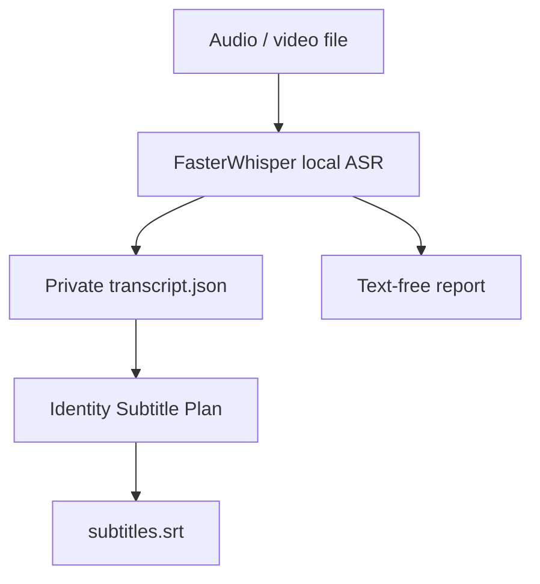
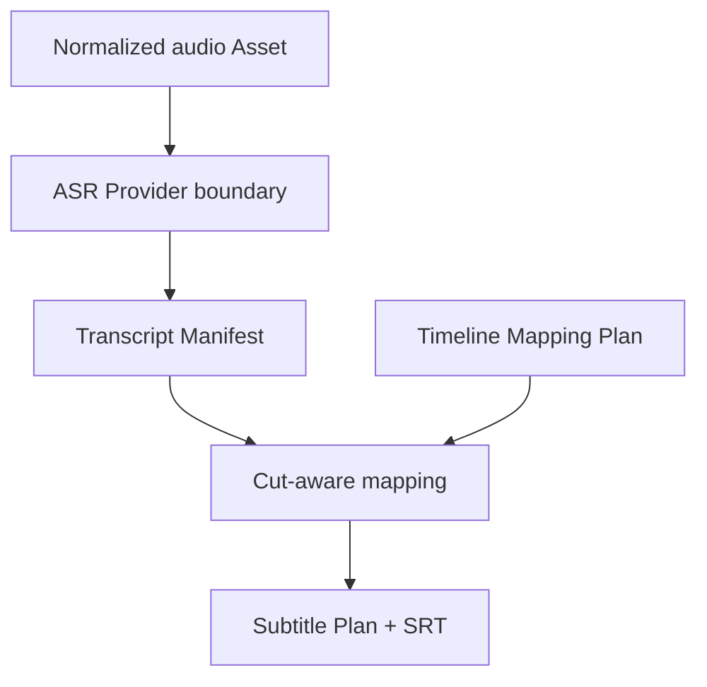
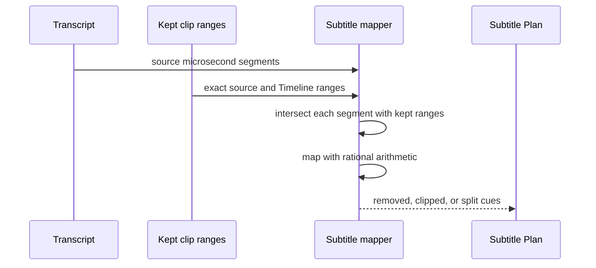

# TASK-006 — Transcript and Subtitle Foundation Detailed Design

- Package: `0.14.0`
- Implementation date: 2026-08-10
- FasterWhisper Slice B target: 2026-08-17
- Native sample transcription target: 2026-08-24
- Resolve subtitle placement target: 2026-08-31

## User outcome

ASRの出力を特定Provider固有JSONのまま扱わず、素材・言語・Model・区間・本文を持つ共通Transcriptへ変換できます。動画のCut後は、残った部分だけを正確なTimeline frameへ再配置し、標準SRTを同じ結果から何度でも生成できます。

Slice BではFasterWhisperを任意依存として接続し、実動画・音声からTranscriptとSRTをローカル生成できます。DaVinci Resolveへの配置はSlice Cで提供します。

## Slice B local transcription



- `faster-whisper`は`.[asr]`任意依存とし、通常インストールを重くしません。
- 既定では`local_files_only=True`で、モデル未配置時に勝手にネットワーク取得しません。
- `--allow-model-download`またはPowerShellの`-AllowModelDownload`がある場合だけ、選択モデルの取得を許可します。
- 推論時の音声・Transcriptは外部へ送信しません。モデル取得許可は推論データ送信の許可ではありません。
- Transcript本文は`transcript.json`と`subtitles.srt`だけに保存し、`transcription-report.json`には件数と実行条件のみを記録します。
- 隣接区間はNTSC丸め後も重ならないよう、フレーム境界を単調化します。
- 入力検証や依存関係エラーでは、空の成果物フォルダを残しません。

### User commands

```powershell
python -m pip install -e ".[asr]"
powershell -ExecutionPolicy Bypass -File .\tools\windows\run-task006-faster-whisper-transcription.ps1 `
  -MediaPath ".\sample.mp4" `
  -OutputDirectory ".\task006-transcription-output" `
  -Model small `
  -Language ja `
  -Device cpu `
  -AllowModelDownload
```

2回目以降、モデルがキャッシュ済みなら`-AllowModelDownload`を外して完全ローカルで実行できます。

## Data flow



## Canonical contracts

| Contract | Purpose | Safety rule |
|---|---|---|
| `AsrRequest` | Provider input boundary | Asset ID and existing regular media file required |
| `TranscriptSegment` | end-exclusive microsecond speech range | ordered, non-overlapping, no NUL, bounded text |
| `TranscriptManifest` | Provider-neutral transcript source of truth | Provider/Model/language provenance and deterministic hash |
| `SubtitleCue` | cut-adjusted Timeline range | at least one frame, ordered and non-overlapping |
| `SubtitlePlan` | Resolve/SRT handoff source of truth | exact rational Timeline rate and deterministic hash |
| `SrtRenderer` | interchange output | start floor, end ceil, normalized CRLF/LF |

## Cut-aware behavior



- Speech wholly inside a removed range produces no cue.
- Speech crossing a Cut is clipped or split per surviving placement.
- Playback-rate and NTSC Timeline duration are inherited from the exact TASK-022 placement frames.
- Floating point is not used for time conversion.
- Empty surviving speech produces a valid empty plan and empty SRT.

## Security and privacy

- Transcript text can contain sensitive speech and must not be placed in public Evidence by default.
- Provider secrets, environment variables and machine paths are absent from both schemas.
- Slice B performs local inference and no paid API or Resolve mutation.
- Model download is denied by default and must be explicitly authorized; selected model licenses remain the user's review responsibility.
- Native process cancellation and bounded worker isolation remain a follow-up hardening item before unattended batch execution.

## Acceptance gates

| Gate | Due | Evidence |
|---|---|---|
| Canonical Transcript and Subtitle schemas | 2026-08-10 | schema/package/hash/validation tests |
| Cut-aware exact mapper and SRT | 2026-08-10 | NTSC, removed range, split cue, multiline fixtures |
| FasterWhisper local Provider | 2026-08-10 | pinned optional dependency, model/cache/download admission contract |
| Native Windows sample transcription | 2026-08-17 | non-sensitive short media, Transcript, SRT and timing review |
| Resolve subtitle placement | 2026-08-31 | automation-owned track import/placement and idempotent rerun Evidence |
