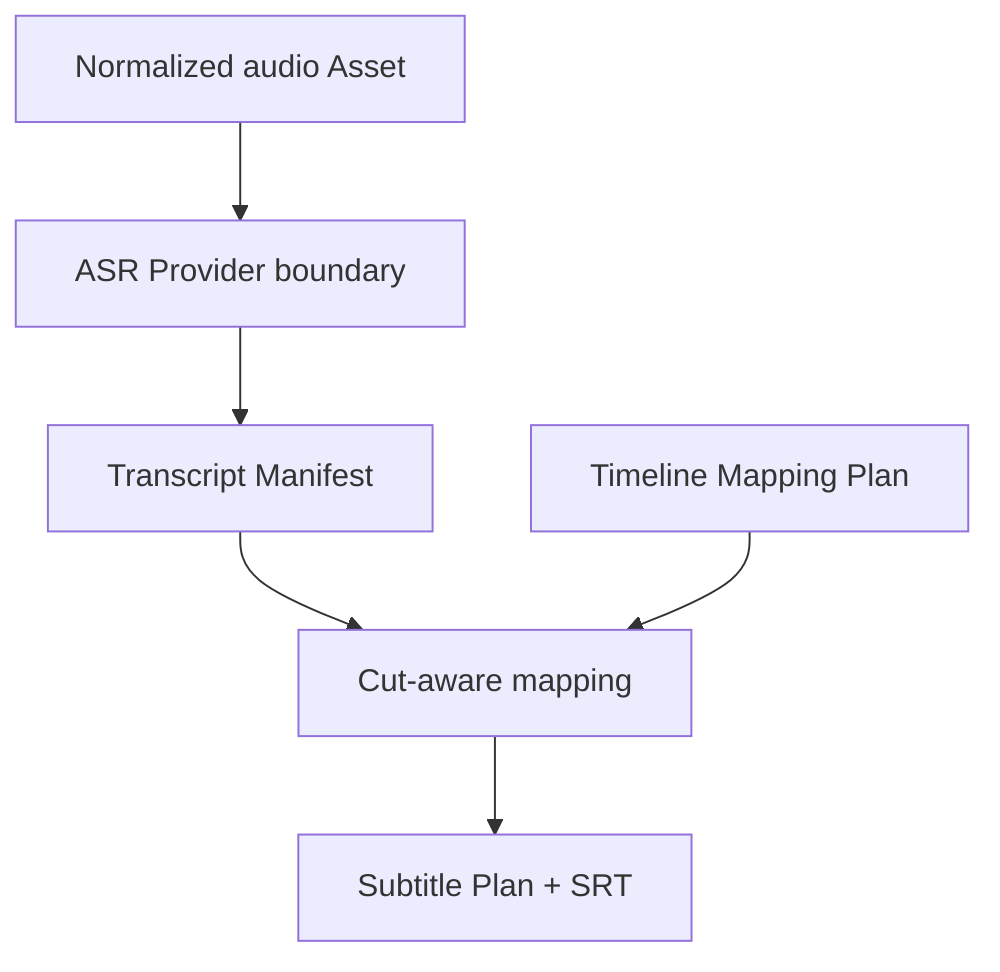
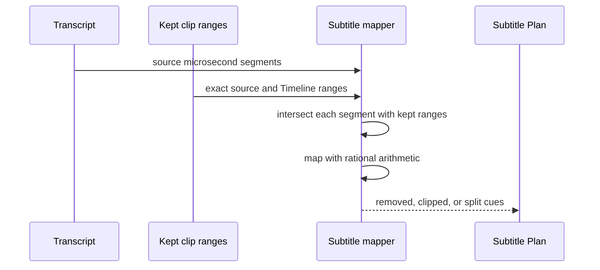

# TASK-006 — Transcript and Subtitle Foundation Detailed Design

- Package: `0.13.0`
- Implementation date: 2026-08-10
- FasterWhisper Slice B target: 2026-08-17
- Native sample transcription target: 2026-08-24
- Resolve subtitle placement target: 2026-08-31

## User outcome

ASRの出力を特定Provider固有JSONのまま扱わず、素材・言語・Model・区間・本文を持つ共通Transcriptへ変換できます。動画のCut後は、残った部分だけを正確なTimeline frameへ再配置し、標準SRTを同じ結果から何度でも生成できます。

Slice Aだけでは音声認識を実行しません。実動画から字幕を作る操作はFasterWhisper接続後に提供します。

## Data flow

## Canonical contracts

| Contract | Purpose | Safety rule |
|---|---|---|
| `AsrRequest` | future Provider input boundary | Asset ID required; execution not implemented in Slice A |
| `TranscriptSegment` | end-exclusive microsecond speech range | ordered, non-overlapping, no NUL, bounded text |
| `TranscriptManifest` | Provider-neutral transcript source of truth | Provider/Model/language provenance and deterministic hash |
| `SubtitleCue` | cut-adjusted Timeline range | at least one frame, ordered and non-overlapping |
| `SubtitlePlan` | Resolve/SRT handoff source of truth | exact rational Timeline rate and deterministic hash |
| `SrtRenderer` | interchange output | start floor, end ceil, normalized CRLF/LF |

## Cut-aware behavior

- Speech wholly inside a removed range produces no cue.
- Speech crossing a Cut is clipped or split per surviving placement.
- Playback-rate and NTSC Timeline duration are inherited from the exact TASK-022 placement frames.
- Floating point is not used for time conversion.
- Empty surviving speech produces a valid empty plan and empty SRT.

## Security and privacy

- Transcript text can contain sensitive speech and must not be placed in public Evidence by default.
- Provider secrets, environment variables and machine paths are absent from both schemas.
- Slice A performs no subprocess, network, Provider, billing, model download or Resolve mutation.
- A future Provider runner must use allowlisted Asset paths, bounded timeouts, model/license declaration and explicit local/cloud egress status.

## Acceptance gates

| Gate | Due | Evidence |
|---|---|---|
| Canonical Transcript and Subtitle schemas | 2026-08-10 | schema/package/hash/validation tests |
| Cut-aware exact mapper and SRT | 2026-08-10 | NTSC, removed range, split cue, multiline fixtures |
| FasterWhisper local Provider | 2026-08-17 | pinned optional dependency, model/cache/license/admission contract |
| Native sample transcription | 2026-08-24 | non-sensitive short media, Transcript, SRT and timing review |
| Resolve subtitle placement | 2026-08-31 | automation-owned track import/placement and idempotent rerun Evidence |
