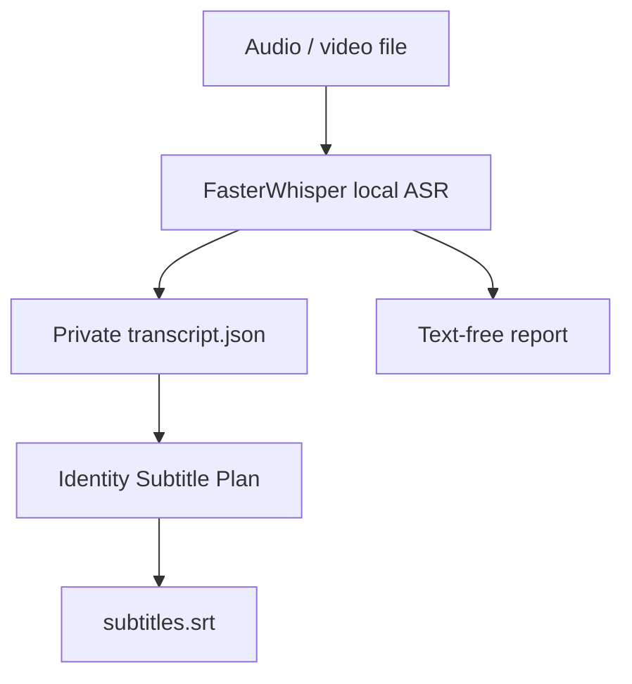
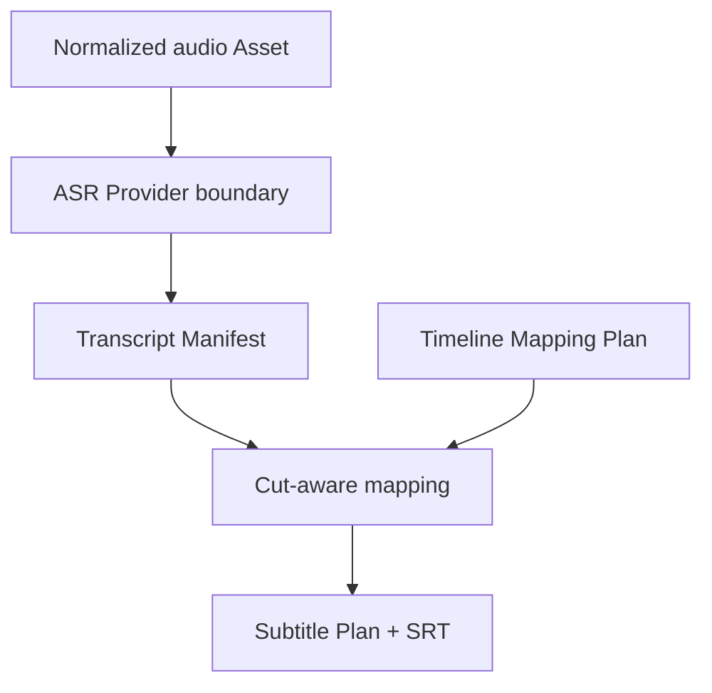
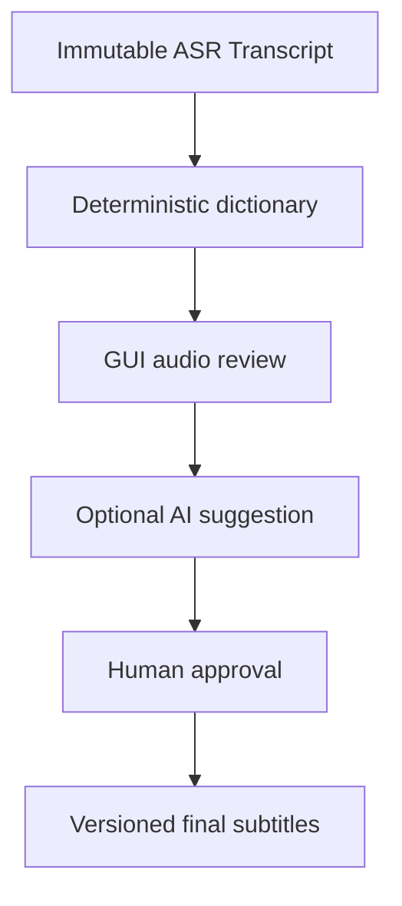
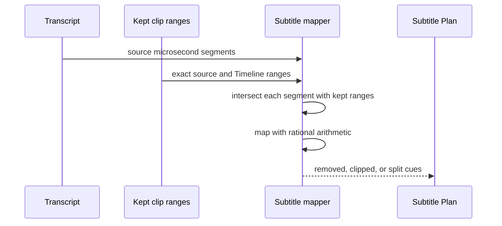

# TASK-006 — Transcript and Subtitle Foundation Detailed Design

- Initial local-ASR package: `0.14.0`
- SRT corrective package: `0.15.1`
- Implementation date: 2026-08-10
- FasterWhisper Slice B target: 2026-08-17
- Native sample transcription target: 2026-08-24
- Resolve subtitle placement target: 2026-08-31

## User outcome

ASRの出力を特定Provider固有JSONのまま扱わず、素材・言語・Model・区間・本文を持つ共通Transcriptへ変換できます。動画のCut後は、残った部分だけを正確なTimeline frameへ再配置し、標準SRTを同じ結果から何度でも生成できます。

Slice BではFasterWhisperを任意依存として接続し、実動画・音声からTranscriptとSRTをローカル生成できます。DaVinci Resolveへの配置はSlice Cで提供します。

Ownerの実動画によるWindows EvidenceではFasterWhisper `small` / Japanese / CPU `int8`が10 Segmentを正常生成し、推論時ネットワーク不使用を確認しました。同時に、ASR誤変換とSRTミリ秒境界の1 ms重複を検出しました。したがってNative ASRはPASS、公開・Resolve配置前のReview/Corrective Gateは継続とします。

## Slice B local transcription



- `faster-whisper`は`.[asr]`任意依存とし、通常インストールを重くしません。
- 既定では`local_files_only=True`で、モデル未配置時に勝手にネットワーク取得しません。
- `--allow-model-download`またはPowerShellの`-AllowModelDownload`がある場合だけ、選択モデルの取得を許可します。
- 推論時の音声・Transcriptは外部へ送信しません。モデル取得許可は推論データ送信の許可ではありません。
- Transcript本文は`transcript.json`と`subtitles.srt`だけに保存し、`transcription-report.json`には件数と実行条件のみを記録します。
- 隣接区間はNTSC丸め後も重ならないよう、フレーム境界を単調化します。
- 入力検証や依存関係エラーでは、空の成果物フォルダを残しません。

### User commands

```powershell
python -m pip install -e ".[asr]"
powershell -ExecutionPolicy Bypass -File .\tools\windows\run-task006-faster-whisper-transcription.ps1 `
  -MediaPath ".\sample.mp4" `
  -OutputDirectory ".\task006-transcription-output" `
  -Model small `
  -Language ja `
  -Device cpu `
  -AllowModelDownload
```

2回目以降、モデルがキャッシュ済みなら`-AllowModelDownload`を外して完全ローカルで実行できます。

## Data flow



## Canonical contracts

| Contract | Purpose | Safety rule |
|---|---|---|
| `AsrRequest` | Provider input boundary | Asset ID and existing regular media file required |
| `TranscriptSegment` | end-exclusive microsecond speech range | ordered, non-overlapping, no NUL, bounded text |
| `TranscriptManifest` | Provider-neutral transcript source of truth | Provider/Model/language provenance and deterministic hash |
| `SubtitleCue` | cut-adjusted Timeline range | at least one frame, ordered and non-overlapping |
| `SubtitlePlan` | Resolve/SRT handoff source of truth | exact rational Timeline rate and deterministic hash |
| `SrtRenderer` | interchange output | start floor, end ceil, normalized CRLF/LF |

`SrtRenderer`の丸め契約はNative Evidenceで、同一のend-exclusive frame境界を終了側ceil・次Cue開始側floorへ変換すると1 ms重なることが判明しました。内部`SubtitlePlan`が非重複でもSRT表現が非重複とは限りません。`0.15.1`では隣接Cueを考慮して`rendered_end < next_rendered_start`を保証し、Native Evidenceと同形の回帰Fixtureを追加しました。孤立Cueと最終Cueは従来の安全なceil-endを維持します。

## Review and correction architecture

字幕本文の補正順序は次に固定します。

1. **原文保持** — FasterWhisperのRaw Transcriptと音声区間を改変せず保持する。
2. **決定的辞書補正** — プロジェクト／チャンネル／共通辞書を優先順位付きで適用し、ルールIDと前後差分を記録する。
3. **GUI人間レビュー** — 音声再生、該当波形、前後Cue、原文、補正候補を同じ画面で確認し、採用・編集・却下する。
4. **AI誤字・脱字チェック** — 機能がオンで、ユーザーが実行した場合だけ、必要最小限の文脈から補正候補を作る。
5. **人間承認と公開** — AIはCanonical本文を直接更新せず、差分承認後に新Revisionとして確定する。



### Transcript revision model

- `raw_text`: Providerが返した不変の本文。
- `working_text`: 辞書・人間・AI候補を反映する作業Revision。
- `final_text`: 人間が承認した公開用本文。
- `correction_source`: `DICTIONARY`, `HUMAN`, `AI_SUGGESTION_ACCEPTED`。
- `correction_events`: actor、時刻、旧値／新値のdigest、理由、辞書rule ID、AI Route/Model、承認者。
- `review_state`: `UNREVIEWED`, `NEEDS_REVIEW`, `REVIEWED`, `APPROVED`, `REJECTED`。

Raw Transcriptを上書きせず、新Revisionが親Revisionを参照します。字幕再生成、Cut変更、AI再提案も同じ履歴へ追記し、以前承認した本文を暗黙に失効させません。

### Dictionary hierarchy

| Priority | Scope | Examples |
|---:|---|---|
| 1 | Project | 作品名、人物名、その動画だけの読み |
| 2 | Channel/Profile | バイサウンド、番組名、定型句、ゲーム固有語 |
| 3 | Shared Japanese | 製品名・技術用語の確認済み表記 |

辞書は単純置換だけでなく、誤認識表記、正規表記、読み、適用言語、前後条件、有効期間、優先度と説明を持ちます。曖昧なRuleや複数候補は自動適用せずGUIレビューへ送ります。

### AI typo and omission check

GUIには`AI誤字・脱字チェック`を設けます。

| Setting | Behavior |
|---|---|
| `OFF`（既定） | AIへ字幕本文を送信しない。AI通信・課金なし。辞書と人間レビューだけを使用する |
| `ON` | AI候補の生成を許可する。ただし、ユーザーが`AIチェックを実行`を押すまで通信しない |

- 全体設定の既定値と、プロジェクト単位の上書きを持ち、実行画面に最終的な有効状態を表示します。
- `ON`は送信許可であって、自動採用や公開承認ではありません。
- 実行前に対象Cue、Provider/Model、送信する前後文、費用見込み、外部送信の有無をPreviewします。
- 原則として音声そのものではなく、対象Cue、必要最小限の前後文、承認済み辞書と作品固有語だけを送ります。
- AIには意味を書き換えず、聞き間違い・誤字・脱字・表記・句読点の候補を提示する制約を与えます。
- 候補は原文、提案文、変更箇所、理由、`採用／却下／編集して採用`を並べて表示します。
- 人名、未公開情報、個人情報を含む場合はPrivacy Gateで停止するか、設定されたローカルModelへRouteします。
- 設定変更、実行、Provider/Model、送信範囲、費用、採否をEvidenceへ記録しますが、公開Evidenceへ字幕本文を含めません。

### GUI minimum scope

- Cue一覧と`未確認／要確認／承認済み`Filter。
- 動画・音声のCue前後再生、再生速度、短いLoop。
- Raw／Working／Finalの比較と変更差分。
- SRT開始・終了、前後CueとのGap/Overlap警告。
- 辞書候補の一括適用Previewと個別除外。
- `AI誤字・脱字チェック`オン／オフ、`AIチェックを実行`、送信内容Preview。
- AI候補ごとの`採用／却下／編集して採用`。
- Undo/Redo、Revision保存、SRT再出力、Resolve配置前の全件承認Gate。

## Cut-aware behavior



- Speech wholly inside a removed range produces no cue.
- Speech crossing a Cut is clipped or split per surviving placement.
- Playback-rate and NTSC Timeline duration are inherited from the exact TASK-022 placement frames.
- Floating point is not used for time conversion.
- Empty surviving speech produces a valid empty plan and empty SRT.

## Security and privacy

- Transcript text can contain sensitive speech and must not be placed in public Evidence by default.
- Provider secrets, environment variables and machine paths are absent from both schemas.
- Slice B performs local inference and no paid API or Resolve mutation.
- Model download is denied by default and must be explicitly authorized; selected model licenses remain the user's review responsibility.
- Native process cancellation and bounded worker isolation remain a follow-up hardening item before unattended batch execution.

## Acceptance gates

| Gate | Due | Evidence |
|---|---|---|
| Canonical Transcript and Subtitle schemas | 2026-08-10 | schema/package/hash/validation tests |
| Cut-aware exact mapper and SRT | 2026-08-10 | NTSC, removed range, split cue, multiline fixtures |
| FasterWhisper local Provider | 2026-08-10 | pinned optional dependency, model/cache/download admission contract |
| Native Windows sample transcription | 2026-08-17 | non-sensitive short media, Transcript, SRT and timing review |
| Review GUI + correction dictionary contract | 2026-08-24 | immutable Raw, revision/event, ambiguous-rule and approval tests |
| Optional AI typo/omission proposal | 2026-08-31 | default-off toggle, explicit execution, minimal-context egress, no-auto-accept and cost/privacy Evidence |
| Resolve subtitle placement | 2026-08-31 | automation-owned track import/placement and idempotent rerun Evidence |
