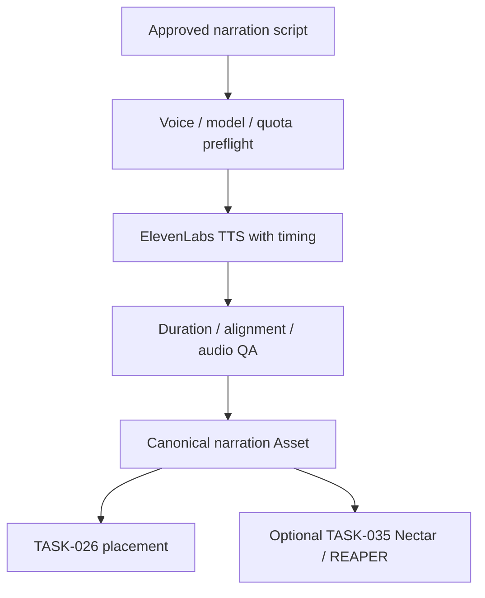

# TASK-014 — Voice TTS / Owner Narration

- Status: `PROPOSED / OWNER-DIRECTED DESIGN`
- Governance candidate: `DEV-4` because voice identity, paid API, consent and external egress are involved
- Provider baseline: ElevenLabs adapter foundation exists since package `0.6.2`
- Owner capability: ElevenLabs Pro account with an already trained approximately two-hour clone of the owner's own voice

## Objective

Generate narration from an owner-approved script with the owner's existing ElevenLabs voice, retain exact provenance and timing, publish a canonical 48 kHz Audio Asset, and hand it to TASK-026 for placement and optionally TASK-035 for REAPER/iZotope finishing.

The system must use the existing trained voice by `voice_id`; it must not upload training recordings, retrain, share, delete or alter the voice unless a separate future operation is explicitly authorized.

## Production flow

## `VoiceProfile` contract

- stable local `voice_profile_id`; display name may identify the owner only in private local settings;
- provider family `ELEVENLABS` and indirect `credential_ref`;
- provider `voice_id` stored in private local configuration, not public examples or telemetry;
- voice category/fine-tuning state, ownership and verification status obtained read-only from the API;
- approved languages and exact TTS model IDs;
- consent subject, consent scope, allowed projects/purposes and revocation state;
- retention policy for generated narration and provider history;
- default voice settings, pronunciation dictionary references and QA profile;
- never contains API keys or original training samples.

Although a `voice_id` is not an API credential, this project treats a private cloned-voice identifier as sensitive personal configuration because it addresses a biometric-like voice resource. Public manifests retain a redacted Voice Profile reference and a digest, not the raw ID.

## Planned slices

| Slice | Result |
|---|---|
| A — Read-only preflight | resolve OS-stored key; retrieve subscription capability; list/search voices; confirm exact voice is owned, verified/fine-tuned and compatible with selected model/language |
| B — Preview | generate a short, explicitly approved and cost-bounded Japanese sample; publish no canonical Asset until listened to |
| C — Narration render | paragraph/scene chunking with continuity context; TTS with character timing; request/cost Evidence; contained output |
| D — Canonicalization | decode/probe, normalize to 48 kHz WAV, checksum, duration/alignment and silence QA, canonical Asset publication |
| E — Placement | map narration timing to Production Blueprint/Subtitle Plan; place via TASK-026 and Resolve gateway |
| F — Finishing | optional Nectar voice treatment and REAPER mix through TASK-035, preserving untreated narration |

## Approval and safety rules

1. Existing ownership and account verification do not replace per-project script and generation approval.
2. The UI shows the exact text, selected local Voice Profile, model, estimated/known cost or character usage, external data destination and retention mode before `GO`.
3. Only the owner's approved cloned voice is in scope initially. Adding another person's voice requires independently recorded consent and a stricter authorization review.
4. No paid request occurs in unit tests, package installation, settings save, voice discovery or dry-run.
5. API keys remain in the OS credential store. Responses from user/subscription endpoints are reduced to allowlisted capability/quota fields; raw user objects and any returned key material are never logged or persisted.
6. Training samples, verification recordings and provider preview URLs are not downloaded or copied unless a later, explicit feature requires them.
7. Generated audio starts in contained staging, is size bounded, media-probed and normalized before promotion.
8. Provider request IDs, character cost/usage, exact model, settings, input-script digest and output hash are recorded without retaining secrets.
9. Provider-side sampling may be nondeterministic even when a seed exists. Reproducibility means exact request/provenance retention and output hashing, not a promise of byte-identical regeneration.
10. Revoking/disabling the Voice Profile prevents new generation but never silently deletes previously published project Assets.

## Timing and editing behavior

The preferred API path returns speech plus character-level alignment. Alignment is mapped to canonical Transcript/Subtitle structures and scene narration slots. The full narration is assembled from bounded chunks using adjacent text/request context where supported. Actual rendered duration, not estimated reading speed, drives the final Scene Ledger revision. Regenerating one chunk must preserve neighboring context, produce a new Asset revision and require a placement diff review.

## Acceptance gates

- a read-only probe selects the owner's intended voice by stable ID rather than display-name guessing;
- mismatched owner/verification/model/language or unavailable quota fails before a billable generation;
- preview and full render are separately authorized;
- Japanese text normalization and pronunciation dictionary choices are explicit;
- timing output round-trips into Transcript/Subtitle/Scene placement without overlapping cues;
- 48 kHz canonical WAV, raw provider derivative where retained, hashes and cost Evidence are complete;
- untreated narration remains available when Nectar/REAPER finishing is applied;
- reports and exceptions contain no key, training sample, raw private account object or raw private voice ID.

## Official references

- [ElevenLabs API introduction and cost headers](https://elevenlabs.io/docs/api-reference/introduction)
- [List voices](https://elevenlabs.io/docs/api-reference/voices/search)
- [Get voice metadata](https://elevenlabs.io/docs/api-reference/voices/get)
- [Create speech with character timing](https://elevenlabs.io/docs/api-reference/text-to-speech/convert-with-timestamps)
- [Get subscription capability](https://elevenlabs.io/docs/api-reference/user/subscription/get)
- [Professional Voice Clone API guide](https://elevenlabs.io/docs/eleven-api/guides/how-to/voices/professional-voice-cloning)

Exact plan entitlement, API model support, format availability and retention controls are checked live at execution time; this design does not infer them merely from the label `Pro`.

## Voice Studio Local Primary extension — design allocated 2026-08-15

TASK-014 remains the sole narration render/publication owner. TASK-046 supplies
the private VoiceProfile/Dataset revision; TASK-014 adds local zero-shot and
fine-tuned Engine adapters behind the existing deterministic plan, paid-
execution gate and containment boundary. Local Primary does not remove the
existing ElevenLabs opt-in path and does not authorize either path.

The extension separates Subtitle, Normalized, TTS and Alignment text; compiles
Engine-independent Semantic Direction; records Direction loss; stages 48 kHz
Cue/Master WAV; uses measured alignment/duration; and publishes only after
whole-output QA. Actual local Model download/generation and paid Cloud calls
remain separately gated.
