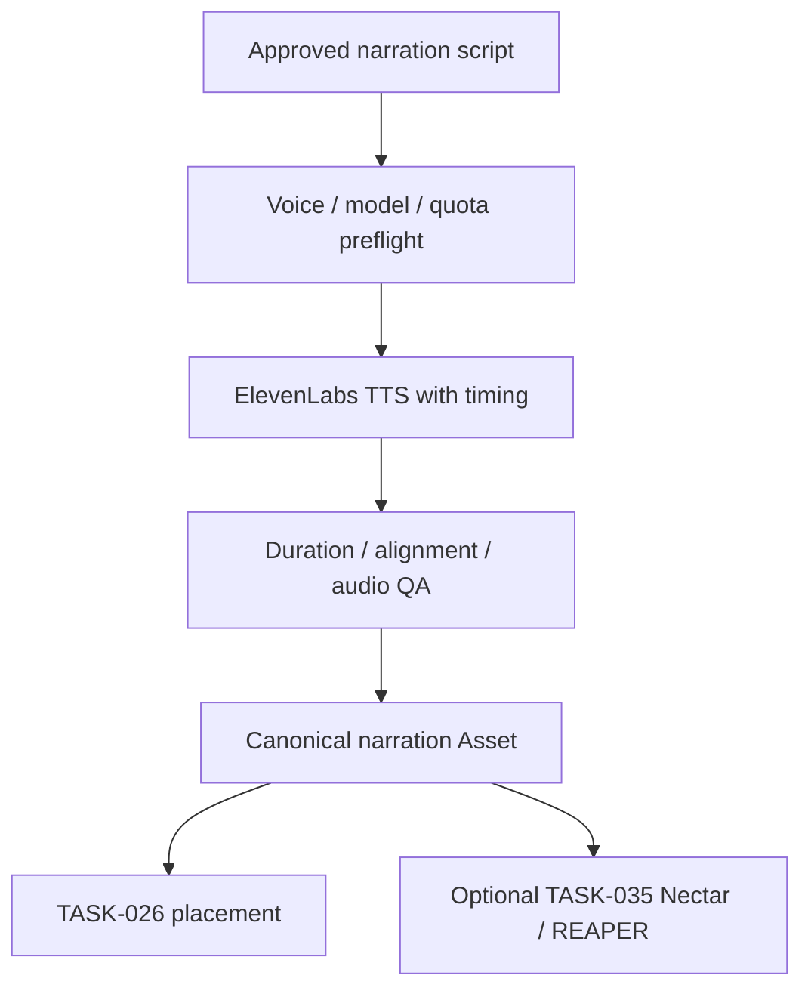

# TASK-014 — Voice TTS / Owner Narration

- Status: `PROPOSED / OWNER-DIRECTED DESIGN / D4_R23_BRANCH_PREDICATE_REVIEW_PENDING / SOURCE_START0 / EFFECT0`
- Governance candidate: `DEV-4` because voice identity, paid API, consent and external egress are involved
- Provider baseline: ElevenLabs adapter foundation exists since package `0.6.2`
- Owner capability: ElevenLabs Pro account with an already trained approximately two-hour clone of the owner's own voice

## Objective

Generate narration from an owner-approved script with the owner's existing ElevenLabs voice, retain exact provenance and timing, publish a canonical 48 kHz Audio Asset, and hand it to TASK-026 for placement and optionally TASK-035 for REAPER/iZotope finishing.

The system must use the existing trained voice by `voice_id`; it must not upload training recordings, retrain, share, delete or alter the voice unless a separate future operation is explicitly authorized.

## Production flow

```mermaid
flowchart TD
    SCRIPT["Approved narration script"] --> PREFLIGHT["Voice / model / quota preflight"]
    PREFLIGHT --> TTS["ElevenLabs TTS with timing"]
    TTS --> QA["Duration / alignment / audio QA"]
    QA --> ASSET["Canonical narration Asset"]
    ASSET --> PLACE["TASK-026 placement"]
    ASSET --> MIX["Optional TASK-035 Nectar / REAPER"]
```

## `VoiceProfile` contract

- stable local `voice_profile_id`; display name may identify the owner only in private local settings;
- provider family `ELEVENLABS` and indirect `credential_ref`;
- provider `voice_id` stored in private local configuration, not public examples or telemetry;
- voice category/fine-tuning state, ownership and verification status obtained read-only from the API;
- approved languages and exact TTS model IDs;
- consent subject, consent scope, allowed projects/purposes and revocation state;
- retention policy for generated narration and provider history;
- default voice settings, pronunciation dictionary references and QA profile;
- never contains API keys or original training samples.

Although a `voice_id` is not an API credential, this project treats a private cloned-voice identifier as sensitive personal configuration because it addresses a biometric-like voice resource. Public manifests retain a redacted Voice Profile reference and a digest, not the raw ID.

## Planned slices

| Slice | Result |
|---|---|
| A — Read-only preflight | resolve OS-stored key; retrieve subscription capability; list/search voices; confirm exact voice is owned, verified/fine-tuned and compatible with selected model/language |
| B — Preview | generate a short, explicitly approved and cost-bounded Japanese sample; publish no canonical Asset until listened to |
| C — Narration render | paragraph/scene chunking with continuity context; TTS with character timing; request/cost Evidence; contained output |
| D — Canonicalization | decode/probe, normalize to 48 kHz WAV, checksum, duration/alignment and silence QA, canonical Asset publication |
| E — Placement | map narration timing to Production Blueprint/Subtitle Plan; place via TASK-026 and Resolve gateway |
| F — Finishing | optional Nectar voice treatment and REAPER mix through TASK-035, preserving untreated narration |

## Approval and safety rules

1. Existing ownership and account verification do not replace per-project script and generation approval.
2. The UI shows the exact text, selected local Voice Profile, model, estimated/known cost or character usage, external data destination and retention mode before `GO`.
3. Only the owner's approved cloned voice is in scope initially. Adding another person's voice requires independently recorded consent and a stricter authorization review.
4. No paid request occurs in unit tests, package installation, settings save, voice discovery or dry-run.
5. API keys remain in the OS credential store. Responses from user/subscription endpoints are reduced to allowlisted capability/quota fields; raw user objects and any returned key material are never logged or persisted.
6. Training samples, verification recordings and provider preview URLs are not downloaded or copied unless a later, explicit feature requires them.
7. Generated audio starts in contained staging, is size bounded, media-probed and normalized before promotion.
8. Provider request IDs, character cost/usage, exact model, settings, input-script digest and output hash are recorded without retaining secrets.
9. Provider-side sampling may be nondeterministic even when a seed exists. Reproducibility means exact request/provenance retention and output hashing, not a promise of byte-identical regeneration.
10. Revoking/disabling the Voice Profile prevents new generation but never silently deletes previously published project Assets.

## Timing and editing behavior

The preferred API path returns speech plus character-level alignment. Alignment is mapped to canonical Transcript/Subtitle structures and scene narration slots. The full narration is assembled from bounded chunks using adjacent text/request context where supported. Actual rendered duration, not estimated reading speed, drives the final Scene Ledger revision. Regenerating one chunk must preserve neighboring context, produce a new Asset revision and require a placement diff review.

## Acceptance gates

- a read-only probe selects the owner's intended voice by stable ID rather than display-name guessing;
- mismatched owner/verification/model/language or unavailable quota fails before a billable generation;
- preview and full render are separately authorized;
- Japanese text normalization and pronunciation dictionary choices are explicit;
- timing output round-trips into Transcript/Subtitle/Scene placement without overlapping cues;
- 48 kHz canonical WAV, raw provider derivative where retained, hashes and cost Evidence are complete;
- untreated narration remains available when Nectar/REAPER finishing is applied;
- reports and exceptions contain no key, training sample, raw private account object or raw private voice ID.

## Official references

- [ElevenLabs API introduction and cost headers](https://elevenlabs.io/docs/api-reference/introduction)
- [List voices](https://elevenlabs.io/docs/api-reference/voices/search)
- [Get voice metadata](https://elevenlabs.io/docs/api-reference/voices/get)
- [Create speech with character timing](https://elevenlabs.io/docs/api-reference/text-to-speech/convert-with-timestamps)
- [Get subscription capability](https://elevenlabs.io/docs/api-reference/user/subscription/get)
- [Professional Voice Clone API guide](https://elevenlabs.io/docs/eleven-api/guides/how-to/voices/professional-voice-cloning)

Exact plan entitlement, API model support, format availability and retention controls are checked live at execution time; this design does not infer them merely from the label `Pro`.

## Voice Studio Local Primary extension — design allocated 2026-08-15

TASK-014 remains the sole narration render/publication owner. TASK-046 supplies
the private VoiceProfile/Dataset revision; TASK-014 adds local zero-shot and
fine-tuned Engine adapters behind the existing deterministic plan, paid-
execution gate and containment boundary. Local Primary does not remove the
existing ElevenLabs opt-in path and does not authorize either path.

The extension separates Subtitle, Normalized, TTS and Alignment text; compiles
Engine-independent Semantic Direction; records Direction loss; stages 48 kHz
Cue/Master WAV; uses measured alignment/duration; and publishes only after
whole-output QA. Actual local Model download/generation and paid Cloud calls
remain separately gated.

## Local Primary current position — 2026-09-27

The zero-shot callable contract and Local Primary call profile V2 are present
on current main, and their focused suites pass `155 / 155`. This closes the
body-free call-profile recovery gap only. It does not create a private
executor, model-load authority, audio output, WAV, Asset, or publication.

The D4 private call/sink source start remains blocked. TASK-074 child-local
direct transfer, the required TASK-072/TASK-076 child and process owner
completions, TASK-075 executor acceptance/completion, TASK-046 private
production port, and TASK-066 native compute proof are not all current and
canonical. The preserved pre-main D4 documentation is advisory and must be
rewritten and independently reviewed against the exact landed owner identities
before any source allocation.

Canonical readiness evidence:
`local-primary-d4-dependency-readiness-r2-evidence-2026-09-27.md`.

## D4 R17 rejected candidate — 2026-10-10

Independent review of TASK-074 R16 confirmed that the old TASK-014 D4 and
TASK-074 producer source-start rules form a cycle, but rejected R16 because it
did not create separate owner acceptance roots or fully close the live and
downstream PASS gates. The findings are preserved in
`../TASK-074/design-r16-independent-review-receipt.md`.

The current correction candidate is
`../TASK-074/complete-design-packet-r17-dependency-sequencing-amendment.md`.
TASK-014 owns the paired candidate record
`d4-restricted-consumer-port-contract-acceptance-r0.md`, whose exact record type
is `TASK014_D4_RESTRICTED_CONSUMER_PORT_CONTRACT_ACCEPTANCE_V1`.

This candidate accepts only an effect-zero, parent-authority-zero consumer-port
and POST/current-read contract boundary. It does not accept or authorize a
private handle, child/process creation, body read, model action, audio/WAV,
Asset publication, `NarrationPublicationReceipt`, TASK-041 PASS or TASK-036
AUDIO_COMPLETION PASS. Real call/sink and POST minting remain blocked on the
exact current TASK-074 live producer plus every R17 closed live prerequisite.

R17, both owner acceptance candidates and both canonical Task record updates
must receive fresh exact-byte Tester/Critic/Judge review with unresolved
`Critical/High = 0/0` and Judge `PASS`. Only then may a body-preserving
administrative update mark the owner records accepted. Each later R17 source
stage still requires its own named allocation, owner lock and Allowed Files;
this Task record grants none.

### D4 R17 design-review Allowed Files

- `docs/ai-team/tasks/TASK-014/task.md`
- `docs/ai-team/tasks/TASK-014/d4-restricted-consumer-port-contract-acceptance-r0.md`
- `docs/ai-team/tasks/TASK-074/task.md`
- `docs/ai-team/tasks/TASK-074/complete-design-packet-r16-dependency-sequencing-amendment.md`
- `docs/ai-team/tasks/TASK-074/design-r16-independent-review-receipt.md`
- `docs/ai-team/tasks/TASK-074/complete-design-packet-r17-dependency-sequencing-amendment.md`
- `docs/ai-team/tasks/TASK-074/r17-direct-transfer-producer-contract-acceptance-r0.md`

Source, schema, tests, current-state, task-index, roadmap, CHANGELOG, native
state and private Evidence are outside this design-review allocation.

R17 did not pass independent review. Exact Tester `FAIL`, Critic `REVISE` and
the withheld Judge result are preserved in
`../TASK-074/design-r17-independent-review-receipt.md`. The R17 amendment and
its acceptance candidates remain immutable rejected Evidence. They must not be
marked accepted, edited into a new status or used for source start.

## D4 R18 stable acceptance candidate — 2026-10-10

The current correction candidate is
`../TASK-074/complete-design-packet-r18-stable-acceptance-split-gates.md`.
TASK-014 owns the immutable contract body
`d4-restricted-consumer-port-contract-r18.md` with identity
`TASK014_D4_RESTRICTED_CONSUMER_PORT_CONTRACT_R18_V1`.

R18 never edits the reviewed contract body to insert acceptance state or its
own hash. Only after exact-byte Tester/Critic `Critical/High = 0/0` and Judge
`PASS` may a separately allocated TASK-014 administrative owner writer create
`d4-r18-owner-acceptance.json`. That envelope binds the predecessor Task record;
the later Task status may reference the fixed envelope without changing it.

The owner envelope still grants no source or effect authority. The accepted
TASK-014/TASK-074 envelope pair makes only a separately allocated effect-zero
restricted consumer/POST unit eligible. Real call/sink, body, model, audio/WAV,
Asset publication and `NarrationPublicationReceipt` minting remain blocked on
the exact current TASK-074 live type and every R18 runtime row.

### D4 R18 design-review Allowed Files

- `docs/ai-team/tasks/TASK-014/task.md`
- `docs/ai-team/tasks/TASK-014/d4-restricted-consumer-port-contract-r18.md`
- `docs/ai-team/tasks/TASK-074/task.md`
- `docs/ai-team/tasks/TASK-074/design-r17-independent-review-receipt.md`
- `docs/ai-team/tasks/TASK-074/complete-design-packet-r18-stable-acceptance-split-gates.md`
- `docs/ai-team/tasks/TASK-074/r18-direct-transfer-producer-contract.md`
- `docs/ai-team/tasks/TASK-041/audio-completion-pass-contract-r18.md`
- `docs/ai-team/tasks/TASK-036/audio-completion-exclusive-binder-contract-r18.md`

Acceptance envelopes, source, schema, tests, current-state, task-index, roadmap,
CHANGELOG, native state and private Evidence are outside this review allocation.

R18 did not pass independent review. Exact Tester `FAIL`, Critic `REVISE` and
the withheld Judge result are preserved in
`../TASK-074/design-r18-independent-review-receipt.md`. The R18 design and
contracts remain immutable rejected Evidence and cannot issue owner envelopes
or source authority.

## D4 R19 three-phase runtime candidate — 2026-10-11

The then-current R19 correction candidate was
`../TASK-074/complete-design-packet-r19-acyclic-runtime-exact-failure.md`.
TASK-014 owns immutable contract
`d4-three-phase-runtime-contract-r19.md`.

R19 separates:

1. pre-arm one-use call dispatch authorization;
2. post-transfer receipt-only preparation and later released execution;
3. post-result publication/POST minting.

The call dispatch lease is created before TASK-076 arm from a TASK-074
operation-ready type that proves no child or body effect. A different TASK-074
child-pair-ready type enables receipt-only preparation after direct transfer and
validated preflight. TASK-075 result and TASK-074 terminal currentness gate only
POST publication, never initial dispatch or transfer.

R19 and its four immutable owner contracts require exact-byte Tester/Critic
`Critical/High = 0/0` and Judge `PASS`. Only later owner-local envelopes may
accept the contracts; envelopes still grant no source or runtime authority.

### D4 R19 design-review Allowed Files

- `docs/ai-team/tasks/TASK-014/task.md`
- `docs/ai-team/tasks/TASK-014/d4-three-phase-runtime-contract-r19.md`
- `docs/ai-team/tasks/TASK-036/audio-completion-exclusive-binder-contract-r19.md`
- `docs/ai-team/tasks/TASK-041/audio-completion-pass-contract-r19.md`
- `docs/ai-team/tasks/TASK-074/task.md`
- `docs/ai-team/tasks/TASK-074/design-r18-independent-review-receipt.md`
- `docs/ai-team/tasks/TASK-074/complete-design-packet-r19-acyclic-runtime-exact-failure.md`
- `docs/ai-team/tasks/TASK-074/r19-direct-transfer-runtime-phases-contract.md`

Owner envelopes, source, schema, tests, current-state, task-index, roadmap,
CHANGELOG, native state and private Evidence remain outside this allocation.

R19 did not pass independent review. Tester returned `FAIL` `0/3/0/0`, Critic
returned `REVISE` `0/3/1/0`, and Judge was withheld. Exact bytes and findings
are preserved in `../TASK-074/design-r19-independent-review-receipt.md`. R19 is
immutable rejected Evidence and grants no owner acceptance or source authority.

## D4 R20 reservation and tagged-terminal candidate — 2026-10-11

The current correction candidate is
`../TASK-074/complete-design-packet-r20-reservation-tagged-terminal-closure.md`.
TASK-014 owns immutable contract
`d4-reservation-closed-terminal-contract-r20.md`.

R20 replaces the invalid pre-arm call-dispatch lease with a metadata-only,
effect-zero reservation. A future separately accepted TASK-014/072/075/076
adapter must consume it while invoking the unchanged TASK-076 arm ABI. Real
TASK-014 call and sink dispatch starts only after exact
`JOB_CHILD_ARTIFACT_PREPARE_PENDING_READBACK_V3`, matching canonical TASK-075
section 9.5.

A second separately accepted four-owner receipt-only terminal adapter binds
TASK-014 prepare/fail-close truth into the existing TASK-076 prepare and
terminal inputs. Neither adapter is accepted or allocated by R20.

R20 defines exact queryable closure for arm rejected/unknown, orphan,
prebootstrap, bootstrap rejection, bind/preflight failure, prepare abort/failure,
release rejection, post-release noncurrent, result-bound success, restart and
reply loss. SUCCESS, NONCURRENT, ABORTED and BURNED_UNKNOWN are disjoint nominal
branches; only SUCCESS can mint POST and a later publication-current read.

R20 and its four immutable owner contracts require fresh exact-byte
Tester/Critic `Critical/High = 0/0` and Judge `PASS`. Only later owner-local
envelopes may accept them. Both four-owner adapter amendments, source and
runtime each require separate allocation; this Task record grants none.

### D4 R20 design-review Allowed Files

- `docs/ai-team/tasks/TASK-014/task.md`
- `docs/ai-team/tasks/TASK-014/d4-reservation-closed-terminal-contract-r20.md`
- `docs/ai-team/tasks/TASK-036/audio-completion-exclusive-binder-contract-r20.md`
- `docs/ai-team/tasks/TASK-041/audio-completion-pass-contract-r20.md`
- `docs/ai-team/tasks/TASK-074/task.md`
- `docs/ai-team/tasks/TASK-074/design-r19-independent-review-receipt.md`
- `docs/ai-team/tasks/TASK-074/complete-design-packet-r20-reservation-tagged-terminal-closure.md`
- `docs/ai-team/tasks/TASK-074/r20-direct-transfer-tagged-terminal-contract.md`

Owner envelopes, cross-owner amendments, source, schema, tests, current-state,
task-index, roadmap, CHANGELOG, native state and private Evidence remain outside
this allocation.

R20 did not pass independent review. Tester returned `FAIL` `0/2/2/0`, Critic
returned `REVISE` `0/4/1/0`, and Judge was withheld. Exact bytes and findings
are preserved in `../TASK-074/design-r20-independent-review-receipt.md`. R20 is
immutable rejected Evidence and grants no owner acceptance or source authority.

## D4 R21 coordinated closure candidate — 2026-10-11

The current correction candidate is
`../TASK-074/complete-design-packet-r21-coordinated-closure-late-truth.md`.
TASK-014 owns immutable contract `d4-coordinated-closure-contract-r21.md`.

R21 gives pre-arm reservation a durable RESERVED/ARMING/JOIN_PENDING/terminal
coordinator, with owner-issued no-vector or burned-unknown reconciliation and no
second arm. It records a prepare-attempt before TASK-014 session entry, so an
abort in that microgap follows canonical abort-wait using sealed NEVER_ENTERED
truth. It also closes ordinary AFTER_PREPARE abort.

TASK-014 result-bound and POST become immutable provisional facts. Positive
publication-current is withheld until exact TASK-076 terminal, TASK-074
retirement and the full canonical TASK-075 SUCCESS/RESULT_VERIFIED predicate
are current. Late uncertainty preserves result/POST/close facts in containment
instead of overwriting them.

R21 and its four immutable contracts require fresh exact-byte Tester/Critic
`Critical/High/Medium = 0/0/0` and Judge `PASS`. Owner envelopes, both
four-owner amendments, source and runtime remain separately allocated; this
Task record grants none.

### D4 R21 design-review Allowed Files

- `docs/ai-team/tasks/TASK-014/task.md`
- `docs/ai-team/tasks/TASK-014/d4-coordinated-closure-contract-r21.md`
- `docs/ai-team/tasks/TASK-036/audio-completion-exclusive-binder-contract-r21.md`
- `docs/ai-team/tasks/TASK-041/audio-completion-pass-contract-r21.md`
- `docs/ai-team/tasks/TASK-074/task.md`
- `docs/ai-team/tasks/TASK-074/design-r20-independent-review-receipt.md`
- `docs/ai-team/tasks/TASK-074/complete-design-packet-r21-coordinated-closure-late-truth.md`
- `docs/ai-team/tasks/TASK-074/r21-global-terminal-closure-contract.md`

Owner envelopes, amendments, source, schema, tests, current-state, task-index,
roadmap, CHANGELOG, native state and private Evidence remain outside this
allocation.

R21 did not pass independent review. Tester returned `FAIL` `0/1/0/0`, Critic
returned `REVISE` `0/2/0/0`, and Judge was withheld. Exact bytes and findings
are preserved in `../TASK-074/design-r21-independent-review-receipt.md`. R21 is
immutable rejected Evidence and grants no owner acceptance or source authority.

## D4 R22 restart split and reachable containment candidate — 2026-10-11

The current correction candidate is
`../TASK-074/complete-design-packet-r22-restart-split-reachable-containment.md`.
TASK-014 owns immutable contract `d4-coordinated-closure-contract-r22.md`.

R22 makes prepare recovery continuity explicit. Only an interruption while the
original broker, worker and private prepare continuation remain live may
query-join pending, issue owner `NEVER_ENTERED` and complete canonical
abort-wait. Product/broker/worker/adapter/coordinator restart or any loss of the
continuation follows pinned TASK-075 section 9.3.1: finish only a durable
pre-restart abort-pending claim; otherwise burned-unknown containment with no
fresh abort, prepare, owner close, release or reconstructed session.

R22 also makes global containment reachable. Exact Job terminal and retirement
are required only for the three known-closed branches; false/unknown late joins
are preserved as independent fields under an exact containment observation.

R22 and its four immutable contracts require fresh exact-byte Tester/Critic
`Critical/High/Medium = 0/0/0` and Judge `PASS`. Owner envelopes, both
four-owner amendments, source and runtime remain separately allocated; this
Task record grants none.

### D4 R22 design-review Allowed Files

- `docs/ai-team/tasks/TASK-014/task.md`
- `docs/ai-team/tasks/TASK-014/d4-coordinated-closure-contract-r22.md`
- `docs/ai-team/tasks/TASK-036/audio-completion-exclusive-binder-contract-r22.md`
- `docs/ai-team/tasks/TASK-041/audio-completion-pass-contract-r22.md`
- `docs/ai-team/tasks/TASK-074/task.md`
- `docs/ai-team/tasks/TASK-074/design-r21-independent-review-receipt.md`
- `docs/ai-team/tasks/TASK-074/complete-design-packet-r22-restart-split-reachable-containment.md`
- `docs/ai-team/tasks/TASK-074/r22-global-terminal-closure-contract.md`

Owner envelopes, amendments, source, schema, tests, current-state, task-index,
roadmap, CHANGELOG, native state and private Evidence remain outside this
allocation.

R22 did not pass independent review. Tester returned `FAIL` `0/2/0/0`, Critic
returned `REVISE` `0/2/0/0`, and Judge was withheld. Exact bytes and findings
are preserved in `../TASK-074/design-r22-independent-review-receipt.md`. R22 is
immutable rejected Evidence and grants no owner acceptance or source authority.

## D4 R23 branch predicate and post-release recovery candidate — 2026-10-11

The current correction candidate is
`../TASK-074/complete-design-packet-r23-branch-predicate-post-release-recovery.md`.
TASK-014 owns immutable contract `d4-coordinated-closure-contract-r23.md`.

R23 retains the exact live-continuation versus restart-class split, adds an
owner-read no-prepare-recovery context for ordinary uninterrupted late joins,
and limits restart burned-unknown rules to explicit pre-release states. A
post-release STARTED child instead follows canonical fixed-child exit and exact
noncurrent terminal recovery, with burned unknown only as fallback.

The global terminal decision now derives exactly one predecessor kind and tests
that kind's complete expected POST/Job-terminal/retirement vector. Known-closed
branches and containment are mutually exclusive; correct POST FALSE for
noncurrent/aborted never selects containment by itself.

R23 and its four immutable contracts require fresh exact-byte Tester/Critic
`Critical/High/Medium = 0/0/0` and Judge `PASS`. Owner envelopes, both
four-owner amendments, source and runtime remain separately allocated; this
Task record grants none.

### D4 R23 design-review Allowed Files

- `docs/ai-team/tasks/TASK-014/task.md`
- `docs/ai-team/tasks/TASK-014/d4-coordinated-closure-contract-r23.md`
- `docs/ai-team/tasks/TASK-036/audio-completion-exclusive-binder-contract-r23.md`
- `docs/ai-team/tasks/TASK-041/audio-completion-pass-contract-r23.md`
- `docs/ai-team/tasks/TASK-074/task.md`
- `docs/ai-team/tasks/TASK-074/design-r22-independent-review-receipt.md`
- `docs/ai-team/tasks/TASK-074/complete-design-packet-r23-branch-predicate-post-release-recovery.md`
- `docs/ai-team/tasks/TASK-074/r23-global-terminal-closure-contract.md`

Owner envelopes, amendments, source, schema, tests, current-state, task-index,
roadmap, CHANGELOG, native state and private Evidence remain outside this
allocation.
