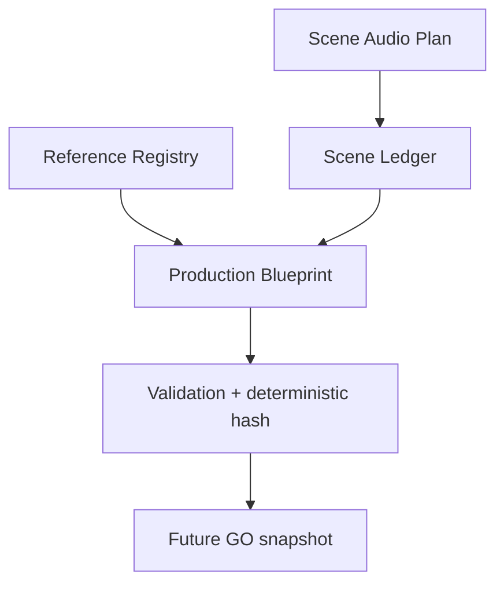

# TASK-027 Slice A1 — Production Blueprint / Scene Ledger Detailed Design

- Package: `0.15.0`
- Authorization: Owner-directed implementation using real production design evidence
- External generation: not included
- `GO` approval: not included; remains required before later execution slices

## User outcome

新規動画の制作意図を、生成Promptだけでなく「何秒のどのSceneに、誰・どの空間・どの素材・どのCamera・どの音を使うか」という検証可能なScene Ledgerへ変換できます。現段階は内部契約であり、GUI提案画面はSlice A2です。

## Contract

### Registry

- `PERSON`, `SPACE`, `PROMPT`, `ASSET`, `AUDIO`を正式IDで登録します。
- 未生成素材は`PLANNED`で予約し、存在するFilenameを偽装できません。
- Sceneが未登録IDを参照するとFail closedします。

### Scene Ledger

- Scene ID、frame範囲、物語上の役割、素材戦略、生成Risk、Camera、Reference、Audio、Holdを保持します。
- Sceneは0 frameからTarget durationまで隙間・重複なく覆います。
- 素材戦略の既定優先順位は`REAL_CAPTURE → REUSE_EXISTING → COMPOSITE → AI_GENERATED`です。

### Generation Risk

| Risk | Typical content | Gate |
|---|---|---|
| A | 文字なし、抽象映像 | 通常のCamera設計可 |
| B | 大きな短い見出し | 参照と文字QAを要求する予定 |
| C | 日本語UI、表、数値、カード | Locked reference、Static camera、post-composite text必須 |

Risk CのHard Gateは、実制作で観測されたズーム先文字化け、カード再生成、表・数値破壊を予防します。

### Audio

各SceneがNarration、Dialogue、SE intent、BGM、Sound Logoの有無を持ちます。生成動画の偶発音声はこのPlanへ自動昇格しません。

## What this slice proves

- 実制作資料から一般化したScene設計を機械検証できます。
- 参照名称の揺れ、未作成素材の見落とし、Scene gap/overlap、密なUIへの危険なCamera指定を早期に拒否できます。
- 同じ入力は同じchecksum付きBlueprintを生成します。

## Remaining Slice A2

- 非技術者向けNew Video入力フォーム。
- AIによるBlueprint提案と説明。
- Sceneカード修正、比較、Restore。
- Cost／Rights／Privacy Preflight。
- 明示的`GO`によるImmutable Approved Production Plan。
