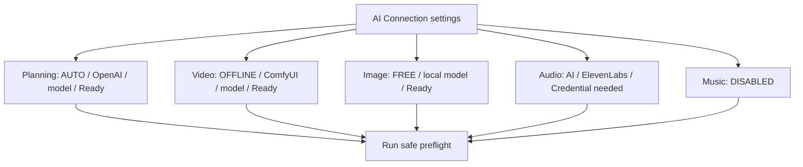
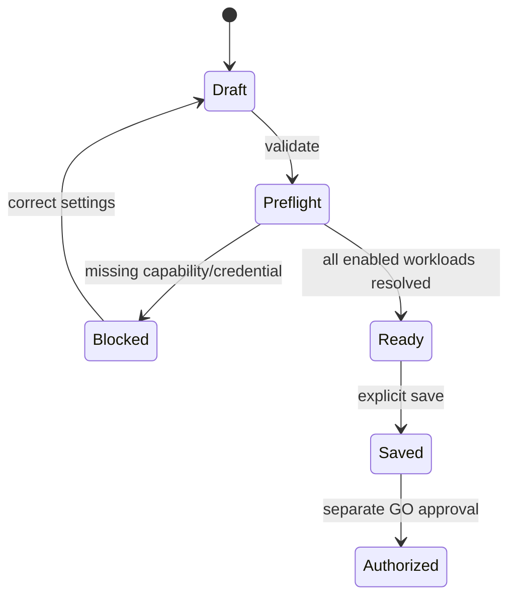
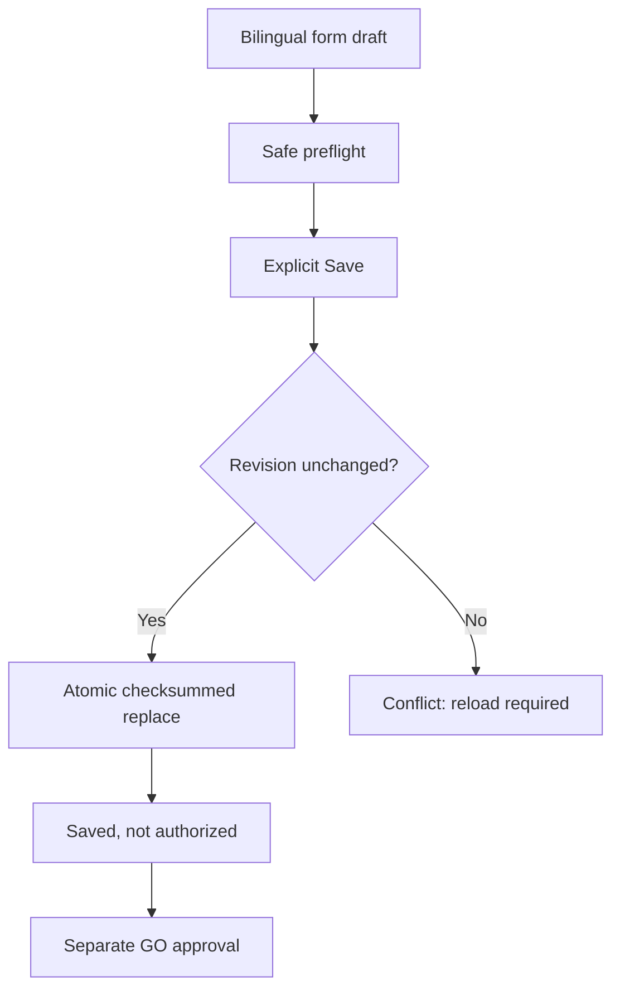

# TASK-032 — AI Connection Settings UI Foundation

- Status: `PERSISTENCE_IMPLEMENTED_UI_PENDING`
- Package: `0.9.0`
- Target dates: API 2026-08-10; first interactive settings screen 2026-08-24; usability review 2026-08-31

## User outcome

A user who does not understand provider APIs can see, for each production purpose, whether AI is enabled, what model would be used, whether it is local/free/paid, and what must be configured before pressing GO.

## Proposed screen

Each row will eventually expose:

- `AI / FREE / AUTO / OFFLINE_ONLY / DISABLED` selection;
- exact Provider and Model, without assigning a fixed purpose to a Provider family;
- locality and cost class;
- reasoning effort where supported;
- credential configured/not configured, never the credential value;
- required capability and adapter availability;
- a plain-language blocking reason.

## Implemented domain/API slice

`AiConnectionSettingsService.preflight()` evaluates all five workloads without a network call or provider execution. It returns a checksummed `SettingsPreflightReport` containing `READY`, `DISABLED`, or `BLOCKED` for each workload, selected safe model metadata, credential booleans, and normalized error codes.

The projection deliberately excludes credential references, endpoints, headers, raw Provider payloads and machine paths. The UI must consume this safe projection rather than inspect environment variables directly.

## State and action flow

Saving connection settings must never equal authorizing a paid generation or Resolve mutation.

## Persistence boundary implemented in 0.9.0

`ConnectionSettingsStore` saves a `1.0.0` envelope containing only the revision and validated `AiConnectionProfile`. `document_sha256` protects the whole envelope while the nested `profile_sha256` protects the profile. Existing files require an exact `expected_revision`; this prevents one open screen from silently overwriting a newer edit made elsewhere.

The write uses a temporary sibling file, filesystem flush, parse-and-contract validation and atomic replace. Failure before replace leaves the previous settings byte-for-byte unchanged. A raw `AiConnectionProfile` document from 0.8.0 is readable as revision zero and is converted only after the user explicitly saves it.

`ConnectionSettingsFormBuilder` exposes Japanese and English workload labels, simple explanations for every selection mode, current status messages, and safe Provider/Model metadata. It excludes credential references, endpoint references, route settings, environment variables and secret values.

## Acceptance gates

| Gate | Due | Evidence |
|---|---|---|
| Safe Preflight API | 2026-08-10 | all workloads projected; no secret reference; deterministic hash tests |
| Settings persistence contract | 2026-08-17 | **Completed 2026-08-10**: schema, migration, atomic save, rollback and conflict tests |
| Interactive screen | 2026-08-24 | screenshot, keyboard operation, error/help text, no paid call |
| Low-literacy usability review | 2026-08-31 | three scripted tasks completed by 2–3 consenting reviewers; blockers recorded |

## Next implementation slice

Bind the implemented GUI-neutral form and persistence services to the first interactive screen. GUI technology selection must consider Windows packaging, accessibility, local-only operation, secret storage integration and future dashboard reuse. The screen must demonstrate save/reload/conflict handling without making a paid Provider call.
