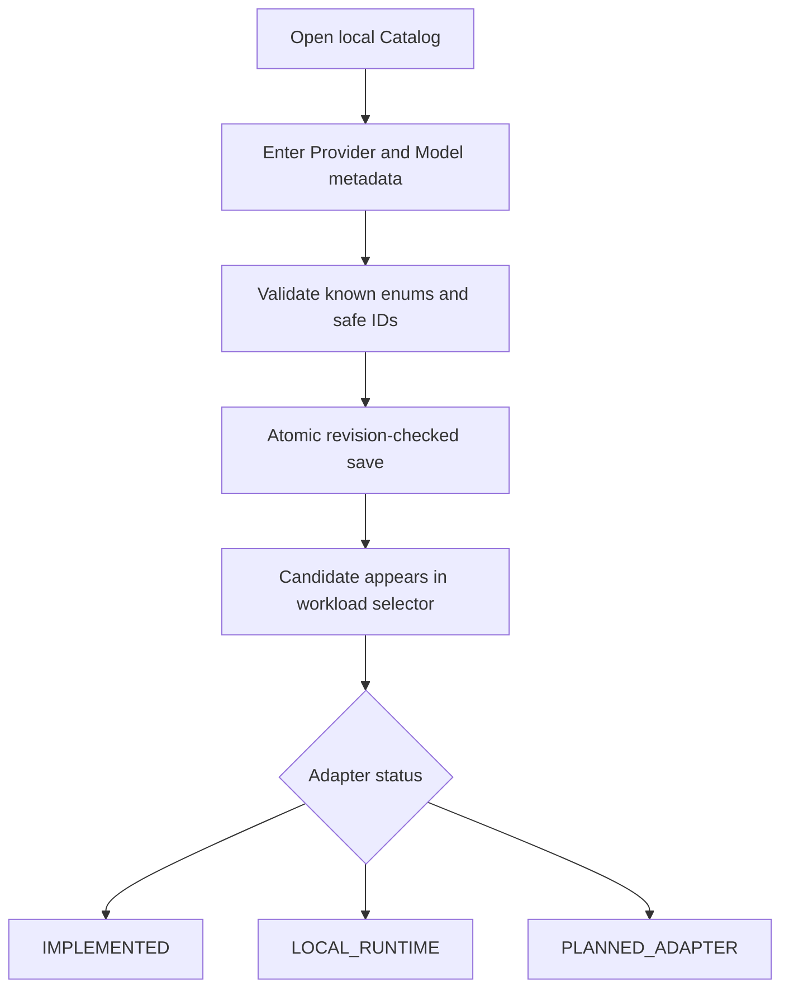
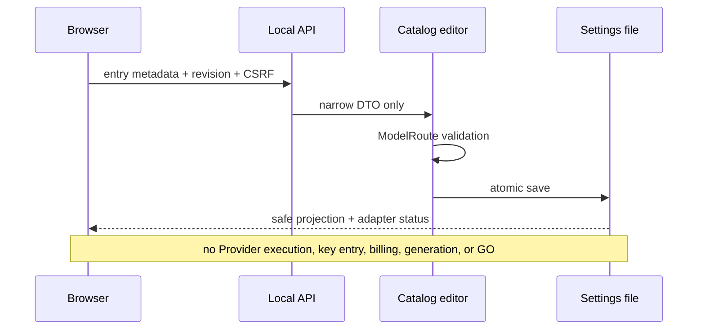

# TASK-033 — Provider and Model Catalog Editor Detailed Design

- Status: `CATALOG_EDITOR_IMPLEMENTED_AWAITING_NATIVE_EVIDENCE`
- Package: `0.11.0`
- Implementation date: 2026-08-10

## User outcome

A user can register the exact Provider and Model they intend to use for planning, video, image, audio, or music without editing JSON. The screen states whether the Provider family is implemented, a local runtime boundary, or only a planned adapter.

## Editable fields

| Field | Rule |
|---|---|
| Route ID | safe immutable identifier; unique within Profile |
| Workload | one of planning, video, image, audio, music; immutable after creation |
| Provider family | known family including `OTHER` |
| Provider ID / Model ID | exact safe identifiers; Provider is not locked to a purpose |
| Cost class | cloud paid/free tier, local free/licensed, or non-AI free |
| Reasoning effort | planning only; other workloads must use `none` |
| Capabilities | unique comma-separated safe identifiers |
| Credential required | boolean only; generates an internal reference, never accepts a secret |
| Enabled | disabling preserves history and allows recovery; physical deletion is not exposed |

## Safety boundary

- API keys, access tokens, endpoint URLs, headers, arbitrary settings and raw secret values are not accepted.
- Credential-required routes use a generated internal `credential://catalog/<route-id>` reference that is never returned to the browser.
- Existing endpoint references and non-secret adapter settings are preserved when editing but are not browser-visible.
- Unknown fields fail closed, preventing clients from smuggling `api_key` or similar properties.
- Route workload and Route ID cannot change after creation; create a new route and disable the old one instead.
- Every mutation retains TASK-032 loopback, Host, CSRF, CSP, body-size, checksum and revision protections.

## Adapter truthfulness

Catalog presence and execution support are different facts:

| Status | Meaning |
|---|---|
| `IMPLEMENTED` | Product contains an adapter boundary for the Provider family; exact Model capability still requires validation |
| `LOCAL_RUNTIME` | Product has a local/external runtime boundary; installation and live capability are separate |
| `PLANNED_ADAPTER` | configuration can be prepared, but Product must not execute it |

## Acceptance gates and deadlines

| Gate | Due | Evidence |
|---|---|---|
| Domain and safe form projection | 2026-08-10 | add/edit/disable, status, secret-exclusion tests |
| Local API and browser form | 2026-08-12 | CSRF/revision mutation, no execution path, JavaScript syntax |
| Native Windows Catalog Evidence | 2026-08-24 | add one example candidate, edit Model, disable it, reload and screenshot |
| Beginner usability integration | 2026-08-31 | Catalog task included in the 2–3-person TASK-032 review |

Use [`native-windows-evidence-template.md`](native-windows-evidence-template.md) for a secret-free, repeatable add/edit/disable check.

## Next slice

TASK-034 should provide OS-backed Credential onboarding. It must store secret values in Windows Credential Manager or an equivalent OS store, while the settings/Profile documents continue to contain references only.
