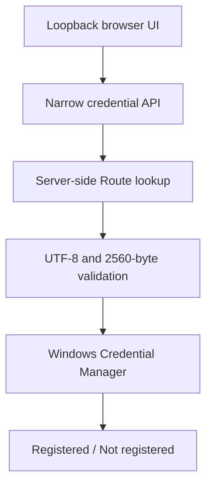

# TASK-034 — OS-backed Credential Onboarding Detailed Design

- Package: `0.12.1`
- Implementation date: 2026-08-10
- Native Evidence due: 2026-08-24
- Beginner usability integration due: 2026-08-31

## User outcome / 利用者ができること

APIキーが必要なModelごとに「未登録 / Not registered」を確認し、パスワード欄へキーを一度入力してWindowsへ保管できます。登録後の画面は「登録済み / Registered」だけを示し、キーを再表示しません。削除も同じ画面で行えます。

## Architecture



| Boundary | Accepted | Never returned or persisted |
|---|---|---|
| Browser → local API | Route ID and one transient secret | internal `credential://` reference |
| Local API → OS vault | opaque SHA-256 target and UTF-8 secret | secret in settings/Profile JSON |
| Local API → browser | Route ID, registered boolean, safe form | secret, Credential ref, native blob |
| Credential operation | save/status/delete | Provider request, billing, generation, GO |

## Threat boundaries

- The server binds only to `127.0.0.1`; Host allowlisting, random CSRF token, restrictive CSP, `no-store`, frame denial and a 64 KiB request cap remain active.
- The secret necessarily exists briefly in the local browser field and loopback request. The field uses password rendering and is cleared after every attempt.
- Each Route uses a unique HTML `id`, `name`, and `section-<route> current-password` autocomplete scope. This allows an explicitly saved browser password-manager entry to be selected again on every row without merging the rows. The value remains masked and is cleared after the operation.
- The API maps Route ID to its internal reference server-side. A caller cannot select an arbitrary vault target.
- The Windows target is `BAI.VideoProduction/<sha256(reference)>`; Provider and reference names are not exposed by the target.
- The Windows generic credential blob is bounded to 2560 UTF-8 bytes. Blank, NUL-containing and oversized values fail closed.
- Native errors contain only a normalized code and Win32 error number, never a secret.
- Non-Windows launches show onboarding as unavailable instead of falling back to plaintext storage.
- Credential presence proves local storage only. It does not prove validity, permissions, quota, Provider availability or Model support.

## State sequence

```mermaid
sequenceDiagram
    participant U as User
    participant L as Local UI/API
    participant W as Windows vault
    U->>L: Route ID + key + CSRF
    L->>L: Resolve allowed Route
    L->>W: CredWrite opaque target
    W-->>L: Stored
    L-->>U: Registered; provider_call_started=false
    U->>L: Delete Route ID + CSRF
    L->>W: CredDelete opaque target
    L-->>U: Not registered; provider_call_started=false
```

The native implementation follows Microsoft Win32 [`CredWriteW`](https://learn.microsoft.com/windows/win32/api/wincred/nf-wincred-credwritew), [`CredReadW`](https://learn.microsoft.com/windows/win32/api/wincred/nf-wincred-credreadw), [`CredDeleteW`](https://learn.microsoft.com/windows/win32/api/wincred/nf-wincred-creddeletew), and `CredFree` ownership rules. Provider execution can consume the same vault through its existing `resolve(reference)` boundary in a later integration task.

## Acceptance gates

| Gate | Due | Evidence |
|---|---|---|
| Vault contract and safe projection | 2026-08-10 | round-trip, opaque target, limit, no-secret tests |
| Loopback credential API/UI | 2026-08-12 | CSRF request, response exclusion, no Provider-call flag |
| Native Windows Evidence | 2026-08-24 | register, reload, delete, reload; Credential Manager target screenshot |
| Low-literacy review | 2026-08-31 | 2–3 people explain storage and no-billing meaning without assistance |

## Deferred by design

Provider connectivity tests, key permission diagnosis, quota/cost checks, cross-device sync, macOS Keychain/Linux Secret Service, production-job GO and cloud credential brokerage are not authorized by TASK-034.
