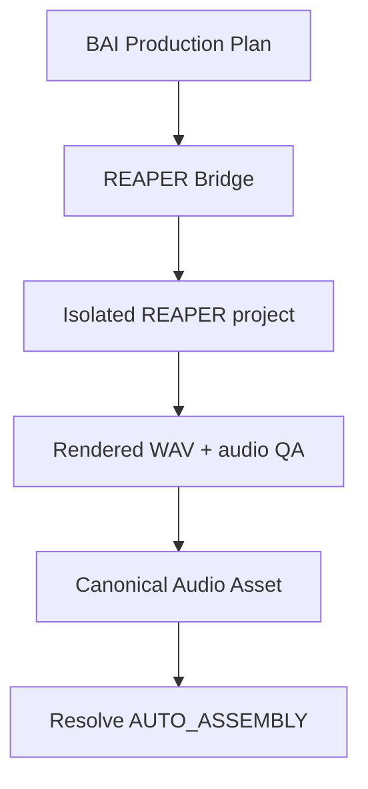

# TASK-035 — REAPER Audio Finishing Bridge / DaVinci Round-trip

- Status: `PROPOSED / OWNER-DIRECTED DESIGN`
- Governance candidate: `DEV-4`
- Target phase: after Resolve Assembly and canonical Audio Placement foundations
- Earliest prerequisites: TASK-003, TASK-010, TASK-011, TASK-022 and TASK-026
- Optional products: REAPER; iZotope Ozone, Nectar and Neutron

## Purpose

Add a bounded DAW execution layer in which BAI Video Production remains the source of production intent and Evidence, REAPER performs repeatable audio assembly/mix/render operations, and DaVinci Resolve receives only verified canonical audio derivatives. The bridge must also support a human taking over in REAPER without losing or silently overwriting their work.

## Product boundary

REAPER is an execution target, not the canonical database. `.rpp` files, plugin state and rendered WAV files are retained as Evidence or Assets according to their role. DaVinci Resolve never watches an arbitrary folder and replaces clips implicitly; a verified Asset and an authorized Placement Plan must cross the existing Resolve mutation gateway.

## Planned slices

| Slice | Deliverable | Live dependency |
|---|---|---|
| A — Capability probe | REAPER/version/API discovery; installed FX inventory; read-only project and render capability matrix | REAPER evaluation is sufficient |
| B — Project contract | deterministic track/region/route/FX/render plan; `.rpp` snapshot; dry-run diff | REAPER |
| C — Native FX execution | track creation, media placement, routing, supported FX insertion, generic parameter/preset application, save/undo | REAPER; optional iZotope |
| D — Render and QA | 48 kHz WAV render; checksum, duration, channel, silence, peak/true-peak and loudness report | REAPER + FFmpeg/QA worker |
| E — Resolve round-trip | publish canonical mix/stems; explicit Resolve placement/relink; rollback and idempotency Evidence | Resolve Studio |
| F — Assisted mix | bounded Ozone/Nectar/Neutron workflows proven per installed version; human preview and approval | licensed plugins |
| G — conversational adapter | optional local MCP facade over the same allowlisted bridge commands | separately reviewed server |

Buying REAPER is not a prerequisite for design or offline tests. The official product offers a fully functional 60-day evaluation; the owner may evaluate Slice A–E before purchasing. License terms and prices must be checked at purchase time.

## Canonical contracts

### `DawSessionPlan`

- `session_plan_id`, `production_job_id`, `revision`, deterministic `plan_hash`
- source Asset IDs and exact Timeline mapping references
- sample rate, frame rate/timecode origin and channel layout
- ordered track, folder, bus, send and item specifications
- plugin requests by stable role plus approved discovered identifier
- render targets, filename pattern, bounds, format and expected duration
- ownership (`AUTOMATION_OWNED`, `HUMAN_OWNED`, `SHARED_REVIEW`)
- authorization, cost, rights and rollback policy

### `DawCapabilityReport`

- REAPER version and platform
- locally generated ReaScript/API version evidence
- discovered FX names/formats without license keys or user paths
- capability state: `SUPPORTED`, `LIMITED`, `PROBE_REQUIRED`, `UNSUPPORTED`
- per-operation notes and safe errors

### `AudioRoundTripManifest`

- input Plan/Asset hashes
- retained `.rpp` snapshot reference
- rendered mix/stem Asset IDs and hashes
- QA metrics and acceptance decision
- Resolve Placement Plan reference
- plugin/version provenance and human approvals

## iZotope automation levels

Plugin hosting and AI Assistant operation are different capabilities and must not be conflated.

| Level | Meaning | Default policy |
|---|---|---|
| L0 | plugin discovered and format/version recorded | read-only probe |
| L1 | plugin inserted by an exact discovered identifier | sandbox project only |
| L2 | enumerated generic parameters read/set and round-trip verified | allowlisted parameters |
| L3 | named preset/state loaded and output reproducibility checked | approved local preset |
| L4 | Assistant analysis invoked and result applied | `PROBE_REQUIRED`; never inferred from L1–L3 |

Initial roles are Nectar for narration/vocal treatment, Neutron for track/bus mixing and Ozone for final master processing. These are defaults, not hard-coded product-purpose locks. Exact installed versions and capabilities decide routing. Assistant output is a proposal: the system records before/after loudness, true peak, spectral or masking metrics where meaningful, preserves the untreated reference, and requires preview/approval before canonical publication.

## Safety and ownership rules

1. The first live mutation uses a newly created, automation-owned REAPER project and synthetic or owner-approved media.
2. Every mutating batch has a dry-run Plan, pre-mutation snapshot, explicit authorization and an undo/restore path.
3. Human-owned tracks/items/FX are not deleted, renamed or replaced. Shared projects require stable BAI IDs in project extension state.
4. Plugin scanning, preset loading and parameter setting use an allowlist derived from a target-machine capability probe.
5. No license data, API key, serial, machine identifier or full user path enters Git, Evidence or telemetry.
6. Third-party MCP servers are untrusted integrations until source/license/security review. They receive no direct unrestricted filesystem, shell or DAW mutation authority.
7. MCP is an optional interface. Canonical Plans, authorization, validation and Evidence remain inside BAI Video Production.
8. Render completion is not success until the expected files are contained, non-symlinked, probed, checksummed and accepted by QA.
9. Folder watching may detect a candidate output but may not promote or insert it into Resolve without manifest validation and an explicit operation.
10. Paid/live/plugin tests are excluded from ordinary CI and run only with explicit owner action.

## Acceptance gates

- identical Plan produces the same track/item/route structure on the supported REAPER version;
- rerun is idempotent and never duplicates BAI-owned tracks or FX;
- missing/reordered/renamed plugins fail closed with an actionable report;
- render uses the requested 48 kHz/channel/time bounds and matches Timeline duration tolerance;
- before/after audio and plugin provenance remain auditable;
- human modification causes conflict/review rather than silent overwrite;
- accepted mix/stems enter Resolve through canonical Assets and the existing mutation gateway;
- disconnect, REAPER crash, render timeout and partial output leave recoverable state;
- no secret or machine-specific private path appears in reports.

## Evidence basis and open questions

Official REAPER documentation confirms ReaScript access to most extension API functions, background/event scripts, project extension state and undo blocks. Its generated API documents track FX operations and programmable render configuration. This supports the proposed native bridge but does not prove a particular third-party MCP implementation.

Open live questions include exact iZotope FX identifiers, which parameters/presets persist reproducibly, whether each Assistant can be invoked without GUI automation, plugin warm-up latency, headless/offline-render behavior, and Resolve media replacement behavior for the chosen Timeline ownership mode. Each remains `PROBE_REQUIRED` until measured on the owner's Windows system.

## Primary references

- [REAPER ReaScript overview](https://www.reaper.fm/sdk/reascript/reascript.php)
- [REAPER generated API reference](https://www.reaper.fm/sdk/reascript/reascripthelp.html)
- [REAPER purchase/evaluation terms](https://www.reaper.fm/purchase.php)
- [DaVinci Resolve installed scripting documentation location](https://wiki.dvresolve.com/developer-docs/scripting-api)
- [iZotope Neutron product information](https://www.izotope.com/en/products/neutron.html)

The installed documentation shipped with the exact REAPER, Resolve and iZotope versions is authoritative for live implementation. Community MCP repositories are discovery inputs only and must be pinned and separately reviewed before use.
