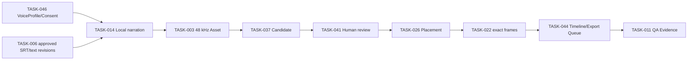

# Japanese Local Voice 60–90 Second Vertical Slice Plan

Date: 2026-08-15
Status: `PLANNED / NATIVE EXECUTION NOT YET AUTHORIZED`

## Goal

Prove one real, traceable Product route before implementing two-hour recording,
fine-tuning, OBS, RX, broad Creative AI or multilingual breadth.

## Fixed scope

- Japanese, one Owner speaker, one approved 60–90 second SRT/script;
- Local/free exact Voice engine and basic style;
- no Cloud, paid provider, OBS, RX, fine-tuning or multilingual behavior;
- one `BAI Video Production.exe` Product route;
- 48 kHz canonical Cue/Master WAV;
- existing Asset/Candidate/Human review/Placement/Timeline/Export/QA owners.

## Dependency graph

## Execution stages

1. Freeze approved SRT, Subtitle/Normalized/TTS/Alignment revisions and hashes.
2. Select exact approved VoiceProfile/Consent/Engine/Model/License revision.
3. Compile Semantic Direction and show any loss before execution.
4. Preflight resource, storage, operation identity, output containment and
   restart behavior.
5. Generate bounded Cue WAV into staging; retain measured alignment/duration.
6. Verify all Cues and atomically publish canonical 48 kHz Assets.
7. Create Candidate and obtain Human review; no automatic ACCEPT/LOCK.
8. Compile non-looping Narration Placement with measured duration and rational
   frames; review Timeline diff.
9. Preview in TASK-044, prepare an exact-bound Export job and run existing QA.
10. Restart conversation-free and prove exact lineage/recovery without replay.

## Exit criteria

- 60–90 seconds completes without Cloud/paid/RX/OBS;
- Source text has zero loss/duplication and each derived text is revisioned;
- every Cue maps to VoiceProfile, Consent, Engine/Model/License, WAV hash,
  Asset, Scene/Cue, Candidate, Human decision, Placement and frame range;
- actual duration drives placement and speech overflow is reviewable;
- cancel/failure/restart retains completed staging, never fabricates success
  and never duplicates UNKNOWN work;
- commercial Export remains blocked when any license evidence is unknown;
- full Windows/WSL2 regression and packaged native Evidence pass.
