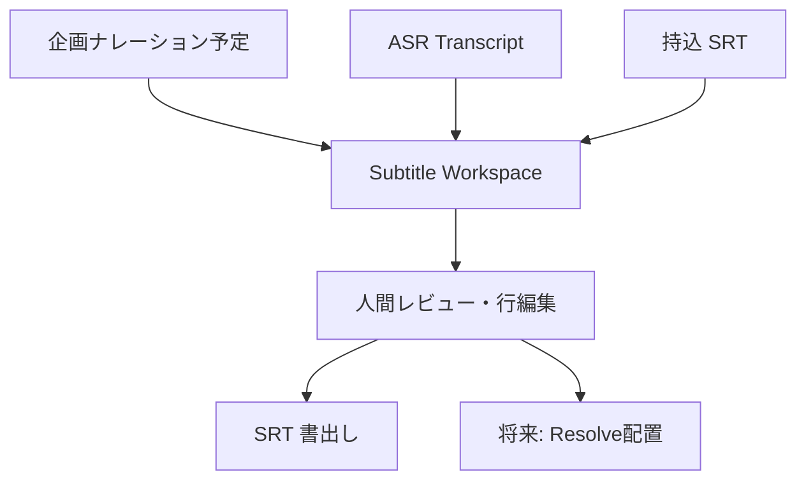

# TASK-006 Subtitle Workspace 詳細設計 Ver1.0

対象Release: `0.16.0` / 完了期限: 2026-08-10

## 利用者ができること

字幕の入口を一つに限定しません。企画段階のナレーション予定、FasterWhisper等のASR結果、手元のSRTを、同じ`SubtitleWorkspace`へ変換します。各行は開始・終了・本文を修正でき、前後への挿入、末尾追加、削除、SRT書出しができます。GUIはPC内の`127.0.0.1`だけで動作します。

## データ契約

| 項目 | 契約 |
|---|---|
| `cue_id` | 編集後も追跡する安定ID |
| `start_ms` / `end_ms` | 非負、終了は開始より後、行同士は非重複 |
| `text` | 現在の編集本文 |
| `raw_text` | 取込時の原文。本文修正で上書きしない |
| `origin` | `PLANNED_NARRATION` / `ASR` / `SRT_IMPORT` / `HUMAN` |
| `review_state` | 未確認・要確認・承認済み |
| `revision` | 保存ごとに増える楽観ロック番号。古い画面からの上書きを拒否 |

企画時刻は実測値ではなく`PLANNED_NARRATION`として保持します。収録後はASRまたは実尺測定による時刻へ更新でき、企画値を実測値と誤表示しません。

## AI誤字・脱字チェック

既定はOFFです。ONは「将来、AI候補生成を実行してよい」という許可の保存だけであり、0.16.0ではAPI通信、課金、本文置換を行いません。将来もAIは候補だけを作り、`raw_text`を変更せず、人間の承認なしにSRTへ確定しない契約です。固有表現辞書をAIより先に適用する設計を維持します。

## 大容量境界

- SRTは全文を一度に読まず行単位で解析します。ただし誤操作・資源枯渇防止のため既定64 MiB・20万Cueで拒否します。
- Workspace JSONとブラウザ表示は全Cueを保持するため、巨大SRT向け仮想スクロール／ページングは未実装です。
- 数GBの動画をFasterWhisperへ渡すことは0.16.0の保証対象外です。次Sliceでffmpeg分割、区間Checkpoint、再開、空き容量事前検査、部分失敗の再試行を実装してから正式対応とします。
- ブラウザへ動画本体をUploadしません。メディアはローカルパス参照を使います。

## 安全性と保存

Workspace JSONは一時ファイルへ書込み・flush・fsync後に置換します。SRT書出しも同様に原子的に置換します。GUIはHost、CSRF、CSP、Request sizeを検査し、Provider実行機能を持ちません。

## 完了条件

- 3入口（企画、ASR、SRT）が同じCue契約へ入る
- 行の追加・挿入・修正・削除がRevision付きで永続化される
- UTF-8 BOM、複数行、番号なしSRTを扱い、重複時刻と上限超過を拒否する
- AI許可は既定OFFで、切替だけでは外部通信しない
- Windows起動コマンド、利用者向け説明、回帰テストがある
