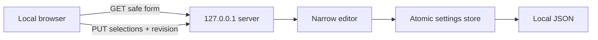

# AI Connection Settings Web — Developer Contract

## Runtime choice

The first GUI uses a Python standard-library HTTP server bound exclusively to `127.0.0.1`. This keeps Windows installation small, reuses the same responsive UI in a future dashboard, and adds no Electron or web-framework dependency. It is a local configuration surface, not a remotely deployable service.



## Trust boundaries

- Bind address is fixed to `127.0.0.1`; the CLI does not accept a host override.
- Host headers are restricted to loopback names and the actual selected port.
- Mutation requires a process-random `X-BAI-CSRF` token.
- CSP denies all resources by default and permits only nonce-bound inline code/style plus same-origin API calls.
- Requests are JSON-only and limited to 64 KiB.
- The editor accepts only five complete workload modes and preferred IDs already present in the loaded Profile.
- Credential references, endpoint references, route settings and secret values never enter the form response.
- HTTP handlers never call a Provider adapter, generation runtime, Resolve, or a shell.

## API

| Method | Path | Result |
|---|---|---|
| `GET` | `/` | Responsive bilingual HTML screen |
| `GET` | `/api/form` | Secret-free form projection and revision |
| `PUT` | `/api/settings` | Validates selections, checks revision and atomically saves |

The PUT body is:

```json
{
  "revision": 1,
  "workload_modes": {
    "PLANNING": "AUTO",
    "VIDEO": "OFFLINE_ONLY",
    "IMAGE": "FREE",
    "AUDIO": "AI",
    "MUSIC": "DISABLED"
  },
  "preferred_route_ids": {
    "PLANNING": "planning-openai",
    "VIDEO": "video-local"
  }
}
```

Unknown workloads, cross-workload route IDs, missing workload modes, stale revisions and invalid enum values fail closed.

## Remaining UI work

Credential onboarding must use an OS credential store and must never add secret values to this JSON contract. Adding Provider/Model candidates needs a separate catalog/editor contract. Native Windows screenshot Evidence and the 2–3-person scripted usability review remain required before TASK-032 completion.
