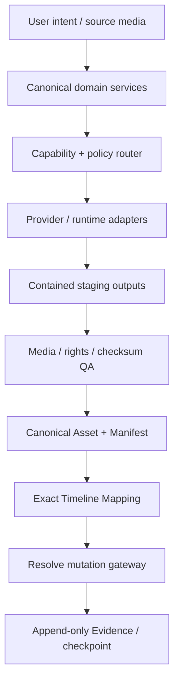
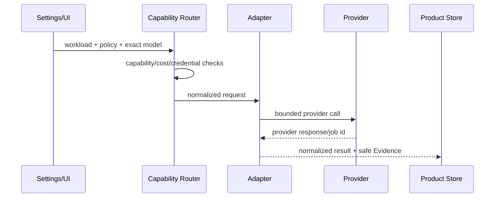

# Developer Architecture Guide

## System responsibility map

## Source-of-truth hierarchy

1. Canonical Manifest and Product Store own product state.
2. Asset Registry owns immutable source/derived identity and rights metadata.
3. Timeline Mapping Plan owns exact placement intent.
4. NLE projects are execution targets, not the only source of truth.
5. Evidence explains operations but never replaces canonical state.

## Security boundaries

| Boundary | Required control |
|---|---|
| Source path → ingest | allowlisted roots, symlink/escape refusal, checksum |
| Prompt/config → provider | schema validation, no raw secret persistence, endpoint policy |
| Provider output → Asset | staging containment, complete-batch QA, checksum before publication |
| Edit plan → Resolve | explicit ownership, idempotency, mutation authorization |
| Retry → external runtime | persisted operation identity, ambiguous-state fail-closed |
| Human action → learning | hypothesis and metrics, holdout, no blind imitation |

## Provider integration contract

Provider family does not determine purpose. An exact model may support planning, image, video, audio, or music only when its descriptor and installed adapter declare that capability.

## Adding an adapter

1. Add or extend an exact capability descriptor.
2. Define request/result normalization without exposing provider payloads to domain callers.
3. Resolve credentials at runtime; persist references only.
4. Enforce endpoint, timeout, size, retry and idempotency bounds.
5. Normalize provider errors into `ProductError` categories.
6. Add offline transport tests, failure tests and secret-redaction assertions.
7. Keep live/paid probes outside ordinary CI.
8. Update English/Japanese public status without claiming unfinished integration.

## Test layers

| Layer | Runs in ordinary CI | Purpose |
|---|---:|---|
| Unit/domain | Yes | invariants, rounding, policy, state |
| Offline adapter contract | Yes | request/response normalization, errors |
| Real FFmpeg golden | Yes | media behavior on Linux/Windows |
| Capability probe | No | installed external runtime discovery |
| Paid/live behavior probe | No | explicit target-machine Evidence |

## Change checklist

- preserve source and human-owned artifacts;
- update version, changelog, citation and relevant task status;
- add tests at the narrowest stable boundary;
- run `pytest`, `compileall`, and `git diff --check`;
- document migration, rollback, cost, rights and privacy effects;
- never add credentials, private media or machine-specific absolute paths.
