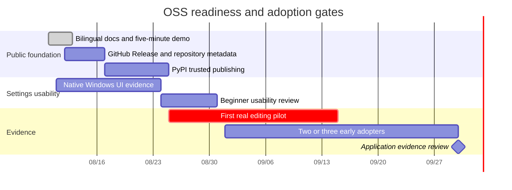

# Public Readiness Schedule

Baseline date: 2026-08-10

## Deadlines and gates

| ID | Due | Owner | Completion evidence | Dependency |
|---|---|---|---|---|
| OSS-01 | 2026-08-12 | Maintainer | Japanese/English README, user/developer guides, rendered diagrams, safe demo | none |
| OSS-02 | 2026-08-16 | Maintainer | GitHub Release with wheel/sdist, description/topics, Discussions decision | OSS-01 |
| OSS-03 | 2026-08-24 | Maintainer | PyPI Trusted Publisher configured; first verified package or recorded blocker | OSS-02 |
| UI-01 | 2026-08-24 | Maintainer | Native Windows screenshot, keyboard save/reload, conflict message, no paid call | package 0.10.0 |
| UI-02 | 2026-08-31 | Maintainer + consenting users | 2–3 users complete mode selection, Model selection and safe save; blockers recorded | UI-01 |
| OSS-04 | 2026-09-15 | Product + Maintainer | one non-sensitive real-video report with baseline, time, corrections, cost and limitations | Editing MVP |
| OSS-05 | 2026-09-30 | Maintainer + consenting users | 2–3 anonymized installation/workflow records | usable installation + relevant MVP |
| OSS-06 | 2026-09-30 | Maintainer | application draft refreshed with measured repository/adoption values | OSS-01–05 |

Dates are target review dates, not permission to publish false or incomplete results. If a dependency is not complete, record the blocker and a revised date in the monthly release-readiness issue.

## Beginner-documentation acceptance

- a reader can identify implemented and unimplemented capabilities without opening source code;
- every command states its working directory and expected output;
- paid/network/destructive behavior is visibly distinguished from free offline checks;
- diagrams have supporting prose and do not carry critical information alone;
- errors route to a safe support path without requesting secrets or private media.

## Developer-documentation acceptance

- source of truth and ownership boundaries are explicit;
- provider, filesystem, process, NLE and Evidence data flows are described;
- adding an adapter has a test/security/release checklist;
- live probes and ordinary CI are clearly separated;
- architecture claims match implemented code and task status.
