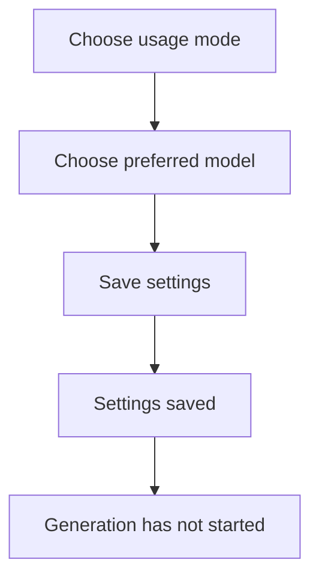

# Using the AI Connection Settings Screen

English | [日本語](AI-CONNECTION-SETTINGS.md)

This local screen selects the usage mode and preferred model for planning, video, image, audio, and music. Saving never starts billing, generation, or video editing.

## Start the screen on Windows

Run these commands at the repository root:

```powershell
python -m pip install -e ".[dev]"
powershell -ExecutionPolicy Bypass -File .\tools\windows\run-ai-connection-settings.ps1
```

If the browser does not open, copy `http://127.0.0.1:8765/` from PowerShell into your browser. Press `Ctrl+C` in PowerShell to stop the screen.

## Modes

| Mode | Meaning | Useful when |
|---|---|---|
| `AUTO` | Choose from available options | You are unsure which route to use |
| `AI` | Use AI models only | Generated quality is the priority |
| `FREE` | Use free options only | You want to limit cost |
| `OFFLINE_ONLY` | Use options running on this computer | You do not want to send assets externally |
| `DISABLED` | Do not create this asset type | You will provide the asset yourself |



The screen reports configured readiness, not a live Provider probe. Actual generation still requires capability checks and a separate GO approval.

Open **Provider & model catalog** at the bottom to add or edit a candidate. Enter safe identifiers, workload, Provider family, exact Model, cost class, and comma-separated capabilities. Check **Credential required** when appropriate, but never enter an API key. `IMPLEMENTED`, `LOCAL_RUNTIME`, and `PLANNED_ADAPTER` distinguish executable boundaries from configuration-only candidates. Disable an obsolete candidate instead of deleting it.

If a conflict appears, another screen saved a newer revision. Reload, review the new settings, and save again. This prevents an older screen from silently overwriting newer work.

Open **Secure credentials**, enter a key for the required Model, and press **Save**. On Windows it is stored in Windows Credential Manager and is never returned to the browser or written to Project settings JSON. The screen shows only **Registered** and never redisplays the key. Press **Delete** when it is no longer needed.

Save/delete does not contact a Provider and cannot prove key validity, permissions, quota, balance, or Model support. It never starts billing, generation, or editing. Never include a key in screenshots, Issues, logs, or Evidence.

Live credential validation, generation, and editing are not available from this screen yet.
