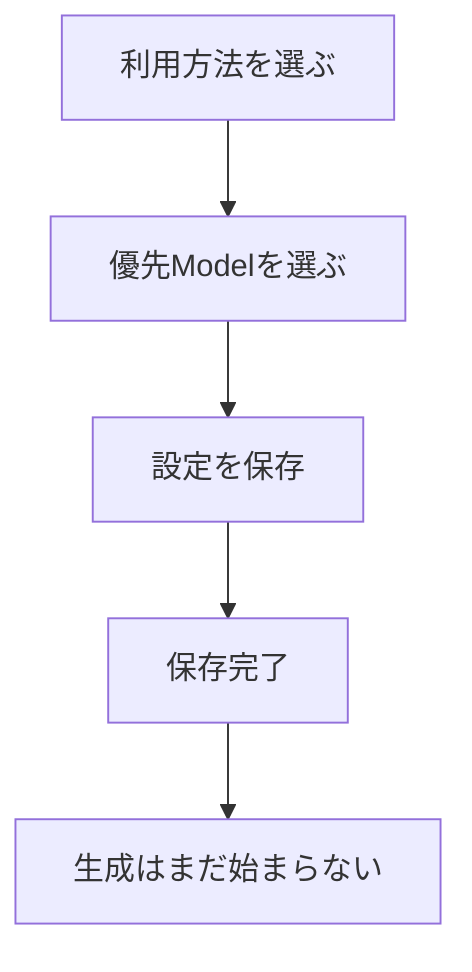

# AI Connection設定画面の使い方

[English](AI-CONNECTION-SETTINGS.en.md) | 日本語

この画面では、企画・動画・画像・音声・音楽ごとに「どの種類の候補を使うか」と「どのModelを優先するか」を設定できます。保存しただけでは課金、素材生成、動画編集は始まりません。

## 起動方法

Repository直下で次を実行します。

```powershell
python -m pip install -e ".[dev]"
powershell -ExecutionPolicy Bypass -File .\tools\windows\run-ai-connection-settings.ps1
```

ブラウザが開かない場合は、PowerShellに表示された`http://127.0.0.1:8765/`をブラウザへ貼り付けます。終了するときはPowerShellで`Ctrl+C`を押します。

## 選択肢

| 選択 | 意味 | 向いている人 |
|---|---|---|
| `AUTO` | 利用できる候補から自動選択 | 迷ったとき |
| `AI` | AIモデルだけを使用 | 生成品質を優先したい |
| `FREE` | 無料候補だけを使用 | 費用を抑えたい |
| `OFFLINE_ONLY` | このPC内で動く候補だけを使用 | 素材を外部送信したくない |
| `DISABLED` | その種類の素材を作成しない | 自分で素材を用意する |



## 状態表示

- **準備できています**：設定上、利用できる候補があります。
- **設定が不足しています**：Credentialや候補Modelなどが不足しています。
- **使用しない設定です**：`DISABLED`が選択されています。

この画面はProviderへ接続する動作確認ではありません。実際の生成前には、別のCapability確認とGO承認が行われます。

## 保存競合が表示された場合

別の画面や処理が先に設定を更新しています。現在のページを再読み込みし、最新設定を確認してからもう一度保存してください。古い画面から新しい設定を上書きしないための安全機能です。

## Provider・Model候補を追加する

画面下部の`Provider・Model候補`を開きます。

1. 重複しないRoute IDを入力します。
2. 用途、Provider family、Provider ID、Model ID、費用区分を選びます。
3. 必要なCapabilityをカンマ区切りで入力します。
4. API認証が必要な場合は`Credentialが必要`だけをチェックします。APIキーは入力しません。
5. `候補を保存`を押します。

候補には次の実装状態が表示されます。

- `IMPLEMENTED`：Provider familyのAdapter境界があります。ただし、そのModelが利用できるかは別途確認が必要です。
- `LOCAL_RUNTIME`：ローカルRuntimeとの境界があります。インストール・起動状態は別途確認します。
- `PLANNED_ADAPTER`：候補設定だけ可能で、まだ実行できません。

間違えた候補は削除せず、編集画面で`有効`を外してください。履歴と復旧可能性を保つための仕様です。

## APIキーをWindowsへ安全に保管する

`APIキーの安全な保管`を開き、対象Modelのパスワード欄へキーを入力して`保管`を押します。キーはWindows Credential Managerへ保存され、Project設定JSONや画面応答には入りません。画面は`登録済み`だけを表示し、キーを再表示しません。不要になったら`削除`を押してください。

登録・削除はProviderへ接続せず、課金・生成・編集を始めません。`登録済み`は保管の成功だけを意味し、キーの有効性、権限、残高、Model対応は証明しません。スクリーンショット、Issue、ログへキーを含めないでください。

Catalogで有効かつ`Credentialが必要`を選んだ候補は、この欄へ自動で追加されます。候補を無効化すると通常欄から外れますが、保管済みキーは勝手に削除されず、`無効候補の保管済みキー`から明示的に削除できます。キーが残っている間は`Credentialが必要`を外せません。

## 現在できないこと

- Providerへ接続してAPIキーの有効性・権限・残高を調べること
- この画面からの素材生成
- 動画編集の開始
