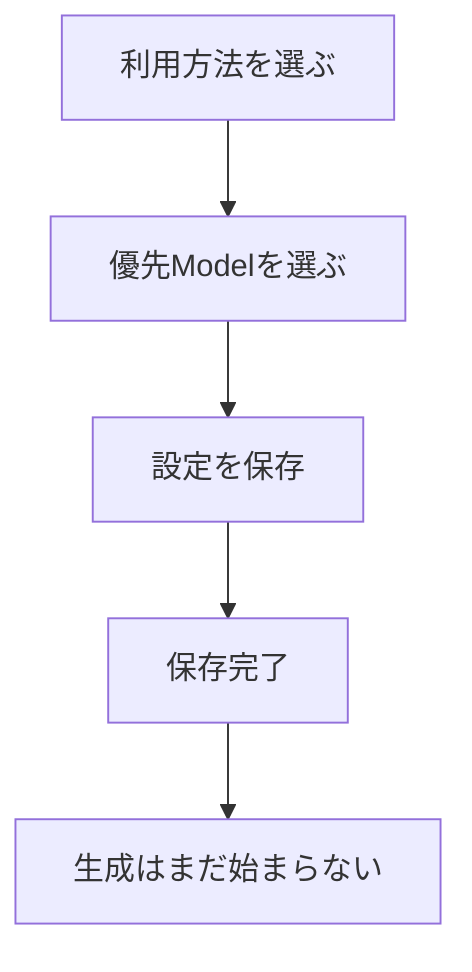

# AI Connection設定画面の使い方

[English](AI-CONNECTION-SETTINGS.en.md) | 日本語

この画面では、企画・動画・画像・音声・音楽ごとに「どの種類の候補を使うか」と「どのModelを優先するか」を設定できます。保存しただけでは課金、素材生成、動画編集は始まりません。

## 起動方法

Repository直下で次を実行します。

```powershell
python -m pip install -e ".[dev]"
powershell -ExecutionPolicy Bypass -File .\tools\windows\run-ai-connection-settings.ps1
```

ブラウザが開かない場合は、PowerShellに表示された`http://127.0.0.1:8765/`をブラウザへ貼り付けます。終了するときはPowerShellで`Ctrl+C`を押します。

## 選択肢

| 選択 | 意味 | 向いている人 |
|---|---|---|
| `AUTO` | 利用できる候補から自動選択 | 迷ったとき |
| `AI` | AIモデルだけを使用 | 生成品質を優先したい |
| `FREE` | 無料候補だけを使用 | 費用を抑えたい |
| `OFFLINE_ONLY` | このPC内で動く候補だけを使用 | 素材を外部送信したくない |
| `DISABLED` | その種類の素材を作成しない | 自分で素材を用意する |



## 状態表示

- **準備できています**：設定上、利用できる候補があります。
- **設定が不足しています**：Credentialや候補Modelなどが不足しています。
- **使用しない設定です**：`DISABLED`が選択されています。

この画面はProviderへ接続する動作確認ではありません。実際の生成前には、別のCapability確認とGO承認が行われます。

## 保存競合が表示された場合

別の画面や処理が先に設定を更新しています。現在のページを再読み込みし、最新設定を確認してからもう一度保存してください。古い画面から新しい設定を上書きしないための安全機能です。

## 現在できないこと

- APIキーの入力・保存
- 新しいProviderやModel候補の追加
- この画面からの素材生成
- 動画編集の開始

Provider・Model候補の追加は、現在は開発者向けProfileで行います。
