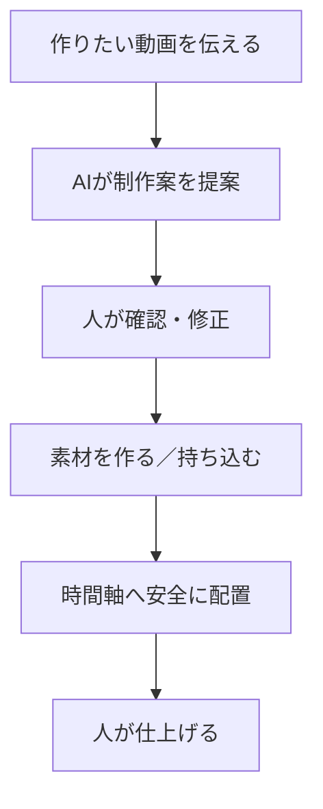
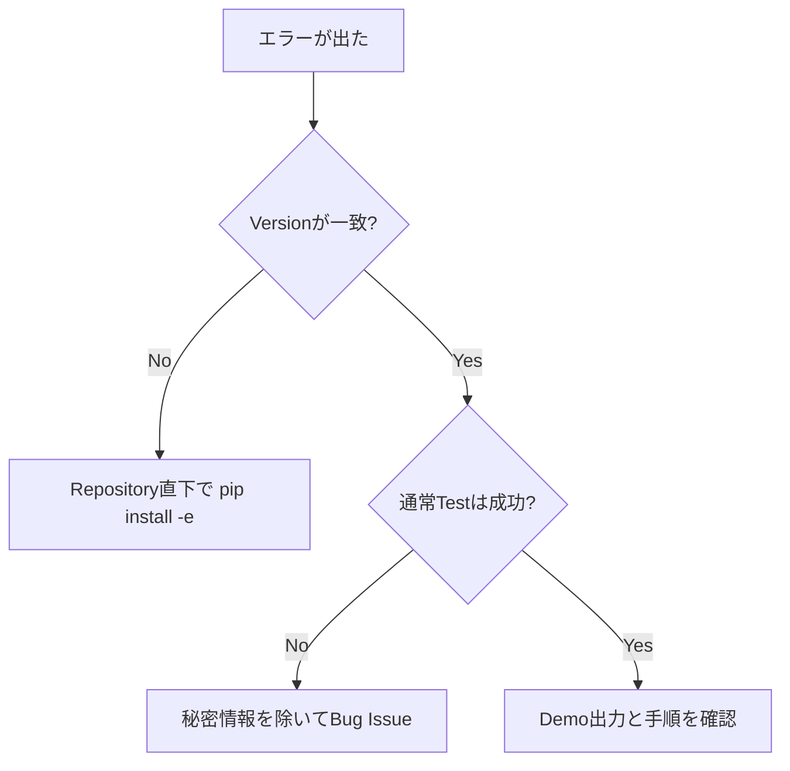

# BAI Video Production やさしい導入ガイド

## これは何ですか

動画作りで必要になる「素材を読み込む」「AIを選ぶ」「時間を正確に合わせる」「編集ソフトへ並べる」「途中で失敗しても再開する」を、一つの安全な流れにまとめるOSSです。



現時点では、上図のすべてを一つのGUIで操作できる完成版ではありません。素材管理、時間軸、AI接続、安全な再開などの基礎部分を先に実装しています。

## お金は自動で発生しますか

通常Testと5分Demoでは発生しません。クラウドAIは、利用者が明示的にProviderとCredentialを設定し、将来の画面で費用を確認して実行を承認した場合だけ使う設計です。

| 操作 | API Key | 有料利用 | 実素材 |
|---|---:|---:|---:|
| 5分Demo | 不要 | なし | 不要 |
| 通常Test | 不要 | なし | 不要 |
| ローカルAI機能 | 原則不要 | Runtime次第 | 機能次第 |
| クラウドAI生成 | 必要 | Provider次第 | 選択した場合のみ |

## 5分で安全に試す

### 1. 必要なもの

- Windows 10/11
- Python 3.11以上
- PowerShell

### 2. Repository直下で実行

```powershell
python -m pip install -e ".[dev]"
python -c "import ai_video_production; print(ai_video_production.__version__)"
ai-video-quickstart --output .\quickstart-output.json
Get-Content .\quickstart-output.json
```

### 3. 成功の見方

画面に次が出れば成功です。

```json
{"ok": true, "output": ".\\quickstart-output.json", "sha256": "sha256:..."}
```

作成されたJSONで、次がすべて`false`になっていることを確認できます。

```text
network_used
credentials_used
paid_provider_used
```

## 5分Demoで確認できること

- 無料・Offline限定という条件でAI接続候補を選べること
- NTSCを含む動画時間を小数誤差なくFrameへ変換できること
- 結果を改ざん検知用Hash付きJSONとして保存できること

実際の動画生成、Cut、字幕、Resolve配置はまだこのDemoでは行いません。

## 困った時



API Key、個人情報、未公開動画はIssueへ貼らないでください。[Support](../../SUPPORT.md)と[Security](../../SECURITY.md)を確認してください。

## 次にできるようになること

最初の大きな完成点は、既存動画を読み込み、無音・フィラー候補と字幕を作り、DaVinci ResolveにCut済み・字幕付きTimelineを安全に作る機能です。その後、新規動画の企画から素材生成・配置までをGUIで扱えるようにします。
